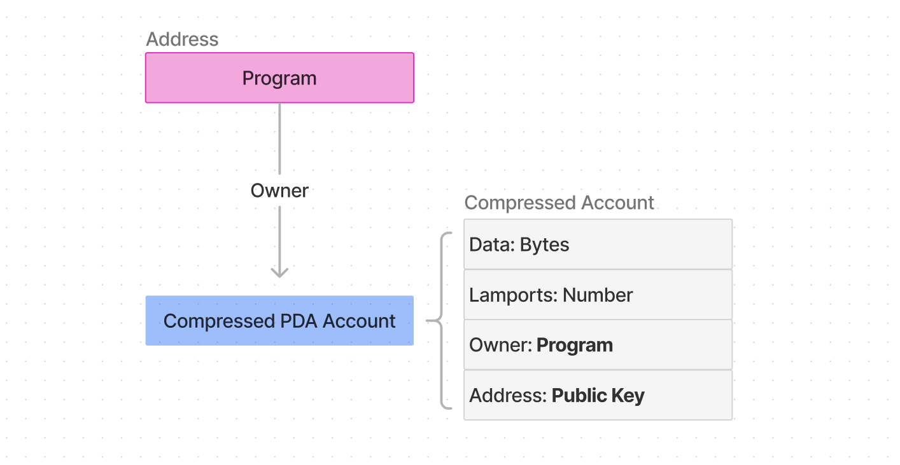

# Compressed Account Model


This guide assumes that you're familiar with [Solana's account model](https://solana.com/docs/core/accounts).


ZK compressed state is stored in compressed accounts. At a high level, compressed accounts largely follow the regular Solana account model, but there are some key differences that enable us to store state off-chain (e.g., in the much cheaper Solana ledger space) instead of the more expensive on-chain account space.

## Key points

* Address as a permanent compressed account identifier is _optional._
* Each compressed account can be identified by its hash.
* Compressed accounts are stored in sparse state trees.

To understand the similarities and differences between Solana's regular account model and compressed accounts, let's first look at **compressed accounts with Program-Derived Addresses** (PDAs).

> If you don't know what PDAs are, read [this explainer](https://solana.com/docs/core/pda) first.

## Compressed PDA Accounts

Like regular accounts, each compressed PDA account can be identified by its unique persistent address, represented as 32 bytes in the format of a `PublicKey`. Like PDAs, compressed account addresses don't belong to a private key; rather, they're derived from the program owning them.

<figure><figcaption>
Compressed PDA Accounts
</figcaption></figure>

The compressed PDA account layout is similar to Solana's regular PDA account layout: Data, Lamports, Owner, and an address field. The data field stores the program state. Notice the enshrined AccountData structure: Discriminator, Data, DataHash:

<figure><figcaption>
Compressed PDA Account with AccountData
</figcaption></figure>

The [Anchor](https://www.anchor-lang.com/) framework reserves the first 8 bytes of a regular account's data field for the discriminator. This helps programs distinguish between different program-owned accounts. The default compressed account layout is opinionated in this regard and enforces a discriminator in the Data field. You can ignore the dataHash field for now; we will cover its importance for ZK compression later.

## Compressed Account

The PDA address field is _optional_ for compressed accounts. Each compressed account can be identified by its hash, regardless of whether it has an address.

<figure><figcaption>
Default Compressed Account
</figcaption></figure>

To understand why the ID of a compressed account is its hash, we must first learn how the protocol stores compressed state:

## State Trees

The protocol stores compressed state in multiple state trees.


A state tree is a binary [Merkle tree](https://brilliant.org/wiki/merkle-tree/) that organizes data into a tree structure where each parent node is the hash of its two children nodes. This leads to a single unique root hash that cryptographically secures the integrity of all the leaves in the tree.


<figure><figcaption>
A small binary Merkle tree (depth 2)
</figcaption></figure>

The hash of each compressed account is stored as a leaf in such a state tree.

Each state tree has a corresponding on-chain Merkle tree account that stores only the tree's final root hash and other metadata. This allows the protocol to store the "raw" compressed account state (the leaves of the tree) outside of Solana's on-chain account space while still being able to verify the validity of any of the tree's state on-chain. By default, ZK compression stores the "raw" state on the much cheaper Solana ledger which preserves the security guarantees of the Solana L1.

## Next Steps

Head to the next section to learn how compressed accounts are used in a[ transaction](lifecycle-of-a-transaction.md) context!
