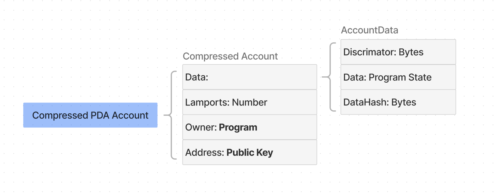

# Compressed Account Model


This guide assumes that you're familiar with [Solana's account model](https://solana.com/docs/core/accounts).


## Regular versus Compressed Accounts

ZK compressed state is stored in compressed accounts. Compressed accounts are similar to regular Solana accounts but with four main differences:

* Each compressed account can be identified by its hash
* Each write to a compressed account changes its hash
* An `address` can optionally be set as a permanent unique ID of the compressed account
* All compressed accounts are stored in [sparse state trees](broken-reference). Only the tree's state root (i.e., a small fingerprint of all compressed accounts) is stored in the on-chain account space

These differences allow the protocol to store states as calldata in the less expensive Solana ledger space instead of costly on-chain account space

To understand the similarities and differences between Solana's regular account model and compressed accounts, let's first look at compressed accounts with Program-Derived Addresses (PDAs)

> If you don't know what PDAs are, read [this explainer](https://solana.com/docs/core/pda) first

## Compressed PDA Accounts

Like regular accounts, each compressed PDA account can be identified by its unique persistent address, represented as 32 bytes in the format of a `PublicKey`. Like PDAs, compressed account addresses don't belong to a private key; rather, they're derived from the program that owns them

<figure><figcaption>
Compressed PDA Accounts
</figcaption></figure>

The compressed PDA account layout is similar to Solana's regular PDA account layout — it has the **Data**, **Lamports**, **Owner**, and **Address** fields. The **Data** field stores the program state. Notice the enshrined **AccountData** structure: **Discriminator**, **Data**, **DataHash**:

<figure><figcaption>
Compressed PDA Account with AccountData
</figcaption></figure>

The [Anchor](https://www.anchor-lang.com/) framework reserves the first 8 bytes of a regular account's data field for the discriminator. This helps programs distinguish between different program-owned accounts. The default compressed account layout is opinionated in this regard and enforces a discriminator in the Data field. You can ignore the **DataHash** field for now; we cover its importance for ZK Compression later.

### Address & Hash

The `address` field is optional for compressed accounts because ensuring that the address of a new account is unique incurs additional computational overhead, and not all use cases need the uniqueness property of addresses

Instead, each compressed account can be identified by its hash, regardless of whether it has an address


* Use the address field wherever the state must be unique (such as for NFTs or certain PDAs)
* You don't need the address for any fungible state (e.g., fungible tokens)


By definition, whenever the data of a compressed account changes, its hash changes. This impacts how developers interact with fungible state:

* Check out the [examples](../../introduction/intro-to-development.md#build-by-example) section to see what using hashes instead of addresses looks like in practice
* Visit the [State Trees](state-trees.md) section to understand why using the account's hash as its ID makes sense for the compression protocol
