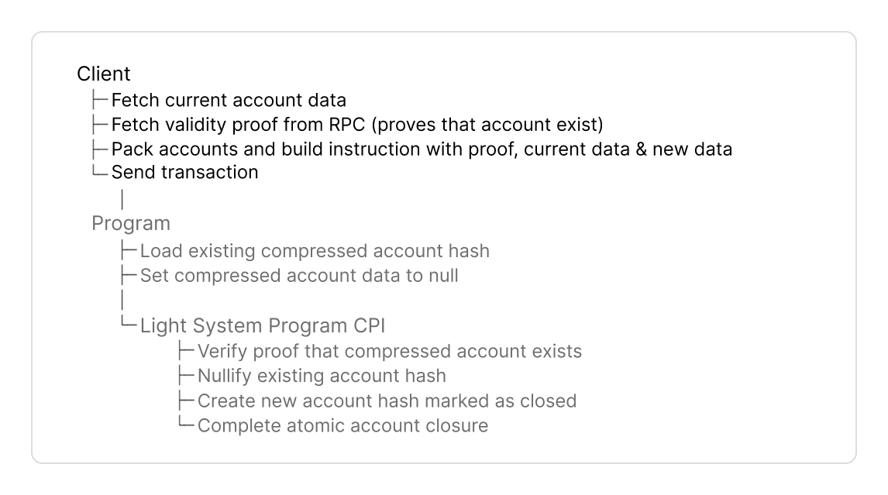
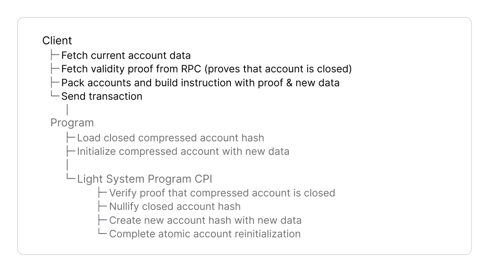

# Overview

Use this guide to build a Typescript or Rust client. Here is the complete flow:



<figure><picture><source srcset="../../.gitbook/assets/client-create (1).png" media="(prefers-color-scheme: dark)"></picture><figcaption></figcaption></figure>



<figure><picture><source srcset="../../.gitbook/assets/client-update (1).png" media="(prefers-color-scheme: dark)"></picture><figcaption></figcaption></figure>



<figure><picture><source srcset="../../.gitbook/assets/client-close (1).png" media="(prefers-color-scheme: dark)"></picture><figcaption></figcaption></figure>



<figure><picture><source srcset="../../.gitbook/assets/client-reinit (1).png" media="(prefers-color-scheme: dark)"></picture><figcaption></figcaption></figure>



<figure><picture><source srcset="../../.gitbook/assets/client-burn (1).png" media="(prefers-color-scheme: dark)"></picture><figcaption></figcaption></figure>




Ask anything via [](https://deepwiki.com/Lightprotocol/light-protocol/3.1-javascripttypescript-sdks).




## Installation and Setup



The Typescript SDK consists of two packages:

1. [@lightprotocol/stateless.js](https://lightprotocol.github.io/light-protocol/stateless.js/index.html)is the core RPC client that provides the ZK Compression RPC interface to query and build transactions that create or interact with compressed accounts on Solana.
2. [@lightprotocol/compressed-token](https://lightprotocol.github.io/light-protocol/compressed-token/index.html) uses the stateless.js RPC interface to build transactions with compressed tokens.


Use the [API documentation](https://lightprotocol.github.io/light-protocol/) to look up specific function signatures, parameters, and return types.


**1. Installation**


```bash
npm install --save \
    @lightprotocol/stateless.js@0.22.1-alpha.1 \
    @lightprotocol/compressed-token@0.22.1-alpha.1 \
    @solana/web3.js
```



```bash
yarn add \
    @lightprotocol/stateless.js@0.22.1-alpha.1 \
    @lightprotocol/compressed-token@0.22.1-alpha.1 \
    @solana/web3.js
```



```bash
pnpm add \
    @lightprotocol/stateless.js@0.22.1-alpha.1 \
    @lightprotocol/compressed-token@0.22.1-alpha.1 \
    @solana/web3.js
```



**2. Create an RPC Connection**


`Rpc` and `TestRpc` implement the same `CompressionApiInterface` for consistent usage across `TestRpc`, local test validator, and public Solana networks.


**Use `Rpc` for test-validator, devnet and mainnet**

* `Rpc` is a thin wrapper extending Solana's web3.js `Connection` class with compression-related endpoints.
* Connects to Photon indexer to query compressed accounts and prover service to generate validity proofs.



```typescript
const rpc = createRpc('https://mainnet.helius-rpc.com/?api-key=YOUR_API_KEY');
```



```typescript
const rpc = createRpc('https://devnet.helius-rpc.com/?api-key=YOUR_API_KEY');
```



```bash
light test-validator
```

Start a start a single-node Solana cluster, an RPC node, and a prover node at ports 8899, 8784, and 3001.



**For unit tests, use `TestRpc`** to start a mock RPC instance that parses events and builds Merkle trees on-demand without persisting state.

```typescript
const lightWasm: LightWasm = await WasmFactory.getInstance();
const testRpc = await getTestRpc(lightWasm);
```



Rust combines tokens in the client library, and has a separate SDK for program-side development:

1. [`light-client`](https://docs.rs/light-client): The RPC client that provides the ZK Compression RPC interface to query and build transactions for **compressed accounts and tokens** on Solana.
2. [`light-sdk`](https://docs.rs/light-sdk): Program-side abstractions (macros, wrappers, CPI interface) to create and interact with compressed accounts in Solana programs. Similar to Anchor's `Account` pattern.

**For devnet and mainnet, use `light-client`**

* Connects to Photon indexer to query compressed accounts and generate validity proofs.

```toml
[dependencies]
light-client = "0.16.0"
light-sdk = "0.16.0"
```



```rust
let config = LightClientConfig::new(
    "https://api.mainnet-beta.solana.com".to_string(),
    Some("https://mainnet.helius.xyz".to_string()),
    Some("YOUR_API_KEY".to_string())
);

let mut client = LightClient::new(config).await?;

client.payer = read_keypair_file("~/.config/solana/id.json")?;
```



```rust
let config = LightClientConfig::devnet(
    Some("https://devnet.helius-rpc.com".to_string()),
    Some("YOUR_API_KEY".to_string())
);

let mut client = LightClient::new(config).await?;

client.payer = read_keypair_file("~/.config/solana/id.json")?;
```



```rust
let config = LightClientConfig::local();

let mut client = LightClient::new(config).await?;

client.payer = read_keypair_file("~/.config/solana/id.json")?;
```

Requires running `light test-validator` locally:

```bash
light test-validator
```

Starts a start a single-node Solana cluster, an RPC node, and a prover node at ports 8899, 8784, and 3001.



**For local testing, use** [**`light-program-test`**](https://docs.rs/light-program-test).

* Initializes a [LiteSVM](https://github.com/LiteSVM/LiteSVM) optimized for ZK Compression with auto-funded payer and TestIndexer. Requires Light CLI for program binaries.
* Use for unit and integration tests of your program or client code.

```toml
[dev-dependencies]
light-program-test = "0.16.0"
light-sdk = "0.16.0"
```

```rust
let config = ProgramTestConfig::new_v2(
    true,
    Some(vec![("program_create", program_create::ID)])
);
let mut rpc = LightProgramTest::new(config).await.unwrap();
let payer = rpc.get_payer().insecure_clone();
```


`LightClient` and `LightProgramTest` implement the same [`Rpc`](https://docs.rs/light-client/latest/light_client/rpc/trait.Rpc.html) and [`Indexer`](https://docs.rs/light-client/latest/light_client/indexer/trait.Indexer.html) traits for consistent usage across `light-program-test`, local test validator, and public Solana networks.






## Tree Configuration

Your client must fetch metadata of two Merkle trees:

* an address tree to derive and store the account address and
* a state tree to store the compressed account hash.


The protocol maintains Merkle trees. You don't need to initialize custom trees. Find the [addresses for Merkle trees here](https://www.zkcompression.com/resources/addresses-and-urls).



V2 is currently on Devnet. Use to optimize compute unit consumption by up to 70%.







```typescript
const addressTree = getDefaultAddressTreeInfo();
const stateTreeInfos = await rpc.getStateTreeInfos();
const outputStateTree = selectStateTreeInfo(stateTreeInfos);
```





```typescript
const addressTree = await rpc.getAddressTreeInfoV2();
const stateTreeInfos = await rpc.getStateTreeInfos();
const outputStateTree = selectStateTreeInfo(stateTreeInfos);
```









```rust
let address_tree_info = rpc.get_address_tree_v1();
let output_state_tree_info = rpc.get_random_state_tree_info().unwrap();
```





```rust
let address_tree_info = rpc.get_address_tree_v2();
let output_state_tree_info = rpc.get_random_state_tree_info().unwrap();
```






**Address Tree methods** return `TreeInfo` of address trees with the public key and other metadata for the address tree.

You will use the address tree `TreeInfo` again:

1. In the next step to derive the address for the compressed account.
2. In Step 4 for `getValidityProofV0()` to prove the address does not exist yet, if you create compressed accounts with address.

**State Tree methods** return an array of `TreeInfo` objects of state trees with public key and other metadata. With these methods you select a random state tree to store the compressed account hash.

You will use the state tree `TreeInfo` again:

1. In Step 4 for `getValidityProofV0()` to prove the account hash exists in the state tree, if you update/close/reinit/burn a compressed account.
2. In Step 5 for packing accounts to optimize instruction data.

* Assigns indices to accounts instead of repeating full pubkeys


- Account hashes can move to different state trees after each state transition.
- Since trees fill up over time, your programs must be able to handle accounts from different state trees within the same transaction.
- **Best practice**: minimize the number of different trees per transaction.


<details>

<summary>Expand to learn what pubkeys and other metadata of a Merkle tree <code>TreeInfo</code> contains.</summary>

* `tree`: Merkle tree account pubkey
* `queue`: Queue account pubkey of queue associated with a Merkle tree
  * Buffers updates of compressed accounts before they are added to the Merkle tree.
  * Clients and programs do not interact with the queue. The Light System Program inserts values into the queue.
* `treeType`: Automatically set based on which tree selection method you used.
* `cpiContext`: Optional CPI context account for batched operations across multiple programs (may be null, currently on devnet)
  * Allows a single zero-knowledge proof to verify compressed accounts from different programs in one instruction
  * Reduces instruction data size and compute unit costs when multiple programs interact with compressed accounts
* `nextTreeInfo`: Next tree to use when current tree reaches \~95% capacity (may be null).
  * The SDK automatically switches to next tree when present. Developers don't need to handle tree rollovers manually.
  * The protocol creates new trees, once existing trees fill up.

</details>



## Derive Address

Derive a persistent address as a unique identifier for your compressed account, similar to [program-derived addresses (PDAs)](https://solana.com/docs/core/pda).

* Use the derivation method that matches your address tree type from the previous step (V1 or V2).
* Like PDAs, compressed account addresses don't belong to a private key; rather, they're derived from the program that owns them.
* The key difference to PDAs is that compressed accounts require an **address tree** parameter.


V2 is currently on Devnet. Use to optimize compute unit consumption by up to 70%.







```typescript
const seed = deriveAddressSeed(
  [Buffer.from('my-seed')],
  programId
);
const address = deriveAddress(seed, addressTree.tree);
```


**1. Derive the seed**:

* Seeds are predefined inputs, such as strings, numbers or other account addresses.
* Specify `programId` to combine with your seeds

**2. Then, derive the address**:

* Pass the derived 32-byte `seed` from the first step
* Specify `addressTree.tree` pubkey




```typescript
const seed = deriveAddressSeedV2(
  [Buffer.from('my-seed')]
);
const address = deriveAddressV2(seed, addressTree.tree, programId);
```


**1. Derive the seed**:

* Seeds are predefined inputs, such as strings, numbers or other account addresses.

**2. Then, derive the address**:

* Pass the derived 32-byte `seed` from the first step.
* Specify `addressTree.tree` pubkey to ensure an address is unique to an address tree. Different trees produce different addresses from identical seeds.
* Specify `programId` in the address derivation. V2 includes it here instead of the first step.








```rust
use light_sdk::address::v1::derive_address;

let (address, _) = derive_address(
    &[b"my-seed"],
    &address_tree_info.tree,
    &program_id,
);
```





```rust
use light_sdk::address::v2::derive_address;

let (address, _) = derive_address(
    &[b"my-seed"],
    &address_tree_info.tree,
    &program_id,
);
```




**Pass these parameters**:

* `&[b"my-seed"]`: Predefined inputs, such as strings, numbers or other account addresses.
* `&address_tree_info.tree`: Specify the tree pubkey to ensure an address is unique to this address tree. Different trees produce different addresses from identical seeds.
* `&program_id`: Specify the program owner pubkey.




Use the same address tree for both address derivation and all subsequent operations:

* To create a compressed account, pass the address to the validity proof, to prove the address does not exist yet.
* To update/close, use the address to fetch the current account with `getCompressedAccount(address)` / `get_compressed_account(address)`.




## Validity Proof

Fetch a validity proof from your RPC provider that supports ZK Compression (Helius, Triton, ...). The proof type depends on the operation:

* To create a compressed account, you must prove the **address doesn't already exist** in the address tree.
* To update or close a compressed account, you must **prove its account hash exists** in a state tree.
* You can **combine multiple addresses and hashes in one proof** to optimize compute cost and instruction data.


[Here's a full guide](https://www.zkcompression.com/resources/json-rpc-methods/getvalidityproof) to the `getValidityProofV0()` / `get_validity_proof()` method.







```typescript
const proof = await rpc.getValidityProofV0(
  [],
  [{ address: bn(address.toBytes()), tree: addressTree.tree, queue: addressTree.queue }]
);
```


**1. Pass these parameters**:

* Leave (`[]`) empty to create compressed accounts, since no compressed account exists yet to reference.
* Specify the derived address with its `tree` and `queue` pubkeys from the address tree `TreeInfo`.

**2. The RPC returns**:

* `compressedProof`: The proof that the address does not exist in the address tree, passed to the program in your instruction data.
* `rootIndices`: An array with root index from the validity proof for the address tree.
* Empty `leafIndices` array, since you do not reference an existing account, when you create a compressed account.




These operations proof that the account hash exists in the state tree. The difference is in your program's instruction handler.



```typescript
const hash = compressedAccount.hash;
const tree = compressedAccount.treeInfo.tree;
const queue = compressedAccount.treeInfo.queue;

const proof = await rpc.getValidityProofV0(
  [{ hash, tree, queue }],
  []
);
```


**1. Pass these parameters**:

* Specify the account `hash` along with `tree` and `queue` pubkeys from the compressed account's `TreeInfo`.
* (`[]`) remains empty, since the proof verifies the account hash exists in a state tree, not that the address doesn't exist in an address tree.

**2. The RPC returns**:

* `compressedProof`: The proof that the account hash exists in the state tree, passed to the program in your instruction data.
* `rootIndices` and `leafIndices` arrays with proof metadata to pack accounts in the next step.








```rust
let rpc_result = rpc
    .get_validity_proof(
        vec![],
        vec![AddressWithTree {
            address: *address,
            tree: address_tree_info.tree,
        }],
        None,
    )
    .await?
    .value;
```


**1. Pass these parameters**:

* Leave (`vec![]`) empty to create compressed accounts, since no compressed account exists yet to reference.
* Specify the new address with `tree` pubkey from the address tree `TreeInfo` in `vec![AddressWithTree]`. Rust does not have a queue field, different from Typescript.

**2. The RPC returns `ValidityProofWithContext`**:

* `proof` to prove that the address does not exist in the address tree, passed to the program in your instruction data.
* `addresses` with the public key and metadata of the address tree to pack accounts in the next step.
* An empty `accounts` field, since you do not reference an existing account, when you create a compressed account.




These operations proof that the account hash exists in the state tree. The difference is in your program's instruction handler.



```rust
let hash = compressed_account.hash;

let rpc_result = rpc
    .get_validity_proof(
        vec![hash],
        vec![],
        None,
    )
    .await?
    .value;
```


**1. Pass these parameters**:

* Specify the `hash` extracted from the compressed account in `vec![hash]` to prove its existence in the state tree.
* (`vec![]`) remains empty, since the proof verifies the account hash exists in a state tree, not that the address doesn't exist in an address tree.

**2. The RPC returns `ValidityProofWithContext`**:

* `proof` with the proof that the account hash exists in the state tree, passed to the program in your instruction data.
* `accounts` with the public key and metadata of the state tree to pack accounts in the next step.
* An empty `addresses` field (only needed when creating an address).





### Optimize with Single Combined Proofs


**Advantages of combined proofs**:

* You only add one validity proof with 128 bytes in size instead of two to your instruction data.
* Reduction of compute unit consumption by at least 100k CU, since combined proofs are verified in a single CPI by the Light System Program.


The specific combinations and maximums to combine proofs depend on the circuit version (v1 or v2) and the proof type.

* Combine multiple hashes **or** multiple addresses in a single proof, or
* multiple hashes **and** addresses in a single combined proof.



V1 circuits can prove in a single proof

* 1, 2, 3, 4, or 8 hashes,
* 1, 2, 3, 4, or 8 addresses, or
* multiple hashes or addresses in any combination of the below.

| **Single Combined Proofs** | Any combination of |
| -------------------------- | :----------------: |
| Hashes                     |    1, 2, 3, 4, 8   |
| Addresses                  |     1, 2, 4, 8     |



V2 circuits can prove in a single proof

* 1 to 20 hashes,
* 1 to 32 addresses, or
* multiple hashes or addresses in any combination of the below.

| **Single Combined Proofs** | Any combination of |
| -------------------------- | :----------------: |
| Hashes                     |       1 to 4       |
| Addresses                  |       1 to 4       |




The combinations and maximums are determined by the available circuit verifying keys. Different proof sizes require different circuits optimized for that specific combination. View the [source code here](https://github.com/Lightprotocol/light-protocol/tree/871215642b4b5b69d2bcd7eca22542346d0e2cfa/program-libs/verifier/src/verifying_keys).


**Example create-and-update proof**

In this example we generate one proof for the update of an existing account, and the creation of a new account.




```typescript
const hash = compressedAccount.hash;
const tree = compressedAccount.treeInfo.tree;
const queue = compressedAccount.treeInfo.queue;

const proof = await rpc.getValidityProofV0(
  [{ hash, tree, queue }],
  [{ address: bn(address.toBytes()), tree: addressTree.tree, queue: addressTree.queue }]
);
```


**1. Pass these parameters**:

* Specify one or more account `hash` values along with `tree` and `queue` pubkeys from the compressed account's `TreeInfo`.
* Specify one or more derived addresses with `tree` and `queue` pubkeys from the address tree `TreeInfo`.

**2. The RPC returns:**

* `compressedProof`: A single combined proof that verifies both the account hash exists in the state tree and the address does not exist in the address tree, passed to the program in your instruction data.
* `rootIndices` and `leafIndices` arrays with proof metadata to build `PackedAddressTreeInfo` and `PackedStateTreeInfo` in the next step.




```rust
let hash = compressed_account.hash;

let rpc_result = rpc
    .get_validity_proof(
        vec![hash],
        vec![AddressWithTree {
            address: *address,
            tree: address_tree_info.tree,
        }],
        None,
    )
    .await?
    .value;
```


**1. Pass these parameters**:

* Specify one or more `hash` values extracted from compressed accounts in `vec![hash]` to prove existence in the state trees.
* Specify one or more addresses with `tree` pubkey from the address tree `TreeInfo` in `vec![AddressWithTree]` to prove non-existence in address trees.

**2. The RPC returns `ValidityProofWithContext` with**

* `proof`: A single combined proof, passed to the program in your instruction data.
* `addresses` with the public key and metadata of the address tree to pack accounts in the next step.
* `accounts` with the public key and metadata of the state tree to pack accounts in the next step.




See the full [create-and-update program example with tests](https://github.com/Lightprotocol/program-examples/tree/main/create-and-update).




## Pack Accounts

To optimize instruction data we pack accounts into an array:

* Every packed account is assigned to an u8 index.
* Indices are included in instruction data, instead of 32 byte pubkeys.
* The indices point to the instructions accounts
  * in anchor to `remainingAccounts`, and
  * in native programs to the account info slice.



**1. Initialize PackedAccounts**

```typescript
const packedAccounts = new PackedAccounts();
```

`PackedAccounts` creates a helper instance with three empty account sections that you populate in the following steps:

1. **`preAccounts`**: Program-specific accounts like signers or fee payer
2. **`systemAccounts`**: [Light System accounts](https://www.zkcompression.com/resources/addresses-and-urls#system-accounts) for proof verification and CPI calls to update state and address trees
3. **`treeAccounts`**: State trees, address trees, and queue accounts from validity proof

**Final array structure:**

```
[preAccounts] [systemAccounts] [treeAccounts]
      ↑              ↑                ↑
   Signers,   Light System      state trees,
  fee payer     accounts       address trees,
                                   queues
```

* The instance maintains an internal deduplication map that assigns sequential u8 indices (0, 1, 2...) when you call `insertOrGet()`.
* If the same pubkey is inserted multiple times, it returns the cached index.
* For example, if the input state tree equals the output state tree, both return the same index.

**2. Add Light System Accounts**

Populate the `systemAccounts` section with Light System accounts. These accounts are needed for proof verification and CPI calls to update state and address trees.


```typescript
const systemAccountConfig = new SystemAccountMetaConfig(programId);
packedAccounts.addSystemAccounts(systemAccountConfig);
```


1. Pass your program ID to `new SystemAccountMetaConfig(programId)` to configure system accounts
2. Call `addSystemAccounts(systemAccountConfig)` - the SDK populates `systemAccounts` with Light System accounts, including the CPI signer PDA derived from your program ID


Program-specific accounts (signers, fee payer) are passed to `.accounts()` in your instruction and are not added to `PackedAccounts`.


**3. Pack Tree Accounts from Validity Proof**

Populate the `treeAccounts` section with tree pubkeys from the validity proof and receive u8 indices to use in instruction data.




```typescript
const addressMerkleTreePubkeyIndex =
  packedAccounts.insertOrGet(addressTree);
const addressQueuePubkeyIndex =
  packedAccounts.insertOrGet(addressQueue);

const packedAddressTreeInfo = {
  rootIndex: proofRpcResult.rootIndices[0],
  addressMerkleTreePubkeyIndex,  // u8 index: 0
  addressQueuePubkeyIndex,        // u8 index: 1
};
```


1. Call `insertOrGet()` with the address tree and address queue pubkeys from `addressTree` TreeInfo

* Each call returns a sequential index starting from 0 (first call returns 0, second returns 1)

2. Store the returned indices in `PackedAddressTreeInfo` instead of the full 32-byte pubkeys
3. Pass `packedAddressTreeInfo` to your program instruction




```typescript
const tree = compressedAccount.treeInfo.tree;
const queue = compressedAccount.treeInfo.queue;

const merkleTreePubkeyIndex = packedAccounts.insertOrGet(tree);
const queuePubkeyIndex = packedAccounts.insertOrGet(queue);

const packedInputAccounts = {
  merkleTreePubkeyIndex,  // u8 index: 0
  queuePubkeyIndex,       // u8 index: 1
  leafIndex: proofRpcResult.leafIndices[0],
  rootIndex: proofRpcResult.rootIndices[0],
};
```


1. Call `insertOrGet()` with the state tree and queue pubkeys from the compressed account's `compressedAccount.treeInfo`

* Each call returns a sequential index starting from 0 (first call returns 0, second returns 1)

2. Store the returned indices along with `leafIndex` and `rootIndex` from the validity proof
3. Pass these indices to your program instruction



**4. Pack Output State Tree**

Pack the output state tree to specify where the new or updated account state will be stored.


```typescript
const outputStateTreeIndex =
  packedAccounts.insertOrGet(outputStateTree);
```


1. Call `insertOrGet()` with the output state tree pubkey from `outputStateTree` TreeInfo

* Returns the u8 index (continues sequential numbering from previous `insertOrGet()` calls)

2. Pass `outputStateTreeIndex` to your program instruction


**Difference in Instructions:**

* **Create**: Output state tree stores the new account hash
* **Update/Close/Reinit**: Output state tree stores the updated account hash (may be same tree as input or different)
* **Burn**: has no output state tree


**5. Finalize Packed Accounts**

Call `toAccountMetas()` to convert packed accounts into the final array for your instruction.


```typescript
const { remainingAccounts, systemStart, packedStart } =
  packedAccounts.toAccountMetas();
```


1. Call `toAccountMetas()` on your PackedAccounts instance
   * Returns an object with three fields:
     * `remainingAccounts`: `AccountMeta[]` array containing all accounts (system accounts + tree accounts)
     * `systemStart`: Offset indicating where system accounts start in the array (used internally by Light System Program)
     * `packedStart`: Offset indicating where tree accounts start in the array (used internally by Light System Program)
2. You have now prepared all components needed for the next step:
   * `remainingAccounts` - to pass to `.remainingAccounts()` in your Anchor instruction builder
   * From Section 3: `packedAddressTreeInfo` (Create) OR `packedInputAccounts` (Update/Close/Reinit/Burn)
   * From Section 4: `outputStateTreeIndex` (Create/Update/Close/Reinit only - Burn has no output state tree)


**Anchor programs:** Pass `remainingAccounts` to `.remainingAccounts()`. The `systemStart` and `packedStart` offsets are used internally by the Light System Program.

**Native programs:** Include `systemStart` and `packedStart` in your instruction data so the program knows the account array layout.




**1. Initialize PackedAccounts**

```rust
let mut remaining_accounts = PackedAccounts::default();
```

Creates a PackedAccounts instance that manages account deduplication and indexing for compressed account operations.

The instance organizes accounts into three sections:

1. **`pre_accounts`**: Program-specific accounts (signers, fee payer) - Native programs only
2. **`system_accounts`**: [Light System accounts](https://www.zkcompression.com/resources/addresses-and-urls#system-accounts) for proof verification and CPI calls to update state and address trees
3. **`tree_accounts`**: State trees, address trees, and queue accounts added dynamically via `insert_or_get()`

**Final array structure:**

```
[pre_accounts] [system_accounts] [tree_accounts]
      ↑              ↑                ↑
   Signers,   Light System      state trees,
  fee payer     accounts       address trees,
                                   queues
```


* The instance maintains an internal deduplication map that assigns sequential u8 indices (0, 1, 2...) when you call `insert_or_get()`.
* If the same pubkey is inserted multiple times, it returns the cached index.
* For example, if the input state tree equals the output state tree, both return the same index.


**2. Add Light System Accounts**

Populate the `system_accounts` with [Light System accounts](https://www.zkcompression.com/resources/addresses-and-urls#system-accounts) needed for proof verification and CPI calls to update state and address trees.




```rust
let config = SystemAccountMetaConfig::new(program_create::ID);
remaining_accounts.add_system_accounts(config)?;
```


1. Pass your program ID to `SystemAccountMetaConfig::new(program_id)` to configure system accounts
2. Call `add_system_accounts(config)?` - the SDK populates `system_accounts` with [Light System accounts](https://www.zkcompression.com/resources/addresses-and-urls#system-accounts), including the CPI signer PDA derived from your program ID




```rust
let config = SystemAccountMetaConfig::new(native_program::ID);
accounts.add_pre_accounts_signer(payer.pubkey());
accounts.add_system_accounts(config)?;
```


1. Pass your program ID to `SystemAccountMetaConfig::new(program_id)` to derive the CPI signer PDA
2. Call `add_pre_accounts_signer(payer.pubkey())` - Native programs must manually add the signer to `pre_accounts`
3. Call `add_system_accounts(config)?` - the SDK populates the `system_accounts` section with [Light System accounts](https://www.zkcompression.com/resources/addresses-and-urls#system-accounts).




**Anchor programs:** Signers are automatically handled by Anchor's account validation. Do not add them to `pre_accounts`.

**Native programs:** Manually add the signer to `pre_accounts` before adding system accounts.




**3. Pack Tree Accounts**

Add tree and queue accounts to the packed accounts array and retrieve indices for the instruction data. The specific trees used depend on your operation type.






Add the address tree and address queue pubkeys to the accounts array and retrieve their indices.


```rust
let packed_accounts = rpc_result.pack_tree_infos(&mut remaining_accounts);
```


1. Call `pack_tree_infos()` on the RPC result from `get_validity_proof()`
   * Returns `PackedTreeInfos` with `.address_trees` field
   * Contains `PackedAddressTreeInfo` with indices for address tree, address queue, and root index
2. You will use `packed_accounts.address_trees[0]` in your instruction



Add the output state tree, address tree, and address queue pubkeys to the accounts array and retrieve their indices.


```rust
let output_state_tree_index = accounts.insert_or_get(*merkle_tree_pubkey);
let packed_address_tree_info = rpc_result.pack_tree_infos(&mut accounts).address_trees[0];
```


1. Call `insert_or_get()` with the output state tree pubkey from `merkle_tree_pubkey`
   * Returns u8 index for the output state tree
   * Native programs add output tree before packing tree infos
2. Call `pack_tree_infos()` on the RPC result and extract `.address_trees[0]`
   * Returns `PackedAddressTreeInfo` with indices for address tree and address queue
3. You will use both `output_state_tree_index` and `packed_address_tree_info` in your instruction





Add the state tree and nullifier queue pubkeys to the accounts array and retrieve their indices.


```rust
let packed_tree_accounts = rpc_result
    .pack_tree_infos(&mut remaining_accounts)
    .state_trees
    .unwrap();
```


1. Call `pack_tree_infos()` on the RPC result and extract `.state_trees.unwrap()`
   * Returns `PackedStateTreeInfos` containing:
     * `packed_tree_infos`: Array with `PackedStateTreeInfo` (indices for state tree, nullifier queue, leaf index, root index)
     * `output_tree_index`: u8 index for output state tree to store the compressed account hash
2. You will use both `packed_tree_accounts.packed_tree_infos[0]` and `packed_tree_accounts.output_tree_index` in your instruction



Add the state tree and nullifier queue pubkeys to the accounts array and retrieve their indices. Burn permanently removes the account without creating output state.


```rust
let packed_tree_accounts = rpc_result
    .pack_tree_infos(&mut remaining_accounts)
    .state_trees
    .unwrap();
```


1. Call `pack_tree_infos()` on the RPC result and extract `.state_trees.unwrap()`
   * Returns `PackedStateTreeInfos` with `packed_tree_infos` array (indices for state tree, nullifier queue, leaf index, root index)
   * No `output_tree_index` field - Burn permanently removes the account without creating output state
2. You will use `packed_tree_accounts.packed_tree_infos[0]` in your instruction




**Instructions Type Summary:**

| Instruction             | Address Tree             | State Tree           | Nullifier Queue | Output State Tree       |
| ----------------------- | ------------------------ | -------------------- | --------------- | ----------------------- |
| Create                  | ✓ (proves non-existence) | -                    | -               | ✓ (stores new hash)     |
| Update / Close / Reinit | -                        | ✓ (proves existence) | ✓ (nullifies)   | ✓ (stores updated hash) |
| Burn                    | -                        | ✓ (proves existence) | ✓ (nullifies)   | -                       |


**4. Pack Output State Tree (Anchor Create Only)**

For Anchor Create operations, pack the output state tree to store the new account hash.


**Why this step varies:**

* **Anchor Create**: Requires separate `pack_output_tree_index()` call (shown below)
* **Native Create**: Already done via `insert_or_get()` in Step 3
* **Update/Close/Reinit**: `output_tree_index` already included in `PackedStateTreeInfos` from Step 3
* **Burn**: No output state tree



```rust
let output_state_tree_index = output_state_tree_info
    .pack_output_tree_index(&mut remaining_accounts)?;
```


Call `pack_output_tree_index()` on the output state tree `TreeInfo`

* Returns u8 index for the output state tree
* This index is passed to your program instruction's `output_state_tree_index` parameter

**5. Finalize Packed Accounts**

Convert packed accounts into the final array for your instruction.




```rust
let (remaining_accounts, _, _) = remaining_accounts.to_account_metas();
```


Call `to_account_metas()` on your `PackedAccounts` instance

* Returns a tuple with three elements:
  * `remaining_accounts`: `Vec<AccountMeta>` containing all accounts (system accounts + tree accounts)
  * `system_start`: Offset where system accounts start (used internally by Light System Program)
  * `packed_start`: Offset where tree accounts start (used internally by Light System Program)
* Pass `remaining_accounts` to `.remaining_accounts()` in your Anchor instruction builder




```rust
let (account_metas, system_start, packed_start) = accounts.to_account_metas();
```


Call `to_account_metas()` on your `PackedAccounts` instance

* Returns a tuple with three elements:
  * `account_metas`: `Vec<AccountMeta>` containing all accounts
  * `system_start`: Offset where system accounts start
  * `packed_start`: Offset where tree accounts start
* Native programs must include `system_start` and `packed_start` in instruction data so the program knows the account array layout





## Instruction Data

Build your instruction data with the validity proof, tree account indices, and complete account data.


Compressed account data must be passed in instruction data because only the Merkle root hash is stored on-chain. Regular accounts store full data on-chain for programs to read directly.

The program hashes this data and the Light System Program verifies the hash against the root in a Merkle tree account.







```typescript
const proof = {
  0: proofRpcResult.compressedProof,
};

const instructionData = {
  proof,
  addressTreeInfo: packedAddressTreeInfo,
  outputStateTreeIndex: outputStateTreeIndex,
};
```


**1. Validity Proof**

* Wrap the `compressedProof` from Step 4 to prove that the address does not exist yet in the specified address tree.

**2. Specify Merkle trees to store address and account hash**

Include the Merkle tree metadata from Step 5:

* `packedAddressTreeInfo`: Index to the address tree account used to derive the address, from Step 5 Section 3
* `outputStateTreeIndex`: Index to the state tree account that will store the compressed account hash, from Step 5 Section 4

**3. Pass initial account data**

* Add custom fields to your instruction struct for any initial data your program requires.
* In this example, a `message` field defines the initial account state.




```typescript
const proof = {
  0: proofRpcResult.compressedProof,
};

const instructionData = {
  proof,
  accountMeta: {
    treeInfo: packedStateTreeInfo,
    address: compressedAccount.address,
    outputStateTreeIndex: outputStateTreeIndex
  },
  currentMessage: currentAccount.message,
  newMessage,
};
```


**1. Validity Proof**

* Wrap the `compressedProof` from Step 4 to prove the account hash exists in the state tree.

**2. Specify input hash and output state tree**

Include the Merkle tree metadata from Step 5:

* `accountMeta` points to the input hash and specifies the output state tree:
  * `treeInfo: packedStateTreeInfo`: Packed indices pointing to the existing account hash that will be nullified, from Step 5 Section 3
  * `address`: Account's derived address from Step 3
  * `outputStateTreeIndex`: Index to the state tree that will store the updated account hash, from Step 5 Section 3

**3. Pass current account data**

* Pass the complete current account data. The program reconstructs the existing account hash from this data to verify it matches the hash in the state tree.
* In this example, `currentMessage` from the fetched account and `newMessage` for the update.




```typescript
const proof = {
  0: proofRpcResult.compressedProof,
};

const instructionData = {
  proof,
  accountMeta: {
    treeInfo: packedStateTreeInfo,
    address: compressedAccount.address,
    outputStateTreeIndex: outputStateTreeIndex
  },
  currentMessage: currentAccount.message,
};
```


**1. Validity Proof**

* Wrap the `compressedProof` from Step 4 to prove the account hash exists in the state tree.

**2. Specify input hash and output state tree**

Include the Merkle tree metadata from Step 5:

* `accountMeta`:
  * `treeInfo: packedStateTreeInfo`: Packed indices to the account hash being closed, from Step 5 Section 3
  * `address`: Account's derived address from Step 3
  * `outputStateTreeIndex`: Index to the state tree that will store a hash with zero values, from Step 5 Section 3

**3. Pass current account data**

* Pass the complete current account data. The program reconstructs the account hash to verify it exists before closing.
* In this example, `currentMessage` from the fetched account.




```typescript
const proof = {
  0: proofRpcResult.compressedProof,
};

const instructionData = {
  proof,
  accountMeta: {
    treeInfo: packedStateTreeInfo,
    address: compressedAccount.address,
    outputStateTreeIndex: outputStateTreeIndex
  },
};
```


**1. Validity Proof**

* Wrap the `compressedProof` from Step 4 to prove the account hash exists in the state tree.

**2. Specify input hash and output state tree**

Include the Merkle tree metadata from Step 5:

* `accountMeta`:
  * `treeInfo: packedStateTreeInfo`: Packed indices to the account hash being reinitialized, from Step 5 Section 3
  * `address`: Account's derived address from Step 3
  * `outputStateTreeIndex`: Index to the state tree that will store the reinitialized account hash, from Step 5 Section 3

**3. Account data initialization**

* Reinitialize creates an account with default-initialized values (e.g., `Pubkey` as all zeros, numbers as `0`, strings as empty).
* To set custom values, update the account in the same or a separate transaction.




```typescript
const proof = {
  0: proofRpcResult.compressedProof,
};

const instructionData = {
  proof,
  accountMeta: {
    treeInfo: packedStateTreeInfo,
    address: compressedAccount.address
  },
  currentMessage: currentAccount.message,
};
```


**1. Validity Proof**

* Wrap the `compressedProof` from Step 4 to prove the account hash exists in the state tree.

**2. Specify input hash**

Include the Merkle tree metadata from Step 5:

* `accountMeta`:
  * `treeInfo: packedStateTreeInfo`: Packed indices to the account hash being burned, from Step 5 Section 3
  * `address`: Account's derived address from Step 3
  * No `outputStateTreeIndex` - Burn permanently removes the account with no output state

**3. Pass current account data**

* Pass the complete current account data for hash reconstruction before burning.
* In this example, `currentMessage` from the fetched account.










```rust
use anchor_lang::InstructionData;

let instruction_data = create::instruction::CreateAccount {
    proof: rpc_result.proof,
    address_tree_info: packed_accounts.address_trees[0],
    output_state_tree_index: output_state_tree_index,
    message,
}
.data();
```





```rust
use borsh::BorshSerialize;

let instruction_data = CreateInstructionData {
    proof: rpc_result.proof,
    address_tree_info: packed_address_tree_info,
    output_state_tree_index: output_state_tree_index,
    message,
};
let serialized = instruction_data.try_to_vec().unwrap();
let data = [&[InstructionType::Create as u8][..], &serialized[..]].concat();
```




**1. Validity Proof**

* `proof`: Validity proof from Step 4 proving the address does not exist yet in the specified address tree.

**2. Specify Merkle trees to store address and account hash**

Include the Merkle tree metadata from Step 5:

* `address_tree_info`: Index to the address tree account used to derive the address, from Step 5 Section 3
* `output_state_tree_index`: Index to the state tree account that will store the compressed account hash, from Step 5 Section 4

**3. Pass initial account data**

* Add custom fields to your instruction struct for any initial data your program requires.
* In this example, a `message` field defines the initial account state.






```rust
use anchor_lang::InstructionData;
use light_sdk::instruction::account_meta::CompressedAccountMeta;

let current_account = MyCompressedAccount::deserialize(
    &mut compressed_account.data.as_ref().unwrap().data.as_slice(),
)?;

let instruction_data = update::instruction::UpdateAccount {
    proof: rpc_result.proof,
    current_account,
    account_meta: CompressedAccountMeta {
        tree_info: packed_tree_accounts.packed_tree_infos[0],
        address: compressed_account.address.unwrap(),
        output_state_tree_index: packed_tree_accounts.output_tree_index,
    },
    new_message,
}
.data();
```





```rust
use borsh::BorshSerialize;

let current_account = MyCompressedAccount::deserialize(
    &mut compressed_account.data.as_ref().unwrap().data.as_slice(),
)?;

let instruction_data = UpdateInstructionData {
    proof: rpc_result.proof,
    current_account,
    account_meta: CompressedAccountMeta {
        tree_info: packed_tree_accounts.packed_tree_infos[0],
        address: compressed_account.address.unwrap(),
        output_state_tree_index: packed_tree_accounts.output_tree_index,
    },
    new_message,
};
let serialized = instruction_data.try_to_vec().unwrap();
let data = [&[InstructionType::Update as u8][..], &serialized[..]].concat();
```




**1. Validity Proof**

* `proof`: Validity proof from Step 4 proving the account hash exists in the state tree.

**2. Specify input hash and output state tree**

Include the Merkle tree metadata from Step 5:

* `account_meta` points to the input hash and specifies the output state tree:
  * `tree_info`: Packed indices pointing to the existing account hash that will be nullified, from Step 5 Section 3
  * `address`: Account's derived address from Step 3
  * `output_state_tree_index`: Index to the state tree that will store the updated account hash, from Step 5 Section 3

**3. Pass current account data**

* Pass the complete current account data. The program reconstructs the existing account hash from this data to verify it matches the hash in the state tree.
* In this example, `current_account` (deserialized from fetched account) and `new_message` for the update.






```rust
use anchor_lang::InstructionData;
use light_sdk::instruction::account_meta::CompressedAccountMeta;

let instruction_data = close::instruction::CloseAccount {
    proof: rpc_result.proof,
    account_meta: CompressedAccountMeta {
        tree_info: packed_tree_accounts.packed_tree_infos[0],
        address: compressed_account.address.unwrap(),
        output_state_tree_index: packed_tree_accounts.output_tree_index,
    },
    current_message,
}
.data();
```





```rust
use borsh::BorshSerialize;

let instruction_data = CloseInstructionData {
    proof: rpc_result.proof,
    account_meta: CompressedAccountMeta {
        tree_info: packed_tree_accounts.packed_tree_infos[0],
        address: compressed_account.address.unwrap(),
        output_state_tree_index: packed_tree_accounts.output_tree_index,
    },
    current_message,
};
let serialized = instruction_data.try_to_vec().unwrap();
let data = [&[InstructionType::Close as u8][..], &serialized[..]].concat();
```




**1. Validity Proof**

* `proof`: Validity proof from Step 4 proving the account hash exists in the state tree.

**2. Specify input hash and output state tree**

Include the Merkle tree metadata from Step 5:

* `account_meta`:
  * `tree_info`: Packed indices to the account hash being closed, from Step 5 Section 3
  * `address`: Account's derived address from Step 3
  * `output_state_tree_index`: Index to the state tree that will store a hash with zero values, from Step 5 Section 3

**3. Pass current account data**

* Pass the complete current account data. The program reconstructs the account hash to verify it exists before closing.
* In this example, `current_message` from the fetched account.






```rust
use anchor_lang::InstructionData;
use light_sdk::instruction::account_meta::CompressedAccountMeta;

let instruction_data = reinit::instruction::ReinitAccount {
    proof: rpc_result.proof,
    account_meta: CompressedAccountMeta {
        tree_info: packed_tree_accounts.packed_tree_infos[0],
        address: compressed_account.address.unwrap(),
        output_state_tree_index: packed_tree_accounts.output_tree_index,
    },
}
.data();
```





```rust
use borsh::BorshSerialize;

let instruction_data = ReinitInstructionData {
    proof: rpc_result.proof,
    account_meta: CompressedAccountMeta {
        tree_info: packed_tree_accounts.packed_tree_infos[0],
        address: compressed_account.address.unwrap(),
        output_state_tree_index: packed_tree_accounts.output_tree_index,
    },
};
let serialized = instruction_data.try_to_vec().unwrap();
let data = [&[InstructionType::Reinit as u8][..], &serialized[..]].concat();
```




**1. Validity Proof**

* `proof`: Validity proof from Step 4 proving the account hash exists in the state tree.

**2. Specify input hash and output state tree**

Include the Merkle tree metadata from Step 5:

* `account_meta`:
  * `tree_info`: Packed indices to the account hash being reinitialized, from Step 5 Section 3
  * `address`: Account's derived address from Step 3
  * `output_state_tree_index`: Index to the state tree that will store the reinitialized account hash, from Step 5 Section 3

**3. Account data initialization**

* Reinitialize creates an account with default-initialized values (e.g., `Pubkey` as all zeros, numbers as `0`, strings as empty).
* To set custom values, update the account in the same or a separate transaction.






```rust
use anchor_lang::InstructionData;
use light_sdk::instruction::account_meta::CompressedAccountMetaBurn;

let instruction_data = burn::instruction::BurnAccount {
    proof: rpc_result.proof,
    account_meta: CompressedAccountMetaBurn {
        tree_info: packed_tree_accounts.packed_tree_infos[0],
        address: compressed_account.address.unwrap(),
    },
    current_message,
}
.data();
```





```rust
use borsh::BorshSerialize;

let instruction_data = BurnInstructionData {
    proof: rpc_result.proof,
    account_meta: CompressedAccountMetaBurn {
        tree_info: packed_tree_accounts.packed_tree_infos[0],
        address: compressed_account.address.unwrap(),
    },
    current_message,
};
let serialized = instruction_data.try_to_vec().unwrap();
let data = [&[InstructionType::Burn as u8][..], &serialized[..]].concat();
```




**1. Validity Proof**

* `proof`: Validity proof from Step 4 proving the account hash exists in the state tree.

**2. Specify input hash**

Include the Merkle tree metadata from Step 5:

* `account_meta`:
  * `tree_info`: Packed indices to the account hash being burned, from Step 5 Section 3
  * `address`: Account's derived address from Step 3
  * No `output_state_tree_index` - Burn permanently removes the account with no output state

**3. Pass current account data**

* Pass the complete current account data for hash reconstruction before burning.
* In this example, `current_message` from the fetched account.







## Instruction

Build the instruction with your `program_id`, `accounts`, and `data` from Step 6. Pass the accounts array you built in Step 5.






```typescript
const instruction = await program.methods
  .createAccount(proof, packedAddressTreeInfo, outputStateTreeIndex, message)
  .accounts({
    signer: payer.publicKey
  })
  .remainingAccounts(packedAccounts.toAccountMetas().remainingAccounts)
  .instruction();
```


Pass the proof, packed address tree info, output state tree index from Step 6, and initial account data (e.g., `message`) as separate parameters to `.createAccount()`.




```typescript
const instruction = await program.methods
  .updateAccount(proof, currentAccount, compressedAccountMeta, newMessage)
  .accounts({
    signer: payer.publicKey
  })
  .remainingAccounts(packedAccounts.toAccountMetas().remainingAccounts)
  .instruction();
```


Pass the proof, current account data, compressed account metadata from Step 6, and new account data as separate parameters to `.updateAccount()`.




```typescript
const instruction = await program.methods
  .closeAccount(proof, compressedAccountMeta, message)
  .accounts({
    signer: payer.publicKey
  })
  .remainingAccounts(packedAccounts.toAccountMetas().remainingAccounts)
  .instruction();
```


Pass the proof, compressed account metadata from Step 6, and current account data as separate parameters to `.closeAccount()`.




```typescript
const instruction = await program.methods
  .reinitAccount(proof, compressedAccountMeta)
  .accounts({
    signer: payer.publicKey
  })
  .remainingAccounts(packedAccounts.toAccountMetas().remainingAccounts)
  .instruction();
```


Pass the proof and compressed account metadata from Step 6 as separate parameters to `.reinitAccount()`. No account data is passed since reinit creates default-initialized zero values.




```typescript
const instruction = await program.methods
  .burnAccount(proof, compressedAccountMeta, currentMessage)
  .accounts({
    signer: payer.publicKey
  })
  .remainingAccounts(packedAccounts.toAccountMetas().remainingAccounts)
  .instruction();
```


Pass the proof, compressed account metadata (without `outputStateTreeIndex`) from Step 6, and current account data as separate parameters to `.burnAccount()`.








```rust
let instruction = Instruction {
    program_id: create::ID,
    accounts: [
        vec![AccountMeta::new(payer.pubkey(), true)],
        remaining_accounts,
    ]
    .concat(),
    data: instruction_data,
};
```


Pass the proof, packed address tree info, output state tree index from Step 6, and initial account data (e.g., `message`) as separate parameters to `.createAccount()`.




```rust
let instruction = Instruction {
    program_id: update::ID,
    accounts: [
        vec![AccountMeta::new(payer.pubkey(), true)],
        remaining_accounts,
    ]
    .concat(),
    data: instruction_data,
};
```


Pass the proof, current account data, compressed account metadata from Step 6, and new account data as separate parameters to `.updateAccount()`.




```rust
let instruction = Instruction {
    program_id: close::ID,
    accounts: [
        vec![AccountMeta::new(payer.pubkey(), true)],
        remaining_accounts,
    ]
    .concat(),
    data: instruction_data,
};
```


Pass the proof, compressed account metadata from Step 6, and current account data as separate parameters to `.closeAccount()`.




```rust
let instruction = Instruction {
    program_id: reinit::ID,
    accounts: [
        vec![AccountMeta::new(payer.pubkey(), true)],
        remaining_accounts,
    ]
    .concat(),
    data: instruction_data,
};
```


Pass the proof and compressed account metadata from Step 6 as separate parameters to `.reinitAccount()`. No account data is passed since reinit creates default-initialized zero values.




```rust
let instruction = Instruction {
    program_id: burn::ID,
    accounts: [
        vec![AccountMeta::new(payer.pubkey(), true)],
        remaining_accounts,
    ]
    .concat(),
    data: instruction_data,
};
```


Pass the proof, compressed account metadata (without `outputStateTreeIndex`) from Step 6, and current account data as separate parameters to `.burnAccount()`.





**What to include:**

1. **Pass program-specific accounts** as defined by your program's IDL (signer, feepayer).
2. **Add all remaining accounts** with `.remainingAccounts()` from Step 5:
   * Light System accounts, added via `PackedAccounts.addSystemAccounts()`
   * Merkle tree and queue accounts, added via `PackedAccounts.insertOrGet()`
3. **Build the instruction**:
   * Anchor converts `.accounts({ signer })` to `AccountMeta[]` using the program's IDL
   * `.remainingAccounts()` appends the complete packed accounts array
   * Returns `TransactionInstruction` with `programId`, merged `keys`, and serialized instruction `data`





## Send Transaction




```typescript
const blockhash = await rpc.getLatestBlockhash();
const signedTx = buildAndSignTx(
  [instruction],
  payer,
  blockhash.blockhash,
  []
);
const signature = await sendAndConfirmTx(rpc, signedTx);
```





```rust
rpc.create_and_send_transaction(&[instruction], &payer.pubkey(), &[payer])
    .await
```






# Full Code Examples

Full TypeScript test examples using local test validator.

1. Install the Light CLI first to download program binaries:


```bash
npm -g i @lightprotocol/zk-compression-cli@0.27.1-alpha.2
```


2. Start local test validator:


```bash
light test-validator
```


3. Then run tests in a separate terminal:


```bash
anchor test --skip-local-validator
```



For help with debugging, see the [Error Cheatsheet](https://www.zkcompression.com/resources/error-cheatsheet).




















































# Next Steps

Start building programs to create, or interact with compressed accounts.


[guides](../guides/)

