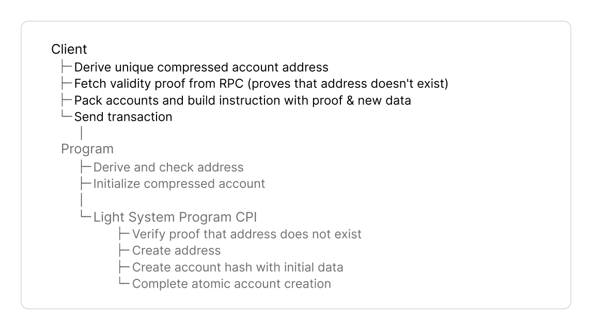

# Overview

Use this guide to build a Typescript or Rust client. Here is the complete flow:



<figure><picture><source srcset="../../.gitbook/assets/client-create (1).png" media="(prefers-color-scheme: dark)"></picture><figcaption></figcaption></figure>



<figure><picture><source srcset="../../.gitbook/assets/client-update (1).png" media="(prefers-color-scheme: dark)"></picture><figcaption></figcaption></figure>



<figure><picture><source srcset="../../.gitbook/assets/client-close (1).png" media="(prefers-color-scheme: dark)"></picture><figcaption></figcaption></figure>



<figure><picture><source srcset="../../.gitbook/assets/client-reinit (1).png" media="(prefers-color-scheme: dark)"></picture><figcaption></figcaption></figure>



<figure><picture><source srcset="../../.gitbook/assets/client-burn (1).png" media="(prefers-color-scheme: dark)"></picture><figcaption></figcaption></figure>




Ask anything via [](https://deepwiki.com/Lightprotocol/light-protocol/3.1-javascripttypescript-sdks).




## Installation and Setup



The Typescript SDK consists of 

1. [@lightprotocol/stateless.js](https://lightprotocol.github.io/light-protocol/stateless.js/index.html): The core RPC client that provides the ZK Compression RPC interface to query and build transactions that create or interact with compressed accounts on Solana. 

2. [@lightprotocol/compressed-token](https://lightprotocol.github.io/light-protocol/compressed-token/index.html) uses the stateless.js RPC interface to build transactions with compressed tokens.


Use the [API documentation]( https://lightprotocol.github.io/light-protocol/) to look up specific function signatures, parameters, and return types.


### 1. Installation



```bash
npm install --save \
    @lightprotocol/stateless.js@0.22.1-alpha.1 \
    @lightprotocol/compressed-token@0.22.1-alpha.1 \
    @solana/web3.js
```



```bash
yarn add \
    @lightprotocol/stateless.js@0.22.1-alpha.1 \
    @lightprotocol/compressed-token@0.22.1-alpha.1 \
    @solana/web3.js
```



```bash
pnpm add \
    @lightprotocol/stateless.js@0.22.1-alpha.1 \
    @lightprotocol/compressed-token@0.22.1-alpha.1 \
    @solana/web3.js
```



### 2. Create an RPC Connection


`Rpc` and `TestRpc` implement the same `CompressionApiInterface` for consistent usage across `TestRpc`, local test validator, and public Solana networks.


**Use `Rpc` for test-validator, devnet and mainnet**
  * `Rpc` is a thin wrapper extending Solana's web3.js `Connection` class with compression-related endpoints.
  * Connects to Photon indexer to query compressed accounts and prover service to generate validity proofs.


```typescript
const rpc = createRpc('https://mainnet.helius-rpc.com/?api-key=YOUR_API_KEY');
```



```typescript
const rpc = createRpc('https://devnet.helius-rpc.com/?api-key=YOUR_API_KEY');
```




```bash
light test-validator
```

Start a start a single-node Solana cluster, an RPC node, and a prover node at ports 8899, 8784, and 3001.




**For unit tests, use `TestRpc`** to start a mock RPC instance that parses events and builds Merkle trees on-demand without persisting state.
```typescript
const lightWasm: LightWasm = await WasmFactory.getInstance();
const testRpc = await getTestRpc(lightWasm);
```





The Rust SDK consists of

1. [`light-client`](https://docs.rs/light-client): The RPC client that provides the ZK Compression RPC interface to query and build transactions for **compressed accounts and tokens** on Solana.

2. [`light-sdk`](https://docs.rs/light-sdk): Program-side abstractions (macros, wrappers, CPI interface) to create and interact with compressed accounts in Solana programs. Similar to Anchor's `Account` pattern.

**For devnet and mainnet, use `light-client`**
* Connects to Photon indexer to query compressed accounts and generate validity proofs.

```toml
[dependencies]
light-client = "0.16.0"
light-sdk = "0.16.0"
```



```rust
let config = LightClientConfig::new(
    "https://api.mainnet-beta.solana.com".to_string(),
    Some("https://mainnet.helius.xyz".to_string()),
    Some("YOUR_API_KEY".to_string())
);

let mut client = LightClient::new(config).await?;

client.payer = read_keypair_file("~/.config/solana/id.json")?;
```



```rust
let config = LightClientConfig::devnet(
    Some("https://devnet.helius-rpc.com".to_string()),
    Some("YOUR_API_KEY".to_string())
);

let mut client = LightClient::new(config).await?;

client.payer = read_keypair_file("~/.config/solana/id.json")?;
```



```rust
let config = LightClientConfig::local();

let mut client = LightClient::new(config).await?;

client.payer = read_keypair_file("~/.config/solana/id.json")?;
```

Requires running `light test-validator` locally:

```bash
light test-validator
```

Starts a start a single-node Solana cluster, an RPC node, and a prover node at ports 8899, 8784, and 3001.



**For local testing, use [`light-program-test`](https://docs.rs/light-program-test)**.
* Initializes a [LiteSVM](https://github.com/LiteSVM/LiteSVM) optimized for ZK Compression with auto-funded payer and TestIndexer. Requires Light CLI for program binaries.
* Use for unit and integration tests of your program or client code.

```toml
[dev-dependencies]
light-program-test = "0.16.0"
light-sdk = "0.16.0"
```

```rust
let config = ProgramTestConfig::new_v2(
    true,
    Some(vec![("program_create", program_create::ID)])
);
let mut rpc = LightProgramTest::new(config).await.unwrap();
let payer = rpc.get_payer().insecure_clone();
```


`LightClient` and `LightProgramTest` implement the same [`Rpc`](https://docs.rs/light-client/latest/light_client/rpc/trait.Rpc.html) and [`Indexer`](https://docs.rs/light-client/latest/light_client/indexer/trait.Indexer.html) traits for consistent usage across `light-program-test`, local test validator, and public Solana networks.







## Tree Configuration

Your client must fetch metadata of two Merkle trees:

* an address tree to derive and store the account address and
* a state tree to store the compressed account hash.


The protocol maintains Merkle trees. You don't need to initialize custom trees.
Find the [addresses for Merkle trees here](https://www.zkcompression.com/resources/addresses-and-urls).



V2 is currently on Devnet. Use to optimize compute unit consumption by up to 70%.








```typescript
const addressTree = getDefaultAddressTreeInfo();
const stateTreeInfos = await rpc.getStateTreeInfos();
const outputStateTree = selectStateTreeInfo(stateTreeInfos);
```





```typescript
const addressTree = await rpc.getAddressTreeInfoV2();
const stateTreeInfos = await rpc.getStateTreeInfos();
const outputStateTree = selectStateTreeInfo(stateTreeInfos);
```











```rust
let address_tree_info = rpc.get_address_tree_v1();
let output_state_tree_info = rpc.get_random_state_tree_info().unwrap();
```





```rust
let address_tree_info = rpc.get_address_tree_v2();
let output_state_tree_info = rpc.get_random_state_tree_info().unwrap();
```








**Address Tree methods** return `TreeInfo` of address trees with the public key and other metadata for the address tree.

You will use the address tree `TreeInfo` again:
1. In the next step to derive the address for the compressed account.
2. In Step 4 for `getValidityProofV0()` to prove the address does not exist yet, if you create compressed accounts with address.

**State Tree methods** return an array of `TreeInfo` objects of state trees with public key and other metadata. With these methods you select a random state tree to store the compressed account hash. 

You will use the state tree `TreeInfo` again:
1. In Step 4 for `getValidityProofV0()` to prove the account hash exists in the state tree, if you update/close/reinit/burn a compressed account.
2. In Step 5 for packing accounts to optimize instruction data.
* Assigns indices to accounts instead of repeating full pubkeys



* Account hashes can move to different state trees after each state transition.
* Since trees fill up over time, your programs must be able to handle accounts from different state trees within the same transaction.
* **Best practice**: minimize the number of different trees per transaction. 


<details>
<summary>Expand to learn what pubkeys and other metadata of a Merkle tree <code>TreeInfo</code> contains.</summary>

* `tree`: Merkle tree account pubkey
* `queue`: Queue account pubkey of queue associated with a Merkle tree
  * Buffers updates of compressed accounts before they are added to the Merkle tree.
  * Clients and programs do not interact with the queue. The Light System Program inserts values into the queue.
* `treeType`: Automatically set based on which tree selection method you used.
* `cpiContext`: Optional CPI context account for batched operations across multiple programs (may be null, currently on devnet)
  * Allows a single zero-knowledge proof to verify compressed accounts from different programs in one instruction
  * Reduces instruction data size and compute unit costs when multiple programs interact with compressed accounts
* `nextTreeInfo`: Next tree to use when current tree reaches ~95% capacity (may be null).
    * The SDK automatically switches to next tree when present. Developers don't need to handle tree rollovers manually.
    * The protocol creates new trees, once existing trees fill up.
</details>




## Derive Address

Derive a persistent address as a unique identifier for your compressed account, similar to [program-derived addresses (PDAs)](https://solana.com/docs/core/pda).

* Use the derivation method that matches your address tree type from the previous step (V1 or V2).
* Like PDAs, compressed account addresses don't belong to a private key; rather, they're derived from the program that owns them.
* The key difference to PDAs is that compressed accounts require an **address tree** parameter.


V2 is currently on Devnet. Use to optimize compute unit consumption by up to 70%.








```typescript
const seed = deriveAddressSeed(
  [Buffer.from('my-seed')],
  programId
);
const address = deriveAddress(seed, addressTree.tree);
```


**1. Derive the seed**:

* Seeds are predefined inputs, such as strings, numbers or other account addresses.
* Specify `programId` to combine with your seeds

**2. Then, derive the address**:

* Pass the derived 32-byte `seed` from the first step
* Specify `addressTree.tree` pubkey




```typescript
const seed = deriveAddressSeedV2(
  [Buffer.from('my-seed')]
);
const address = deriveAddressV2(seed, addressTree.tree, programId);
```


**1. Derive the seed**:

* Seeds are predefined inputs, such as strings, numbers or other account addresses.

**2. Then, derive the address**:

* Pass the derived 32-byte `seed` from the first step.
* Specify `addressTree.tree` pubkey to ensure an address is unique to an address tree. Different trees produce different addresses from identical seeds.
* Specify `programId` in the address derivation. V2 includes it here instead of the first step.










```rust
use light_sdk::address::v1::derive_address;

let (address, _) = derive_address(
    &[b"my-seed"],
    &address_tree_info.tree,
    &program_id,
);
```





```rust
use light_sdk::address::v2::derive_address;

let (address, _) = derive_address(
    &[b"my-seed"],
    &address_tree_info.tree,
    &program_id,
);
```




**Pass these parameters**:

* `&[b"my-seed"]`: Predefined inputs, such as strings, numbers or other account addresses.
* `&address_tree_info.tree`: Specify the tree pubkey to ensure an address is unique to this address tree. Different trees produce different addresses from identical seeds.
* `&program_id`: Specify the program owner pubkey.





Use the same address tree for both address derivation and all subsequent operations:

* To create a compressed account, pass the address to the validity proof, to prove the address does not exist yet.
* To update/close, use the address to fetch the current account with `getCompressedAccount(address)` / `get_compressed_account(address)`.






### Validity Proof

Fetch a validity proof from your RPC provider that supports ZK Compression (Helius, Triton, ...). The proof type depends on the operation:

* To create a compressed account, you must prove the **address doesn't already exist** in the address tree.
* To update or close a compressed account, you must **prove its account hash exists** in a state tree.
* You can **combine multiple addresses and hashes in one proof** to optimize compute cost and instruction data.


[Here's a full guide](https://www.zkcompression.com/resources/json-rpc-methods/getvalidityproof) to the `getValidityProofV0()` / `get_validity_proof()` method.







```typescript
const proof = await rpc.getValidityProofV0(
  [],
  [{ address: bn(address.toBytes()), tree: addressTree.tree, queue: addressTree.queue }]
);
```


**1. Pass these parameters**:

* Leave (`[]`) empty to create compressed accounts, since no compressed account exists yet to reference.
* Specify the derived address with its `tree` and `queue` pubkeys from the address tree `TreeInfo`.

**2. The RPC returns**:

* `compressedProof`: The proof that the address does not exist in the address tree, passed to the program in your instruction data.
* `rootIndices`: An array with root index from the validity proof for the address tree.
* Empty `leafIndices` array, since you do not reference an existing account, when you create a compressed account.




These operations proof that the account hash exists in the state tree. The difference is in your program's instruction handler.



```typescript
const hash = compressedAccount.hash;
const tree = compressedAccount.treeInfo.tree;
const queue = compressedAccount.treeInfo.queue;

const proof = await rpc.getValidityProofV0(
  [{ hash, tree, queue }],
  []
);
```


**1. Pass these parameters**:

* Specify the account `hash` along with `tree` and `queue` pubkeys from the compressed account's `TreeInfo`.
* (`[]`) remains empty, since the proof verifies the account hash exists in a state tree, not that the address doesn't exist in an address tree.

**2. The RPC returns**:

* `compressedProof`: The proof that the account hash exists in the state tree, passed to the program in your instruction data.
* `rootIndices` and `leafIndices` arrays with proof metadata to pack accounts in the next step.










```rust
let rpc_result = rpc
    .get_validity_proof(
        vec![],
        vec![AddressWithTree {
            address: *address,
            tree: address_tree_info.tree,
        }],
        None,
    )
    .await?
    .value;
```


**1. Pass these parameters**:

* Leave (`vec![]`) empty to create compressed accounts, since no compressed account exists yet to reference.
* Specify the new address with `tree` pubkey from the address tree `TreeInfo` in `vec![AddressWithTree]`. Rust does not have a queue field, different from Typescript.

**2. The RPC returns `ValidityProofWithContext`**:

* `proof` to prove that the address does not exist in the address tree, passed to the program in your instruction data.
* `addresses` with the public key and metadata of the address tree to pack accounts in the next step.
* An empty `accounts` field, since you do not reference an existing account, when you create a compressed account.




These operations proof that the account hash exists in the state tree. The difference is in your program's instruction handler.



```rust
let hash = compressed_account.hash;

let rpc_result = rpc
    .get_validity_proof(
        vec![hash],
        vec![],
        None,
    )
    .await?
    .value;
```


**1. Pass these parameters**:

* Specify the `hash` extracted from the compressed account in `vec![hash]` to prove its existence in the state tree.
* (`vec![]`) remains empty, since the proof verifies the account hash exists in a state tree, not that the address doesn't exist in an address tree.

**2. The RPC returns `ValidityProofWithContext`**:

* `proof` with the proof that the account hash exists in the state tree, passed to the program in your instruction data.
* `accounts` with the public key and metadata of the state tree to pack accounts in the next step.
* An empty `addresses` field (only needed when creating an address).







### Optimize with Single Combined Proofs


**Advantages of combined proofs**:
* You only add one validity proof with 128 bytes in size instead of two to your instruction data.
* Reduction of compute unit consumption by at least 100k CU, since combined proofs are verified in a single CPI by the Light System Program.



The specific combinations and maximums to combine proofs depend on the circuit version (v1 or v2) and the proof type.

* Combine multiple hashes **or** multiple addresses in a single proof, or
* multiple hashes **and** addresses in a single combined proof.



V1 circuits can prove in a single proof

* 1, 2, 3, 4, or 8 hashes,
* 1, 2, 3, 4, or 8 addresses, or
* multiple hashes or addresses in any combination of the below.

| **Single Combined Proofs** | Any combination of |
| -------------------------- | :----------------: |
| Hashes                     |    1, 2, 3, 4, 8   |
| Addresses                  |     1, 2, 4, 8     |



V2 circuits can prove in a single proof

* 1 to 20 hashes,
* 1 to 32 addresses, or
* multiple hashes or addresses in any combination of the below.

| **Single Combined Proofs** | Any combination of |
| -------------------------- | :----------------: |
| Hashes                     |       1 to 4       |
| Addresses                  |       1 to 4       |




The combinations and maximums are determined by the available circuit verifying keys. Different proof sizes require different circuits optimized for that specific combination. View the [source code here](https://github.com/Lightprotocol/light-protocol/tree/871215642b4b5b69d2bcd7eca22542346d0e2cfa/program-libs/verifier/src/verifying_keys).





In this example we update an existing account, and create a new account in the same transaction.


```typescript
const hash = compressedAccount.hash;
const tree = compressedAccount.treeInfo.tree;
const queue = compressedAccount.treeInfo.queue;

const proof = await rpc.getValidityProofV0(
  [{ hash, tree, queue }],
  [{ address: bn(address.toBytes()), tree: addressTree.tree, queue: addressTree.queue }]
);
```


**1. Pass these parameters**:

* Specify one or more account `hash` values along with `tree` and `queue` pubkeys from the compressed account's `TreeInfo`.
* Specify one or more derived addresses with `tree` and `queue` pubkeys from the address tree `TreeInfo`.

**2. The RPC returns:**

* `compressedProof`: A single combined proof that verifies both the account hash exists in the state tree and the address does not exist in the address tree, passed to the program in your instruction data.
* `rootIndices` and `leafIndices` arrays with proof metadata to build `PackedAddressTreeInfo` and `PackedStateTreeInfo` in the next step.





In this example we update an existing account, and create a new account in the same transaction.


```rust
let hash = compressed_account.hash;

let rpc_result = rpc
    .get_validity_proof(
        vec![hash],
        vec![AddressWithTree {
            address: *address,
            tree: address_tree_info.tree,
        }],
        None,
    )
    .await?
    .value;
```


**1. Pass these parameters**:

* Specify one or more `hash` values extracted from compressed accounts in `vec![hash]` to prove existence in the state trees.
* Specify one or more addresses with `tree` pubkey from the address tree `TreeInfo` in `vec![AddressWithTree]` to prove non-existence in address trees.

**2. The RPC returns `ValidityProofWithContext` with**

* `proof`: A single combined proof, passed to the program in your instruction data.
* `addresses` with the public key and metadata of the address tree to pack accounts in the next step.
* `accounts` with the public key and metadata of the state tree to pack accounts in the next step.







## Pack Accounts

To optimize instruction data we pack accounts into an array:

* Every packed account is assigned to an u8 index.
* Indices are included in instruction data, instead of 32 byte pubkeys.
* The indices point to the instructions accounts
  * in anchor to `remainingAccounts`, and
  * in native programs to the account info slice.















## 















