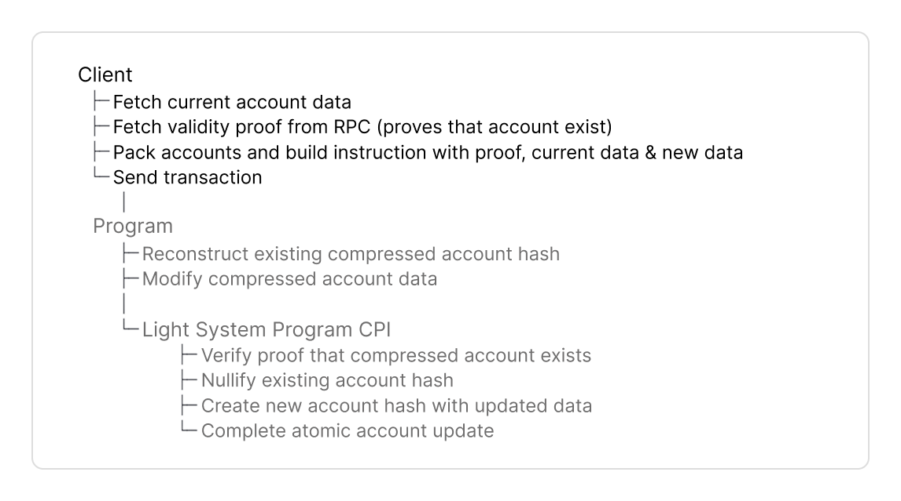

# Overview

Use this guide to build a Typescript or Rust client.




The Typescript client provides 

1. [@lightprotocol/stateless.js](https://lightprotocol.github.io/light-protocol/stateless.js/index.html) is the core RPC client that provides the ZK Compression RPC interface to query and build transactions that create or interact with compressed accounts on Solana. 

2. [@lightprotocol/compressed-token](https://lightprotocol.github.io/light-protocol/compressed-token/index.html) uses the stateless.js RPC interface to build transactions with compressed tokens.

### Installation






```bash
npm install --save \
    @lightprotocol/stateless.js@0.22.1-alpha.1 \
    @lightprotocol/compressed-token@0.22.1-alpha.1 \
    @solana/web3.js
```



```bash
yarn add \
    @lightprotocol/stateless.js@0.22.1-alpha.1 \
    @lightprotocol/compressed-token@0.22.1-alpha.1 \
    @solana/web3.js
```



```bash
pnpm add \
    @lightprotocol/stateless.js@0.22.1-alpha.1 \
    @lightprotocol/compressed-token@0.22.1-alpha.1 \
    @solana/web3.js
```




Use the [API documentation]( https://lightprotocol.github.io/light-protocol/) to look up specific function signatures, parameters, and return types.


### Create an RPC Connection

* **For unit tests, use `TestRpc`.**
  * Mock RPC instance that parses events and builds Merkle trees on-demand without persisting state.
* **For test-validator, devnet and mainnet use `Rpc`.**
  * `Rpc` is a thin wrapper extending Solana's web3.js `Connection` class with compression-related endpoints.
  * Connects to Photon indexer to query compressed accounts and prover service to generate validity proofs.
* `Rpc` and `TestRpc` implement the same `CompressionApiInterface` for consistent usage across `TestRpc`, local test validator, and public Solana networks.



Connect to local, devnet or mainnet with `Rpc`.




```typescript
import { createRpc } from '@lightprotocol/stateless.js';

const rpc = createRpc('https://mainnet.helius-rpc.com/?api-key=YOUR_API_KEY');
```





```typescript
import { createRpc } from '@lightprotocol/stateless.js';

const rpc = createRpc('https://devnet.helius-rpc.com/?api-key=YOUR_API_KEY');
```




Start a local test-validator with the below command. It will start a single-node Solana cluster, an RPC node, and a prover node at ports 8899, 8784, and 3001.


```bash
light test-validator
```


Then connect to it:


```typescript
import { createRpc } from '@lightprotocol/stateless.js';

const rpc = createRpc();
```






Set up test environment with `TestRpc`.


```typescript
import { getTestRpc } from '@lightprotocol/stateless.js';
import { LightWasm, WasmFactory } from '@lightprotocol/hasher.rs';

const lightWasm: LightWasm = await WasmFactory.getInstance();
const testRpc = await getTestRpc(lightWasm);
```






* **For local testing, use** [**`light-program-test`**](https://docs.rs/light-program-test)**.**
  * Initializes a [LiteSVM](https://github.com/LiteSVM/LiteSVM) optimized for ZK Compression with auto-funded payer, local prover server and TestIndexer to generate proofs instantly. Requires Light CLI for program binaries.
  * Use for unit and integration tests of your program or client code.
* **For devnet and mainnet use** [**`light-client`**](https://docs.rs/light-client)
  * `light-client` is an RPC client for compressed accounts and tokens.
  * Connects to Photon indexer to query compressed accounts and generate validity proofs.
* `LightClient` and `LightProgramTest` implement the same [`Rpc`](https://docs.rs/light-client/latest/light_client/rpc/trait.Rpc.html) and [`Indexer`](https://docs.rs/light-client/latest/light_client/indexer/trait.Indexer.html) traits for consistent usage across `light-program-test`, local test validator, and public Solana networks.




Find [full code examples at the end](add) for Anchor.


# Implementation Guide


Ask anything via [](https://deepwiki.com/Lightprotocol/light-protocol/3.1-javascripttypescript-sdks).


This guide covers the components to build a Rust and Typescript client. Here is the complete flow:



<figure><picture><source srcset="../../.gitbook/assets/client-create (1).png" media="(prefers-color-scheme: dark)"></picture><figcaption></figcaption></figure>



<figure><picture><source srcset="../../.gitbook/assets/client-update (1).png" media="(prefers-color-scheme: dark)"></picture><figcaption></figcaption></figure>



<figure><picture><source srcset="../../.gitbook/assets/client-close (1).png" media="(prefers-color-scheme: dark)"></picture><figcaption></figcaption></figure>



<figure><picture><source srcset="../../.gitbook/assets/client-reinit (1).png" media="(prefers-color-scheme: dark)"></picture><figcaption></figcaption></figure>



<figure><picture><source srcset="../../.gitbook/assets/client-burn (1).png" media="(prefers-color-scheme: dark)"></picture><figcaption></figcaption></figure>





### Dependencies








```toml
[dependencies]
light-client = "0.16.0"
light-sdk = "0.16.0"
tokio = { version = "1", features = ["full"] }
solana-program = "2.2"
anchor-lang = "0.31.1" 
```





```toml
[dev-dependencies]
light-program-test = "0.16.0"
light-sdk = "0.16.0"
tokio = { version = "1", features = ["full"] }
solana-program = "2.2"
anchor-lang = "0.31.1"
```





The [`light-sdk`](https://docs.rs/light-sdk) provides abstractions similar to Anchor's `Account`: macros, wrappers and CPI interface to create and interact with compressed accounts in Solana programs.






