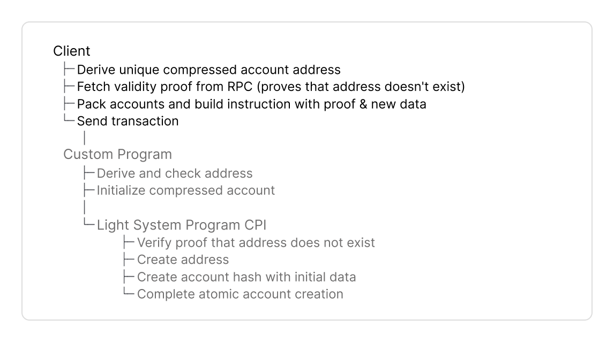
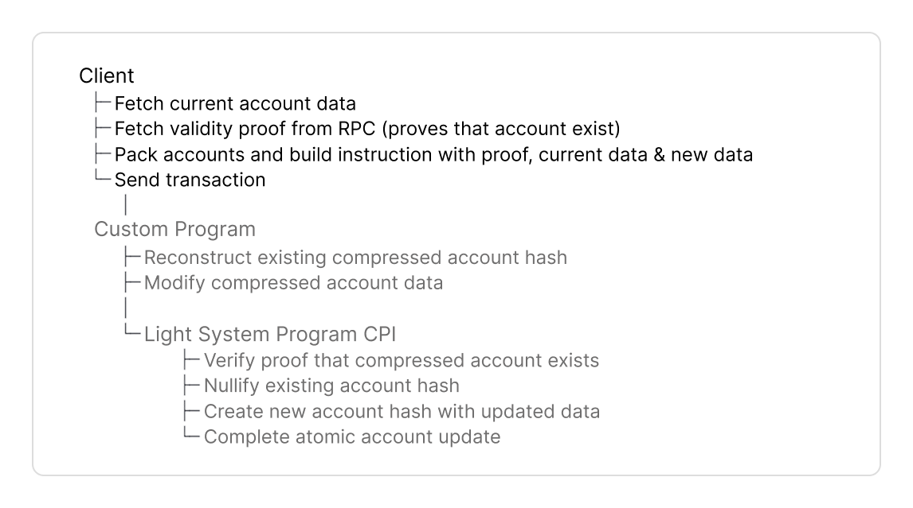
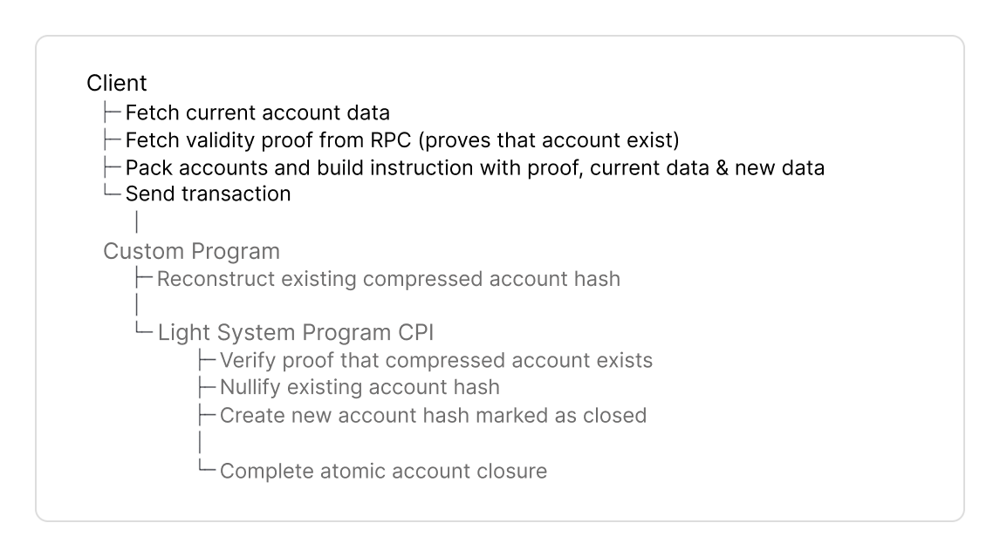
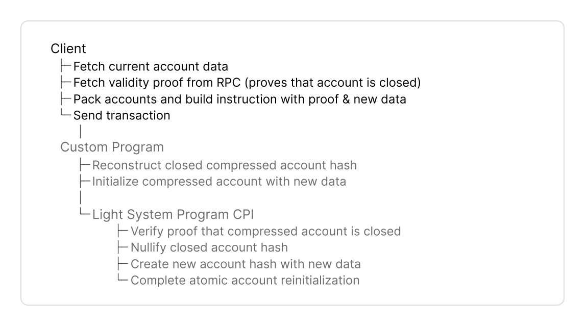
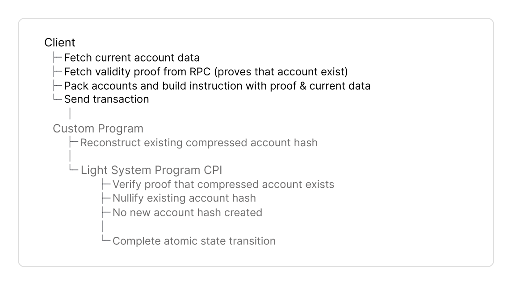

# Rust

The Rust Client SDK provides two abstractions to create or interact with compressed accounts and tokens:

* **For local testing, use `light-program-test`.**
  * [`light-program-test`](https://docs.rs/light-program-test) is a local test environment.
  * It creates an in-process Solana VM via [LiteSVM](https://github.com/LiteSVM/LiteSVM) with auto-funded payer, local prover server and in-memory indexer. Requires Light CLI for program binaries.
* **For devnet and mainnet use `light-client`**
  * [`light-client`](https://docs.rs/light-client) is an RPC client for compressed accounts and tokens. Find a [full list of JSON RPC methods here](https://www.zkcompression.com/resources/json-rpc-methods).
  * It connects to the Photon indexer that tracks compressed state to query compressed accounts and the prover service for validity proofs.
* `LightClient` and `LightProgramTest` implement the same [`Rpc`](https://docs.rs/light-client/latest/light_client/rpc/trait.Rpc.html) and [`Indexer`](https://docs.rs/light-client/latest/light_client/indexer/trait.Indexer.html) traits. Seamlessly switch between `light-program-test`, local test validator, and public Solana networks.


Find full code examples for a counter program [at the end for Anchor and native Rust](rust.md#full-code-example).


## Implementation Guide



<figure><picture><source srcset="../../.gitbook/assets/create.png" media="(prefers-color-scheme: dark)"></picture><figcaption></figcaption></figure>



<figure><picture><source srcset="../../.gitbook/assets/update-dark.png" media="(prefers-color-scheme: dark)"></picture><figcaption></figcaption></figure>



<figure><picture><source srcset="../../.gitbook/assets/close-dark.png" media="(prefers-color-scheme: dark)"></picture><figcaption></figcaption></figure>



<figure><picture><source srcset="../../.gitbook/assets/reinit-dark.png" media="(prefers-color-scheme: dark)"></picture><figcaption></figcaption></figure>



<figure><picture><source srcset="../../.gitbook/assets/burn-dark.png" media="(prefers-color-scheme: dark)"></picture><figcaption></figcaption></figure>





### Dependencies



```toml
[dependencies]
light-client = "0.15.0"
light-sdk = "0.15.0"
tokio = { version = "1.0", features = ["full"] }
solana-program = "2.2"
anchor-lang = "0.31.1"  # if using Anchor programs
```



```toml
[dependencies]
light-program-test = "0.15.0"
light-sdk = "0.15.0"
tokio = { version = "1.0", features = ["full"] }
solana-program = "2.2"
anchor-lang = "0.31.1"  # if using Anchor programs
```




The [`light-sdk`](https://docs.rs/light-sdk) provides abstractions similar to Anchor's `Account`: macros, wrappers and CPI interface to create and interact with compressed accounts on Solana.




### Environment



Connect to local, devnet or mainnet with `LightClient`.



```rust
use light_client::{LightClient, LightClientConfig};
use solana_sdk::signature::read_keypair_file;

let config = LightClientConfig::new(
    "https://api.mainnet-beta.solana.com".to_string(),
    Some("https://mainnet.helius.xyz".to_string()),
    Some("YOUR_API_KEY".to_string())
);

let mut client = LightClient::new(config).await?;

client.payer = read_keypair_file("~/.config/solana/id.json")?;
```



```rust
use light_client::{LightClient, LightClientConfig};
use solana_sdk::signature::read_keypair_file;

let config = LightClientConfig::new(
    "https://devnet.helius-rpc.com/?api-key=YOUR_API_KEY".to_string(),
);

let mut client = LightClient::new(config).await?;

client.payer = read_keypair_file("~/.config/solana/id.json")?;
```

* For Helius devnet RPC: Use the standard RPC endpoint. The endpoint serves both standard RPC and Photon indexer API.



```rust
use light_client::{LightClient, LightClientConfig};
use solana_sdk::signature::read_keypair_file;

let config = LightClientConfig::local();

let mut client = LightClient::new(config).await?;

client.payer = read_keypair_file("~/.config/solana/id.json")?;
```

* Requires running `light test-validator` locally





For testing, `LightProgramTest` provides a validator with auto-funded keypair and all infrastructure.

```rust
let config = ProgramTestConfig::new_v2(
    true,
    Some(vec![("counter", counter::ID)])
);
let mut rpc = LightProgramTest::new(config).await.unwrap();
let payer = rpc.get_payer().insecure_clone();
```





### Tree Configuration

Before creating a compressed account, your client must fetch metadata of two Merkle trees:

* an address tree to derive and store the account address and
* a state tree to store the account hash.


The protocol maintains Merkle trees. You don't need to initialize custom trees. See the [addresses for Merkle trees here](https://www.zkcompression.com/resources/addresses-and-urls).


```rust
let address_tree_info = rpc.get_address_tree_v1();
let output_state_tree_info = rpc.get_random_state_tree_info().unwrap();
```

Fetch metadata of trees with:

* `get_address_tree_v1()` to return the `TreeInfo` struct with the public key and other metadata for the address tree.
  * Used to derive addresses with `derive_address()` and
  * for `get_validity_proof()` to prove the address does not exist yet to avoid duplicate addresses.
* `get_random_state_tree_info()` to return the `TreeInfo` struct with the public key and other metadata for a random state tree to store the compressed account hash.
  * Selecting a random state tree prevents write-lock contention on state trees and increases throughput.
  * Account hashes can move to different state trees after each state transition.
  * Best practice is to minimize different trees per transaction. Still, since trees may fill up over time, programs must handle accounts from different state trees within the same transaction. The protocol creates new trees, once existing trees fill up.


`TreeInfo` contains metadata for a Merkle tree:

* `tree`: Merkle tree account pubkey
* `queue`: Queue account pubkey
  * Buffers insertions before they are added to the Merkle tree
  * Client and program do not interact directly with the queue
* `treeType`: Identifies tree version and account&#x20;
* `cpiContext`: Optional CPI context account for batched operations across multiple programs (may be null)
  * Allows a single zero-knowledge proof to verify compressed accounts from different programs in one instruction
  * First program caches its signer checks, second program reads them and combines instruction data
  * Reduces instruction data size and compute unit costs when multiple programs interact with compressed accounts
* `nextTreeInfo`: The tree to use for the next operation when the current tree is full (may be null)
  * When set, switch to this tree instead of continuing with the current one




### Derive Address

Derive a persistent address as a unique identifier for your compressed account with `derive_address()`.

```rust
use light_sdk::address::v1::derive_address;

let (address, _) = derive_address(
    &[b"my-seed"],
    &address_tree_info.tree,
    &program_id,
);
```

**Pass these parameters**:

* `&[b"my-seed"]`: Arbitrary byte slices that uniquely identify the account
* `&address_tree_info.tree` to specify the tree pubkey. This parameter ensures an address is unique to an address tree. Different trees produce different addresses from identical seeds.
* `ProgramID` to specify the program owner pubkey.


Use the same `address_tree_info.tree` for both `derive_address()` and all subsequent operations on that account in your client and program.

* To create a compressed account, pass the address to `get_validity_proof()` to prove the address does not exist yet, or
* To update/close, use the address to fetch the current account with `get_compressed_account(address)`.




### Validity Proof

Fetch a zero-knowledge proof (Validity proof) from your RPC provider that supports ZK Compression (Helius, Triton, ...). What is proved depends on the operation:

* To create a compressed account, you must prove the **address doesn't already exist** in the address tree.
* To update or close a compressed account, you must **prove its account hash exists** in a state tree.
* You can **combine multiple operations in one proof** to optimize compute cost and instruction data.


[Here's a full guide](https://www.zkcompression.com/resources/json-rpc-methods/getvalidityproof) to the `get_validity_proof()` method.




```rust
let rpc_result = rpc
    .get_validity_proof(
        vec![], 
        vec![AddressWithTree {
            address: *address,
            tree: address_tree_info.tree,
        }],
        None,
    )
    .await?
    .value;
```

**Pass these parameters**:

* Leave (`vec![]`) empty to create compressed accounts, since no compressed account exists yet to reference.
* Specify in (`vec![AddressWithTree]`) the new address to create with its address tree.

The RPC returns `ValidityProofWithContext` with

* `proof` to prove that the address does not exist in the address tree, passed to the program in your instruction data.
* `addresses` with the public key and metadata of the address tree to pack accounts in the next step.
* An empty `accounts` field, since you do not reference an existing account, when you create a compressed account.




**Update and Close** use identical proof mechanisms. The difference is in your program's instruction handler.


```rust
let hash = compressed_account.hash;

let rpc_result = rpc
    .get_validity_proof(
        vec![hash],  
        vec![],
        None,
    )
    .await?
    .value;
```

**Pass these parameters**:

* Specify in (`vec![hash]`) the hash of the existing compressed account to prove its existence in the state tree.
* Leave (`vec![]`) empty, since the proof verifies the account hash exists in a state tree, not the address in an address tree.

The RPC returns `ValidityProofWithContext` with

* `proof` with the proof that the account hash exists in the state tree, passed to the program in your instruction data.
* `accounts` with the public key and metadata of the state tree to pack accounts in the next step.
* An empty `addresses` field, since you passed no metadata to create an address, when you update or close a compressed account.




**Advantages of combined proofs**:

* Combining proof generation and verification reduces \~30,000-40,000 compute units per instruction
* You only add one validity proof with 128 bytes in size instead of two to your instruction data.
* The Light System Program computes one combined hash instead of verifying two separate hashes from both parameters


```rust
let hash = compressed_account.hash;

let rpc_result = rpc
    .get_validity_proof(
        vec![hash],
        vec![AddressWithTree {
            address: *address,
            tree: address_tree_info.tree,
        }],
        None,
    )
    .await?
    .value;
```

**Pass these parameters**:

* Specify in (`vec![hash]`) the hash of the existing compressed account to prove its existence in the state tree.
* Specify in (`vec![AddressWithTree]`) the new address to create with its address tree.

The RPC returns `ValidityProofWithContext` with

* `proof` with a single combined proof that verifies both the account hash exists in the state tree and the address does not exist in the address tree, passed to the program in your instruction data.
* `addresses` with the public key and metadata of the address tree to pack accounts in the next step.
* `accounts` with the public key and metadata of the state tree to pack accounts in the next step.





### Pack Accounts

Compressed account instructions require packing accounts into the `remaining_accounts` array.


**"Packing" accounts optimizes instruction size:**

* **Packed structs** contain account **indices** (u8) instead of 32 byte pubkeys. The indices point to the `remainingAccounts` array.
* **Non-Packed structs** contain full pubkeys. RPC methods return full pubkeys.

You will pass this array in the instruction data.


```rust
let mut remaining_accounts = PackedAccounts::default();
```

`PackedAccounts::default()` creates a helper struct with three empty vectors:

1. `pre_accounts` includes the signers, fee payer, and any program-specific accounts.
2. `system_accounts` includes eight accounts the Light System program requires to create or interact with compressed accounts.
3. `packed_accounts` includes Merkle tree and queue accounts returned from the `getValidityProof()` response in the previous step.

You will populate the vectors in the next steps.

```
[pre_accounts] [system_accounts] [packed_accounts]
       ↑               ↑                ↑
    Signers,    Light System      state trees,
   fee payer      accounts      address trees

```

#### 2. Add Light System Accounts

Add the Light System accounts your program needs to create and interact with compressed via CPI to the Light System Program.

```rust
let config = SystemAccountMetaConfig::new(counter::ID);
remaining_accounts.add_system_accounts(config);
```

* Pass your program ID in `SystemAccountMetaConfig::new(counter::ID)` to derive the CPI signer PDA
* Call `add_system_accounts(config)` - the SDK will populate the `system_accounts` vector with 8 Light System accounts in the sequence below.

<details>

<summary><em>System Accounts List</em></summary>

<table><thead><tr><th width="40">#</th><th width="256.43182373046875">Account</th><th>Description</th></tr></thead><tbody><tr><td>1</td><td><a data-footnote-ref href="#user-content-fn-1">Light System Program</a></td><td>Verifies validity proofs and executes CPI calls to create or interact with compressed accounts</td></tr><tr><td>2</td><td>CPI Signer</td><td>- PDA to sign CPI calls from your program to Light System Program<br>- Verified by Light System Program during CPI<br>- Derived from your program ID</td></tr><tr><td>3</td><td>Registered Program PDA</td><td>- Proves your program can interact with Account Compression Program<br>- Prevents unauthorized programs from modifying compressed account state</td></tr><tr><td>4</td><td><a data-footnote-ref href="#user-content-fn-2">Noop Program</a></td><td>- Logs compressed account state to Solana ledger<br>- Indexers parse transaction logs to reconstruct compressed account state</td></tr><tr><td>5</td><td><a data-footnote-ref href="#user-content-fn-3">Account Compression Authority</a></td><td>Signs CPI calls from Light System Program to Account Compression Program</td></tr><tr><td>6</td><td><a data-footnote-ref href="#user-content-fn-4">Account Compression Program</a></td><td>- Writes to state and address tree accounts<br>- Client and program do not directly interact with this program</td></tr><tr><td>7</td><td>Invoking Program</td><td>Your program's ID, used by Light System Program to:<br>- Derive the CPI Signer PDA<br>- Verify the CPI Signer matches your program ID<br>- Set the owner of created compressed accounts</td></tr><tr><td>8</td><td><a data-footnote-ref href="#user-content-fn-5">System Program</a></td><td>Solana System Program to create accounts or transfer lamports</td></tr></tbody></table>

</details>

#### 3. Pack Tree Accounts from Validity Proof

`getValidityProof()` returns pubkeys and other metadata of Merkle trees. With `pack_tree_infos`, you will convert the pubkeys to u8 indices that reference indices in `remaining_accounts` to optimize your instruction data.



```rust
let packed_address_tree_accounts = rpc_result
    .pack_tree_infos(&mut remaining_accounts)
    .address_trees;
```

Call `pack_tree_infos(&mut remaining_accounts)` to extract tree pubkeys and add them to the accounts array.

The returned `PackedTreeInfos` contains `.address_trees` as `Vec<PackedAddressTreeInfo>`:

* `address_merkle_tree_pubkey_index`: Points to the address tree account in `remaining_accounts`
* `address_queue_pubkey_index`: Points to the address queue account in `remaining_accounts`
  * The queue buffers new addresses before they are inserted into the address tree
* `root_index`: The Merkle root index from the validity proof
  * Specifies which historical root to verify the address does not exist in the tree



```rust
let packed_state_tree_accounts = rpc_result
    .pack_tree_infos(&mut remaining_accounts)
    .state_trees
    .unwrap();
```

Call `pack_tree_infos(&mut remaining_accounts)` to extract tree pubkeys and add them to the accounts array.

The returned `PackedTreeInfos` contains `.state_trees` as `Option<PackedStateTreeInfos>`:

* `merkle_tree_pubkey_index`: Points to the state tree account in `remaining_accounts`
* `queue_pubkey_index`: Points to the nullifier queue account in `remaining_accounts`
  * The queue tracks nullified (spent) account hashes to prevent double-spending
* `leaf_index`: The leaf position in the Merkle tree from the validity proof
  * Specifies which leaf contains your account hash to verify it exists in the tree
* `root_index`: The Merkle root index from the validity proof
  * Specifies which historical root to verify the account hash against



#### 4. Add Output State Tree

```rust
let output_state_tree_index = output_state_tree_info
    .pack_output_tree_index(&mut remaining_accounts)?;
```

* Use `output_state_tree_info` variable from Step 3 - it contains the `TreeInfo` with pubkey and metadata for the randomly selected state tree
* Call `pack_output_tree_index(&mut remaining_accounts)` to convert the tree pubkey to a u8 index in `remaining_accounts`

#### 5. Summary

You initialized the `PackedAccounts::default()` helper struct to merge the following accounts into the `remaining_accounts` array for the instruction data:

* Light System accounts to create and interact with compressed accounts via the Light System Program.
* Tree accounts from the validity proof to prove address non-existence (create), or existence of the account hash (update/close).
* The output state tree to store the new account hash.

The accounts receive a sequential u8 index. Instruction data references accounts via these indices in this order.



### Instruction Data

Build your instruction data with the validity proof, tree account indices, and complete account data.


Compressed account data must be passed in instruction data, since only the Merkle root hash is stored on-chain. This is unlike Solana accounts, where programs can read data directly from accounts.

The program hashes this data and the Light System Program verifies the hash against the root in a Merkle tree account to ensure its correctness.




```rust
let instruction_data = counter::instruction::CreateCounter {
    proof: rpc_result.proof,
    address_tree_info: packed_address_tree_accounts[0],
    output_state_tree_index,
};
```

1. **Validity Proof**

* Add the `ValidityProof` you fetched with `getValidityProof()` from your RPC provider to prove that the address does not exist yet in the specified address tree.

2. **Specify Merkle trees to store address and account hash**

Include the Merkle tree metadata fetched in Step 3:

* `PackedAddressTreeInfo` specifies the index to the address tree account used to derive the address. The index points to the address tree account in `remaining_accounts`.
* `output_state_tree_index` points to the state tree account in `remaining_accounts` that will store the compressed account hash.

3. **Pass initial account data**

* The counter program intializes the account to 0, wherefore no new value needs to be passed.
* If your program requires initial data, add custom fields to your instruction struct.



```rust
let instruction_data = counter::instruction::IncrementCounter {
    proof: rpc_result.proof,
    counter_value: current_counter_value,
    account_meta: CompressedAccountMeta {
        tree_info: packed_state_tree_accounts.packed_tree_infos[0],
        address: compressed_account.address.unwrap(),
        output_state_tree_index: packed_state_tree_accounts.output_tree_index,
    },
};
```

1. **Validity Proof**

* Add the `ValidityProof` you fetched with `getValidityProof()` from your RPC provider to prove the account exists in the state tree.

2. **Specify input hash and output state tree**

Include the Merkle tree metadata fetched in Step 3:

* `CompressedAccountMeta` points to the input hash and specifies the output state tree with these fields:
  * `tree_info: PackedStateTreeInfo` points to the existing account hash that will be nullified by the Light System Program
  * `address` specifies the account's derived address
  * `output_state_tree_index` points to the state tree that will store the updated compressed account hash

3. **Pass current account data**

* Pass the complete current account data. The program reconstructs the existing account hash from this data to verify it matches the hash in the state tree.
* In this example, we pass the current `counterValue`, before incrementing.



```rust
let instruction_data = counter::instruction::CloseCounter {
    proof: rpc_result.proof,
    counter_value: current_counter_value,
    account_meta: CompressedAccountMeta {
        tree_info: packed_state_tree_accounts.packed_tree_infos[0],
        address: compressed_account.address.unwrap(),
        output_state_tree_index: packed_state_tree_accounts.output_tree_index,
    },
};
```

1. **Validity Proof**

* Add the `ValidityProof` you fetched with `getValidityProof()` from your RPC provider to prove the account exists in the state tree.

2. **Specify input hash and output state tree**

Include the Merkle tree metadata fetched in Step 3:

* `CompressedAccountMeta` points to the input hash and specifies the output state tree:
  * `tree_info: PackedStateTreeInfo` points to the existing account hash that will be nullified by the Light System Program
  * `address` specifies the account's derived address
  * `output_state_tree_index` points to the state tree that will store the output hash with zero values

3. **Pass current account data**

* Pass the complete current account data. The program reconstructs the existing account hash from this data to verify it matches the hash in the state tree.
* In this example, we pass the current `counterValue`, before closing.





### Instruction

Build a standard Solana `Instruction` struct with your `program_id`, `accounts`, and `data` from Step 7. Pass the `remaining_accounts` array you built in Step 6.

<pre class="language-rust"><code class="lang-rust">let accounts = counter::accounts::AnchorAccounts { // for non-Anchor build Vec

    signer: payer.pubkey(), 
};                                                                            

let (remaining_accounts_metas, 
    _system_accounts_offset, 
    _tree_accounts_offset) 
        = remaining_accounts.to_account_metas(); 

<strong>let instruction = Instruction {
</strong><strong>    program_id: counter::ID,
</strong><strong>    accounts: [
</strong>        accounts.to_account_metas(Some(true)),
        remaining_accounts_metas,
    ]
    .concat(),
<strong>    data: instruction_data.data(),
</strong>};
</code></pre>

**What to include in `accounts`:**

1. **Create your program-specific accounts struct** with any accounts required by your program. Use `AnchorAccounts`, or manually build `Vec<AccountMeta>` - it won't interfere with compression-related accounts.

* You can safely ignore `_system_accounts_offset` and `_tree_accounts_offset`. The values are passed by the SDK under the hood for your program.
* The client only requires `Vec<AccountMeta>`

<details>

<summary>Here is what happens under the hood</summary>

The values are offset indices returned by `to_account_metas()`:

* `system_accounts_start_offset`: Index in vector where Light System accounts start
* `packed_accounts_start_offset`: Index in vector pointing to the first Merkle tree or queue account
* Your program extracts `system_accounts_start_offset` from the instruction data to slice the accounts array before passing it to `CpiAccounts::new()`.
* `CpiAccounts::new()` requires the accounts slice to start at the Light System Program.
  * If you pass the full array without offsets, `CpiAccounts` expects the Light System accounts to start at position 0, while it's actually at 1.
  * This would lead to the `InvalidCpiAccountsOffset` error. See this page for help with debugging.

</details>

2. **Get Light System accounts** by calling `remaining_accounts.to_account_metas()` to return the merged accounts array with Light System and tree account indices.
3. **Merge all account indices into one vector**:

* `accounts.to_account_metas(Some(true))` converts your Anchor struct to `Vec<AccountMeta>` (Anchor auto-generates this method)
* `remaining_accounts_metas` returns the indices for the Light System and tree accounts.

This is the final account array:

```
[0]    Your program accounts 
[1]    Light System Program
[2]    CPI Signer PDA
[3-8]  Other Light System accounts
[9+]   Merkle trees, queues
```



### Send Transaction

```rust
rpc.create_and_send_transaction(&[instruction],
  &payer.pubkey(), &[payer])
      .await?;
```



## Full Code Example

Full Rust test examples using `light-program-test`.


## Next Steps

Start building programs to create, update, or close compressed accounts.


[guides](../guides/)


[^1]: [Program ID:](https://solscan.io/account/SySTEM1eSU2p4BGQfQpimFEWWSC1XDFeun3Nqzz3rT7) SySTEM1eSU2p4BGQfQpimFEWWSC1XDFeun3Nqzz3rT7

[^2]: [Program ID:](https://solscan.io/account/noopb9bkMVfRPU8AsbpTUg8AQkHtKwMYZiFUjNRtMmV) noopb9bkMVfRPU8AsbpTUg8AQkHtKwMYZiFUjNRtMmV

[^3]: PDA derived from Light System Program ID with seed `b"cpi_authority"`.&#x20;


    [Pubkey](https://solscan.io/account/HZH7qSLcpAeDqCopVU4e5XkhT9j3JFsQiq8CmruY3aru): HZH7qSLcpAeDqCopVU4e5XkhT9j3JFsQiq8CmruY3aru

[^4]: [Program ID](https://solscan.io/account/compr6CUsB5m2jS4Y3831ztGSTnDpnKJTKS95d64XVq): compr6CUsB5m2jS4Y3831ztGSTnDpnKJTKS95d64XVq

[^5]: [Program ID](https://solscan.io/account/11111111111111111111111111111111): 11111111111111111111111111111111
