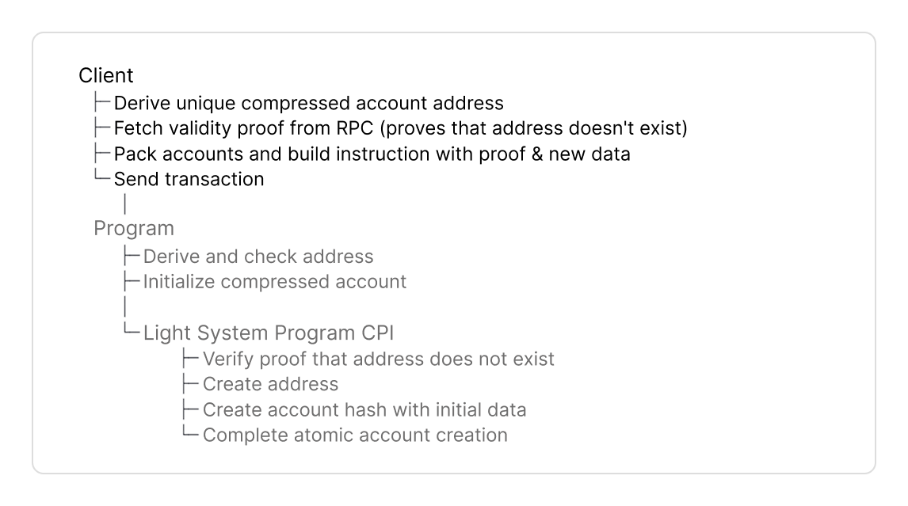
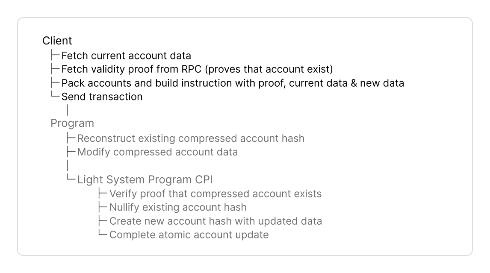
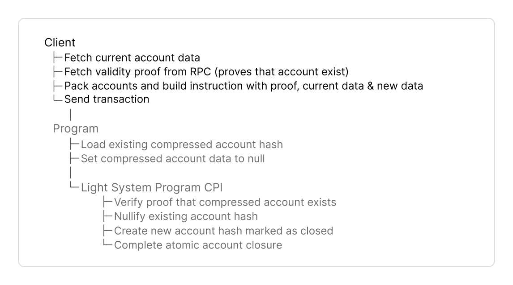
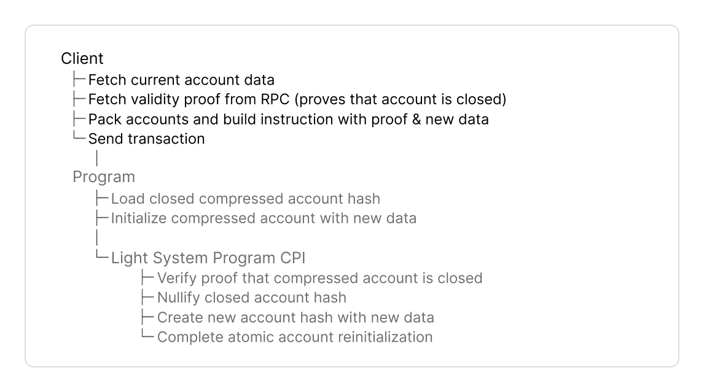
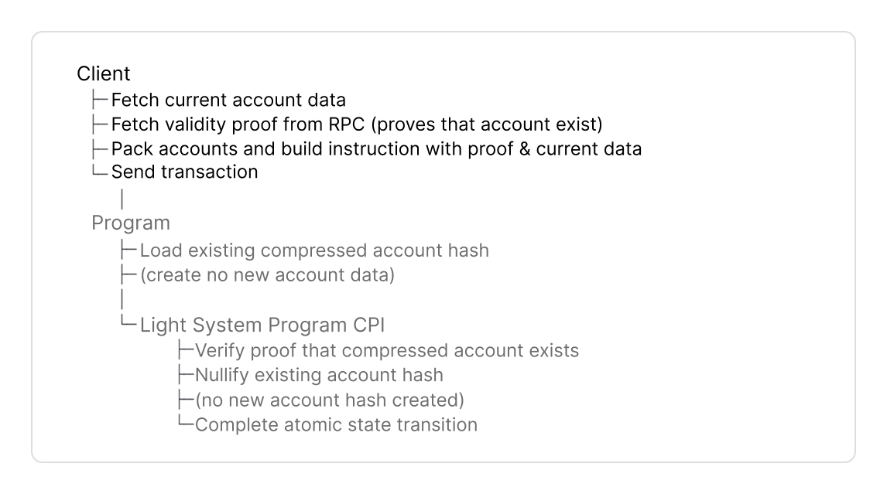

# Typescript

The TypeScript Client SDK provides two test environments:

* **For local testing, use `TestRpc`.**
  * `TestRpc` is a local test environment with in-memory indexer and without external dependencies.
  * Parses events and builds Merkle trees on-demand to generate proofs instantly without persisting state.
* **For test-validator, devnet and mainnet use `Rpc`**
  * `Rpc` is a thin wrapper extending Solana's web3.js `Connection` class with compression-related endpoints. Find a [full list of JSON RPC methods here](https://www.zkcompression.com/resources/json-rpc-methods).
  * Connects to Photon indexer to query compressed accounts and prover service to generate validity proofs.
* `Rpc` and `TestRpc` implement the same `CompressionApiInterface`. Seamlessly switch between `TestRpc`, local test validator, and public Solana networks.


Find [full code examples at the end](typescript.md#full-code-example) for Anchor.


## Implementation Guide

This guide covers the components of a Typescript client. Here is the complete flow:



<figure><picture><source srcset="../../.gitbook/assets/client-create (1).png" media="(prefers-color-scheme: dark)"></picture><figcaption></figcaption></figure>



<figure><picture><source srcset="../../.gitbook/assets/client-update (1).png" media="(prefers-color-scheme: dark)"></picture><figcaption></figcaption></figure>



<figure><picture><source srcset="../../.gitbook/assets/client-close (1).png" media="(prefers-color-scheme: dark)"></picture><figcaption></figcaption></figure>



<figure><picture><source srcset="../../.gitbook/assets/client-reinit (1).png" media="(prefers-color-scheme: dark)"></picture><figcaption></figcaption></figure>



<figure><picture><source srcset="../../.gitbook/assets/client-burn (1).png" media="(prefers-color-scheme: dark)"></picture><figcaption></figcaption></figure>





#### Dependencies



```bash
npm install --save \
    @lightprotocol/stateless.js@0.22.0 \
    @lightprotocol/compressed-token@0.22.0 \
    @solana/web3.js
```



```bash
yarn add \
    @lightprotocol/stateless.js@0.22.0 \
    @lightprotocol/compressed-token@0.22.0 \
    @solana/web3.js
```



```bash
pnpm add \
    @lightprotocol/stateless.js@0.22.0 \
    @lightprotocol/compressed-token@0.22.0 \
    @solana/web3.js
```




`@lightprotocol/stateless.js` provides the core SDK to create and interact with compressed accounts, including `Rpc` and `TestRpc` classes.




#### Environment



Connect to local, devnet or mainnet with `Rpc`.



```typescript
import { createRpc } from '@lightprotocol/stateless.js';

const rpc = createRpc(
  'https://api.mainnet-beta.solana.com',
  'https://mainnet.helius-rpc.com/?api-key=YOUR_API_KEY',
  'https://mainnet.helius-rpc.com/?api-key=YOUR_API_KEY'
);
```



```typescript
import { createRpc } from '@lightprotocol/stateless.js';

const rpc = createRpc(
  'https://devnet.helius-rpc.com/?api-key=YOUR_API_KEY',
  'https://devnet.helius-rpc.com/?api-key=YOUR_API_KEY',
  'https://devnet.helius-rpc.com/?api-key=YOUR_API_KEY'
);
```

* For Helius devnet: The endpoint serves RPC, Photon indexer, and prover API.



```typescript
import { createRpc } from '@lightprotocol/stateless.js';

const rpc = createRpc();
```

* Defaults to `http://127.0.0.1:8899` (RPC), `http://127.0.0.1:8784` (indexer), `http://127.0.0.1:3001` (prover)
* Requires running `light test-validator` locally





Set up test environment with `TestRpc`.

```typescript
import { getTestRpc } from '@lightprotocol/stateless.js';
import { LightWasm, WasmFactory } from '@lightprotocol/hasher.rs';

const lightWasm: LightWasm = await WasmFactory.getInstance();
const testRpc = await getTestRpc(lightWasm);
```





#### Tree Configuration

Before creating a compressed account, your client must fetch metadata of two Merkle trees:

* an address tree to derive and store the account address and
* a state tree to store the compressed account hash.


The protocol maintains Merkle trees. You don't need to initialize custom trees.\
Find the [addresses for Merkle trees here](https://www.zkcompression.com/resources/addresses-and-urls).


```typescript
const addressTree = await rpc.getAddressTreeInfo();
const stateTreeInfos = await rpc.getStateTreeInfos();
const outputStateTree = selectStateTreeInfo(stateTreeInfos);
```

Fetch metadata of trees with:

* `getAddressTreeInfo()` to return `TreeInfo` with the public key and other metadata for the address tree.
  * Used to derive addresses with `deriveAddress()` and
  * for `getValidityProof()` to prove the address does not exist yet.


Only needed to create new addresses. Other interactions with compressed accounts fetch it via the existing address (`getCompressedAccount(address)`).


* `getStateTreeInfos()` returns `TreeInfo[]` with pubkeys and metadata for all active state trees.
* `selectStateTreeInfo()` selects a random state tree to store the compressed account hash.
  * Selecting a random state tree prevents write-lock contention on state trees and increases throughput.
  * Account hashes can move to different state trees after each state transition.
  * Best practice is to minimize different trees per transaction. Still, since trees fill up over time, programs must handle accounts from different state trees within the same transaction.


`TreeInfo` contains metadata for a Merkle tree:

* `tree`: Merkle tree account pubkey
* `queue`: Queue account pubkey
  * Buffers updates of compressed accounts before they are added to the Merkle tree.
  * Clients and programs do not interact with the queue. The Light System Program inserts values into the queue.
* `treeType`: Identifies tree version (StateV1, AddressV2) and account for hash insertion
* `cpiContext` (currently on devnet): Optional CPI context account for batched operations across multiple programs (may be null)
  * Allows a single zero-knowledge proof to verify compressed accounts from different programs in one instruction
  * First program caches its signer checks, second program reads them and combines instruction data
  * Reduces instruction data size and compute unit costs when multiple programs interact with compressed accounts
* `nextTreeInfo`: The tree to use for the next operation when the current tree is full (may be null)
  * When set, use this tree as output tree.
  * The protocol creates new trees, once existing trees fill up.




#### Derive Address

Derive a persistent address as a unique identifier for your compressed account.

```typescript
const seed = deriveAddressSeed(
  [Buffer.from('my-seed')],
  programId
);
const address = deriveAddress(seed, addressTree.tree);
```

**First, derive the seed**:

* Pass arbitrary byte slices in the array to uniquely identify the account
* Specify `programId` to combine with your seeds

**Then, derive the address**:

* Pass the derived 32-byte `seed` from the first step.
* Specify `addressTree.tree` pubkey. This parameter ensures an address is unique to an address tree. Different trees produce different addresses from identical seeds.


Use the same `addressTree` for both `deriveAddress()` and all subsequent operations on that account in your client and program.

* To create a compressed account, pass the address to `getValidityProof()` to prove the address does not exist yet.
* To update/close, use the address to fetch the current account with `getCompressedAccount(address)`.




#### Validity Proof

Fetch a validity proof from your RPC provider that supports ZK Compression (Helius, Triton, ...). The proof type depends on the operation:

* To create a compressed account, you must prove the **address doesn't already exist** in the address tree.
* To update or close a compressed account, you must **prove its account hash exists** in a state tree.
* You can **combine multiple operations in one proof** to optimize compute cost and instruction data.


[Here's a full guide](https://www.zkcompression.com/resources/json-rpc-methods/getvalidityproof) to the `getValidityProof()` method.




```typescript
const proof = await rpc.getValidityProof(
  [],
  [{ address, tree: addressTree.tree, queue: addressTree.queue }]
);
```

**Pass these parameters**:

* Leave (`[]`) empty to create compressed accounts, since no compressed account exists yet to reference.
* Specify the new address with its tree and queue pubkeys in `[{ address, tree, queue }]`.

The RPC returns `ValidityProofWithContext` with

* `compressedProof`: The proof that the address does not exist in the address tree, passed to the program in your instruction data.
* `newAddressParams`: An array with address tree public key and metadata to pack accounts in the next step.
* Empty `rootIndices` and `leafIndices` arrays, since you do not reference an existing account hash, when you create a compressed account.




**Update and Close** use identical proof mechanisms. The difference is in your program's instruction handler.


```typescript
const hash = compressedAccount.hash;
const tree = compressedAccount.merkleContext.tree;
const queue = compressedAccount.merkleContext.queue;

const proof = await rpc.getValidityProof(
  [{ hash, tree, queue }],
  []
);
```

**Pass these parameters**:

* Specify the account hash with its tree and queue pubkeys in `[{ hash, tree, queue }]`.
* Leave (`[]`) empty, since the proof verifies the account hash exists in a state tree, not the address in an address tree.

The RPC returns `ValidityProofWithContext` with

* `compressedProof`: The proof that the account hash exists in the state tree, passed to the program in your instruction data.
* `rootIndices`, `leafIndices`, and `proveByIndices` arrays with proof metadata to pack accounts in the next step.
* An empty `newAddressParams` array, since you pass no address to the proof, when you update or close a compressed account.




**Advantages of combined proofs**:

* You only add one validity proof with 128 bytes in size instead of two to your instruction data.
* Reduction of compute unit consumption by at least 100k, since combined proofs are verified in a single CPI by the Light System Program.


```typescript
const hash = compressedAccount.hash;
const tree = compressedAccount.merkleContext.tree;
const queue = compressedAccount.merkleContext.queue;

const proof = await rpc.getValidityProof(
  [{ hash, tree, queue }],
  [{ address, tree: addressTree.tree, queue: addressTree.queue }]
);
```

**Pass these parameters**:

* Specify the existing account hash with its tree and queue pubkeys in `[{ hash, tree, queue }]`.
* Specify the new address with its tree and queue pubkeys in `[{ address, tree, queue }]`.

The RPC returns `ValidityProofWithContext` with

* `compressedProof`: A single combined proof that verifies both the account hash exists in the state tree and the address does not exist in the address tree, passed to the program in your instruction data.
* `newAddressParams` array with address tree public key and metadata to build `PackedAddressTreeInfo` in the next step.
* `rootIndices`, `leafIndices`, and `proveByIndices` arrays with proof metadata to build `PackedStateTreeInfo` in the next step.





#### Pack Accounts

Compressed account instructions require packing accounts into an array.


**"Packing" accounts optimizes instruction size:**

* **Packed structs** contain account **indices** (u8) instead of 32 byte pubkeys. The indices point to the `remainingAccounts` array.
* **Non-Packed structs** contain full pubkeys. RPC methods return full pubkeys.

You will pass this array in the instruction data.


**1. Build PackedAccounts Helper**

Build a `PackedAccounts` helper class to construct the `remainingAccounts` array with correct indices.

The helper

1. derives CPI signer PDA and builds all 8 Light System accounts with `read-only` permission flags.

* These accounts log/verify state changes but don't modify their own state.

2. deduplicates pubkeys to make sure each unique pubkey appears only once in `remainingAccounts`.

* For example, if the input state tree is the same as the output state tree, both reference the same pubkey and return the same index.

3. converts pubkeys to sequential u8 indices in the sequential order below.

```
[0]    Your program accounts 
[1]    Light System Program
[2]    CPI Signer PDA
[3-8]  Other Light System accounts
[9+]   Merkle trees, queues
```

You will populate these fields in the following steps.

<details>

<summary>Copy-paste this helper</summary>

```typescript
import { PublicKey, AccountMeta } from '@solana/web3.js';
import { defaultStaticAccountsStruct } from '@lightprotocol/stateless.js';

class PackedAccounts {
  private systemAccounts: AccountMeta[] = [];
  private nextIndex: number = 0;
  private map: Map<string, [number, AccountMeta]> = new Map();

  addSystemAccounts(programId: PublicKey): void {
    const cpiSigner = PublicKey.findProgramAddressSync(
      [Buffer.from('cpi_authority')],
      programId
    )[0];

    const defaults = defaultStaticAccountsStruct();
    const lightSystemProgram = new PublicKey('SySTEM1eSU2p4BGQfQpimFEWWSC1XDFeun3Nqzz3rT7');
    const systemProgram = new PublicKey('11111111111111111111111111111111');

    this.systemAccounts = [
      { pubkey: lightSystemProgram, isSigner: false, isWritable: false },
      { pubkey: cpiSigner, isSigner: false, isWritable: false },
      { pubkey: defaults.registeredProgramPda, isSigner: false, isWritable: false },
      { pubkey: defaults.noopProgram, isSigner: false, isWritable: false },
      { pubkey: defaults.accountCompressionAuthority, isSigner: false, isWritable: false },
      { pubkey: defaults.accountCompressionProgram, isSigner: false, isWritable: false },
      { pubkey: programId, isSigner: false, isWritable: false },
      { pubkey: systemProgram, isSigner: false, isWritable: false },
    ];
  }

  insertOrGet(pubkey: PublicKey, isWritable: boolean = true): number {
    const key = pubkey.toBase58();
    const entry = this.map.get(key);
    if (entry) return entry[0];

    const index = this.nextIndex++;
    this.map.set(key, [index, { pubkey, isSigner: false, isWritable }]);
    return index;
  }

  toAccountMetas(): AccountMeta[] {
    const entries = Array.from(this.map.entries());
    entries.sort((a, b) => a[1][0] - b[1][0]);
    const packedAccounts = entries.map(([, [, meta]]) => meta);
    return [...this.systemAccounts, ...packedAccounts];
  }
}
```

</details>

**2. Initialize Helper**

```typescript
const packedAccounts = new PackedAccounts();
packedAccounts.addSystemAccounts(programId);
```

Initialize the helper and populate the 8 Light System accounts:

1. **Create helper instance** with `new PackedAccounts()`.
2. **Add system accounts** with `addSystemAccounts(programId)` to populate indices 0-7.

In the next steps, you will add tree and queue accounts from the validity proof, then convert to `AccountMeta[]`.


Program-specific accounts (signers, fee payer) are passed to `.accounts()`, not added to `remainingAccounts`.


<details>

<summary><em>System Accounts List</em></summary>

| # | Account                            | Purpose                                                                                                                                                                                        |
| - | ---------------------------------- | ---------------------------------------------------------------------------------------------------------------------------------------------------------------------------------------------- |
| 1 | Light System Program\[^1]          | Verifies validity proofs and executes CPI calls to create or interact with compressed accounts                                                                                                 |
| 2 | CPI Signer\[^2]                    | <p>- Signs CPI calls from your program to Light System Program<br>- PDA verified by Light System Program during CPI<br>- Derived from your program ID</p>                                      |
| 3 | Registered Program PDA             | <p>- Proves your program can interact with Account Compression Program<br>- Prevents unauthorized programs from modifying compressed account state</p>                                         |
| 4 | Noop Program\[^3]                  | <p>- Logs compressed account state to Solana ledger<br>- Indexers parse transaction logs to reconstruct compressed account state</p>                                                           |
| 5 | Account Compression Authority\[^4] | Signs CPI calls from Light System Program to Account Compression Program                                                                                                                       |
| 6 | Account Compression Program\[^5]   | <p>- Writes to state and address tree accounts<br>- Client and program do not directly interact with this program</p>                                                                          |
| 7 | Invoking Program                   | <p>Your program's ID, used by Light System Program to:<br>- Derive the CPI Signer PDA<br>- Verify the CPI Signer matches your program ID<br>- Set the owner of created compressed accounts</p> |
| 8 | System Program\[^6]                | Solana System Program to create accounts or transfer lamports                                                                                                                                  |

</details>

**3. Pack Tree Accounts from Validity Proof**

`getValidityProof()` returns pubkeys and other metadata of Merkle trees. You will convert the pubkeys to u8 indices that reference accounts in the `remainingAccounts` array to optimize your instruction data.



```typescript
const addressTreeIndex = packedAccounts.insertOrGet(addressTree.tree);
const addressQueueIndex = packedAccounts.insertOrGet(addressTree.queue);

const packedAddressTreeInfo = {
  addressMerkleTreePubkeyIndex: addressTreeIndex,
  addressQueuePubkeyIndex: addressQueueIndex,
  rootIndex: proof.newAddressParams[0].rootIndex
};
```

* Call `insertOrGet()` with each tree and queue pubkey from the validity proof
* Create `PackedAddressTreeInfo` with three fields:

1. `addressMerkleTreePubkeyIndex`: Points to the address tree account in `remainingAccounts`
   * The address tree is used to derive addresses and verify the address does not already exist
2. `addressQueuePubkeyIndex`: Points to the address queue account in `remainingAccounts`
   * The queue buffers new addresses before they are inserted into the address tree
3. `rootIndex`: The Merkle root index from `proof.newAddressParams[0].rootIndex` (Validity Proof step)
   * Specifies which historical root to verify the address does not exist in the tree



```typescript
const merkleTreeIndex = packedAccounts.insertOrGet(compressedAccount.merkleContext.tree);
const queueIndex = packedAccounts.insertOrGet(compressedAccount.merkleContext.queue);

const packedStateTreeInfo = {
  merkleTreePubkeyIndex: merkleTreeIndex,
  queuePubkeyIndex: queueIndex,
  leafIndex: proof.leafIndices[0],
  rootIndex: proof.rootIndices[0],
  proveByIndex: false
};
```

* Call `insertOrGet()` with the state tree and queue pubkeys from `compressedAccount.merkleContext`
* Create `PackedStateTreeInfo` with five fields:

1. `merkleTreePubkeyIndex`: Points to the state tree account in `remainingAccounts`
   * The state tree stores the existing account hash that Light System Program verifies
2. `queuePubkeyIndex`: Points to the nullifier queue account in `remainingAccounts`
   * The queue tracks nullified (spent) account hashes to prevent double-spending
3. `leafIndex`: The leaf position in the Merkle tree from `proof.leafIndices[0]`
   * Specifies which leaf contains your account hash to verify it exists in the tree
4. `rootIndex`: The Merkle root index from `proof.rootIndices[0]`
   * Specifies which historical root to verify the account hash against
5. `proveByIndex`: The proof verification mode from the validity proof
   * `false` for StateV1 trees: requires full Merkle proof path from leaf to root
   * `true` for StateV2 trees: account validity established by index position in tree
   * Value comes from `proof.proveByIndex` returned by the RPC



**4. Add Output State Tree**

Specify the state tree to store the new account hash.

```typescript
const outputTreeIndex = packedAccounts.insertOrGet(outputStateTree.tree);
```

* Use `outputStateTree` variable from Step 3 with the `TreeInfo` with pubkey and metadata for the randomly selected state tree
* Call `insertOrGet(outputStateTree.tree)` to add the tree and get its index for instruction data


The output tree is separate from the trees in your validity proof. The validity proof references trees that verify existing state (or prove an address doesn't exist), while the output tree specifies where to write the new account hash.


**5. Finalize Accounts**

```typescript
const accountMetas = packedAccounts.toAccountMetas();
```

Call `toAccountMetas()` to build the complete `AccountMeta[]` array for `.remainingAccounts()`. Packed struct indices reference accounts by their position in this array.

**The method returns accounts in two sections:**

```
 [systemAccounts] [packedAccounts]
       ↑               ↑
  Light System     Merkle tree &
    accounts      queue accounts

```

1. **System accounts as `read-only`** (indices 0-7):
   * System accounts like the noop program log state changes but don't modify their own state.
   * Light System Program expects these accounts at these exact positions.
2. **Tree and queue accounts as `writable`** (indices 8+):
   * All tree and queue accounts with writable flags in sequential order.
   * Light System Program writes new hashes and addresses to these accounts.

**6. Summary**

You built the `remainingAccounts` array to merge accounts into an array:

* Light System accounts to create and interact with compressed accounts via the Light System Program
* Tree accounts from the validity proof to prove address non-existence (create) or existence of the account hash (update/close)
* The output state tree to store the new account hash

The accounts receive a sequential u8 index. Instruction data references accounts via these indices in this order.


`PackedAddressTreeInfo` and `PackedStateTreeInfo` structs contain indices instead of 32-byte pubkeys, to reduce instruction data size to 1 byte per index.




#### Instruction Data

Build your instruction data with the validity proof, tree account indices, and complete account data.


Compressed account data must be passed in instruction data because only the Merkle root hash is stored on-chain. Regular accounts store full data on-chain for programs to read data directly.

The program hashes this data and the Light System Program verifies the hash against the root in a Merkle tree account to ensure its correctness.




```typescript
const instructionData = {
  proof: proof.compressedProof,
  addressTreeInfo: packedAddressTreeInfo,
  outputStateTreeIndex: outputTreeIndex,
};
```

1. **Validity Proof**

* Add the `compressedProof` you fetched to prove that the address does not exist yet in the specified address tree.

2. **Specify Merkle trees to store address and account hash**

Include the Merkle tree metadata from the Pack Accounts section:

* `PackedAddressTreeInfo` specifies the index to the address tree account used to derive the address. The index points to the address tree account in the accounts array.
* `outputStateTreeIndex` points to the state tree account in the accounts array that will store the compressed account hash.

3. **Pass initial account data**

* This example creates an account with default values.
* Add custom fields to your instruction struct for any initial data your program requires.



```typescript
const instructionData = {
  proof: proof.compressedProof,
  accountMeta: {
    treeInfo: packedStateTreeInfo,
    address: compressedAccount.address,
    outputStateTreeIndex: outputTreeIndex
  },
  currentMessage: currentAccount.message,
  newMessage,
};
```

1. **Validity Proof**

* Add the `compressedProof` you fetched to prove the account hash exists in the state tree.

2. **Specify input hash and output state tree**

Include the Merkle tree metadata from the Pack Accounts section:

* `accountMeta` points to the input hash and specifies the output state tree with these fields:
  * `treeInfo: PackedStateTreeInfo` points to the existing account hash that will be nullified by the Light System Program
  * `address` specifies the account's derived address
  * `outputStateTreeIndex` points to the state tree that will store the updated compressed account hash

3. **Pass current account data**

* Pass the complete current account data. The program reconstructs the existing account hash from this data to verify it matches the hash in the state tree.
* In this example, we pass `currentMessage` from the fetched account and `newMessage` for the update.



```typescript
const instructionData = {
  proof: proof.compressedProof,
  accountMeta: {
    treeInfo: packedStateTreeInfo,
    address: compressedAccount.address,
    outputStateTreeIndex: outputTreeIndex
  },
  currentMessage: currentAccount.message,
};
```

1. **Validity Proof**

* Add the `compressedProof` you fetched to prove the account hash exists in the state tree.

2. **Specify input hash and output state tree**

Include the Merkle tree metadata from the Pack Accounts section:

* `accountMeta` points to the input hash and specifies the output state tree:
  * `treeInfo: PackedStateTreeInfo` points to the existing account hash that will be nullified by the Light System Program
  * `address` specifies the account's derived address
  * `outputStateTreeIndex` points to the state tree that will store the output hash with zero values

3. **Pass current account data**

* Pass the complete current account data. The program reconstructs the existing account hash from this data to verify it matches the hash in the state tree.
* In this example, we pass `currentMessage` from the fetched account before closing.





#### Instruction

Build the instruction with your `program_id`, `accounts`, and `data` from Step 7. Pass the accounts array you built in Step 6.

```typescript
const instruction = await program.methods
  .create(
    instructionData.proof,
    instructionData.addressTreeInfo,
    instructionData.outputStateTreeIndex)
  .accounts({
    signer: payer.publicKey
  })
  .remainingAccounts(accountMetas)
  .instruction();
```

**What to include in `accounts`:**

1. **Define program-specific accounts** in `.accounts()` with any accounts your program requires - these won't interfere with compression-related accounts.
2. **Client-program coordination:** The client builds accounts in the order expected by the program (program accounts, then Light System accounts, then tree accounts).

* The SDK passes index values within the packed instruction data structures (`merkleTreePubkeyIndex`, `queuePubkeyIndex`, etc.) to your program.
* Your program uses these embedded indices to locate accounts in the `AccountInfo` array.

3. **Add the Light System and Merkle tree accounts** with `.remainingAccounts(accountMetas)` to append them after your program accounts.
4. **Build the complete instruction with `.instruction()`**:

* Anchor converts `.accounts({ signer })` to `AccountMeta[]` with the program's IDL account metadata. These accounts have fixed indices defined by the IDL.
* `.remainingAccounts()` appends the Light System and Merkle tree accounts after named accounts.
* Returns `TransactionInstruction` with `programId`, merged `keys` (all accounts concatenated), and serialized instruction `data`.

```
[0]    Your program accounts (signer, etc.)
[1]    Light System Program
[2]    CPI Signer PDA
[3-8]  Other Light System accounts
[9+]   Merkle trees, queues (from validity proof)
```



#### Send Transaction

Submit the instruction to the network.

```typescript
const blockhash = await rpc.getLatestBlockhash();
const signedTx = buildAndSignTx(
  [instruction],
  payer,
  blockhash.blockhash,
  [] // additional signers if needed
);
const signature = await sendAndConfirmTx(rpc, signedTx);
```



## Full Code Examples

Full TypeScript test examples using local test validator with `createRpc()`.

1. Install the Light CLI first to download program binaries:

```bash
npm i -g @lightprotocol/zk-compression-cli
```

2. Start local test validator:

```bash
light test-validator
```

3. Then run tests in a separate terminal:

```bash
anchor test --skip-local-validator
```


For help with debugging, see the [Error Cheatsheet](https://www.zkcompression.com/resources/error-cheatsheet).




```typescript
import * as anchor from "@coral-xyz/anchor";
import { Program, web3 } from "@coral-xyz/anchor";
import { CreateCompressedAccount } from "../target/types/create_compressed_account";
import idl from "../target/idl/create_compressed_account.json";
import {
  bn,
  CompressedAccountWithMerkleContext,
  createRpc,
  defaultStaticAccountsStruct,
  defaultTestStateTreeAccounts,
  deriveAddress,
  deriveAddressSeed,
  LightSystemProgram,
  Rpc,
  sleep,
} from "@lightprotocol/stateless.js";

const path = require("path");
const os = require("os");
require("dotenv").config();

const anchorWalletPath = path.join(os.homedir(), ".config/solana/id.json");
process.env.ANCHOR_WALLET = anchorWalletPath;

describe("create-compressed-account", () => {
  const program = anchor.workspace
    .CreateCompressedAccount as Program<CreateCompressedAccount>;
  const coder = new anchor.BorshCoder(idl as anchor.Idl);

  it("Create compressed account", async () => {
    let signer = new web3.Keypair();
    let rpc = createRpc(
      "http://127.0.0.1:8899",
      "http://127.0.0.1:8784",
      "http://127.0.0.1:3001",
      {
        commitment: "confirmed",
      }
    );
    await rpc.requestAirdrop(signer.publicKey, web3.LAMPORTS_PER_SOL);

    const outputMerkleTree = defaultTestStateTreeAccounts().merkleTree;
    const addressTree = defaultTestStateTreeAccounts().addressTree;
    const addressQueue = defaultTestStateTreeAccounts().addressQueue;

    const seed = deriveAddressSeed(
      [new TextEncoder().encode("data"), signer.publicKey.toBytes()],
      new web3.PublicKey(program.idl.address)
    );
    const address = deriveAddress(seed, addressTree);

    // Create compressed account
    await createCompressedAccount(
      rpc,
      addressTree,
      addressQueue,
      address,
      program,
      outputMerkleTree,
      signer,
      "Hello, Compressed World!"
    );

    // Wait for indexer to catch up
    await sleep(2000);

    let compressedAccount = await rpc.getCompressedAccount(
      bn(address.toBytes())
    );

    let accountData = coder.types.decode(
      "DataAccount",
      compressedAccount.data.data
    );

    // Assertions
    if (accountData.owner.toBase58() !== signer.publicKey.toBase58()) {
      throw new Error(
        `Owner mismatch: expected ${signer.publicKey.toBase58()}, got ${accountData.owner.toBase58()}`
      );
    }
    if (accountData.message !== "Hello, Compressed World!") {
      throw new Error(
        `Message mismatch: expected "Hello, Compressed World!", got ${accountData.message}`
      );
    }

  });
});

async function createCompressedAccount(
  rpc: Rpc,
  addressTree: anchor.web3.PublicKey,
  addressQueue: anchor.web3.PublicKey,
  address: anchor.web3.PublicKey,
  program: anchor.Program<CreateCompressedAccount>,
  outputMerkleTree: anchor.web3.PublicKey,
  signer: anchor.web3.Keypair,
  message: string
) {
  const proofRpcResult = await rpc.getValidityProof(
    [],
    [
      {
        tree: addressTree,
        queue: addressQueue,
        address: bn(address.toBytes()),
      },
    ]
  );

  const systemAccountConfig = SystemAccountMetaConfig.new(program.programId);
  let remainingAccounts =
    PackedAccounts.newWithSystemAccounts(systemAccountConfig);

  const addressMerkleTreePubkeyIndex =
    remainingAccounts.insertOrGet(addressTree);
  const addressQueuePubkeyIndex = remainingAccounts.insertOrGet(addressQueue);
  const packedAddressMerkleContext = {
    rootIndex: proofRpcResult.rootIndices[0],
    addressMerkleTreePubkeyIndex,
    addressQueuePubkeyIndex,
  };
  const outputMerkleTreeIndex = remainingAccounts.insertOrGet(outputMerkleTree);

  let proof = {
    0: proofRpcResult.compressedProof,
  };

  const computeBudgetIx = web3.ComputeBudgetProgram.setComputeUnitLimit({
    units: 1400000,
  });

  const tx = await program.methods
    .create(
      proof,
      packedAddressMerkleContext,
      outputMerkleTreeIndex,
      message
    )
    .accounts({
      signer: signer.publicKey,
    })
    .preInstructions([computeBudgetIx])
    .remainingAccounts(remainingAccounts.toAccountMetasWithDefaultRW())
    .signers([signer])
    .rpc();

  console.log("Transaction signature:", tx);
}

// Helper classes for TypeScript tests (not yet exported by @lightprotocol/stateless.js)
class PackedAccounts {
  private preAccounts: web3.AccountMeta[] = [];
  private systemAccounts: web3.AccountMeta[] = [];
  private nextIndex: number = 0;
  private map: Map<web3.PublicKey, [number, web3.AccountMeta]> = new Map();

  static newWithSystemAccounts(
    config: SystemAccountMetaConfig
  ): PackedAccounts {
    const instance = new PackedAccounts();
    instance.addSystemAccounts(config);
    return instance;
  }

  addPreAccountsSigner(pubkey: web3.PublicKey): void {
    this.preAccounts.push({ pubkey, isSigner: true, isWritable: false });
  }

  addPreAccountsSignerMut(pubkey: web3.PublicKey): void {
    this.preAccounts.push({ pubkey, isSigner: true, isWritable: true });
  }

  addPreAccountsMeta(accountMeta: web3.AccountMeta): void {
    this.preAccounts.push(accountMeta);
  }

  addSystemAccounts(config: SystemAccountMetaConfig): void {
    this.systemAccounts.push(...getLightSystemAccountMetas(config));
  }

  insertOrGet(pubkey: web3.PublicKey): number {
    return this.insertOrGetConfig(pubkey, false, true);
  }

  insertOrGetReadOnly(pubkey: web3.PublicKey): number {
    return this.insertOrGetConfig(pubkey, false, false);
  }

  insertOrGetConfig(
    pubkey: web3.PublicKey,
    isSigner: boolean,
    isWritable: boolean
  ): number {
    const entry = this.map.get(pubkey);
    if (entry) {
      return entry[0];
    }
    const index = this.nextIndex++;
    const meta: web3.AccountMeta = { pubkey, isSigner, isWritable };
    this.map.set(pubkey, [index, meta]);
    return index;
  }

  private hashSetAccountsToMetas(): web3.AccountMeta[] {
    const entries = Array.from(this.map.entries());
    entries.sort((a, b) => a[1][0] - b[1][0]);
    return entries.map(([, [, meta]]) => meta);
  }

  toAccountMetasWithDefaultRW(): web3.AccountMeta[] {
    const packed = this.hashSetAccountsToMetas();
    return [...this.preAccounts, ...this.systemAccounts, ...packed];
  }
}

class SystemAccountMetaConfig {
  selfProgram: web3.PublicKey;
  cpiContext?: web3.PublicKey;
  solCompressionRecipient?: web3.PublicKey;
  solPoolPda?: web3.PublicKey;

  private constructor(
    selfProgram: web3.PublicKey,
    cpiContext?: web3.PublicKey,
    solCompressionRecipient?: web3.PublicKey,
    solPoolPda?: web3.PublicKey
  ) {
    this.selfProgram = selfProgram;
    this.cpiContext = cpiContext;
    this.solCompressionRecipient = solCompressionRecipient;
    this.solPoolPda = solPoolPda;
  }

  static new(selfProgram: web3.PublicKey): SystemAccountMetaConfig {
    return new SystemAccountMetaConfig(selfProgram);
  }
}

function getLightSystemAccountMetas(
  config: SystemAccountMetaConfig
): web3.AccountMeta[] {
  let signerSeed = new TextEncoder().encode("cpi_authority");
  const cpiSigner = web3.PublicKey.findProgramAddressSync(
    [signerSeed],
    config.selfProgram
  )[0];
  const defaults = SystemAccountPubkeys.default();
  const metas: web3.AccountMeta[] = [
    { pubkey: defaults.lightSystemProgram, isSigner: false, isWritable: false },
    { pubkey: cpiSigner, isSigner: false, isWritable: false },
    {
      pubkey: defaults.registeredProgramPda,
      isSigner: false,
      isWritable: false,
    },
    { pubkey: defaults.noopProgram, isSigner: false, isWritable: false },
    {
      pubkey: defaults.accountCompressionAuthority,
      isSigner: false,
      isWritable: false,
    },
    {
      pubkey: defaults.accountCompressionProgram,
      isSigner: false,
      isWritable: false,
    },
    { pubkey: config.selfProgram, isSigner: false, isWritable: false },
  ];
  if (config.solPoolPda) {
    metas.push({
      pubkey: config.solPoolPda,
      isSigner: false,
      isWritable: true,
    });
  }
  if (config.solCompressionRecipient) {
    metas.push({
      pubkey: config.solCompressionRecipient,
      isSigner: false,
      isWritable: true,
    });
  }
  metas.push({
    pubkey: defaults.systemProgram,
    isSigner: false,
    isWritable: false,
  });
  if (config.cpiContext) {
    metas.push({
      pubkey: config.cpiContext,
      isSigner: false,
      isWritable: true,
    });
  }
  return metas;
}

class SystemAccountPubkeys {
  lightSystemProgram: web3.PublicKey;
  systemProgram: web3.PublicKey;
  accountCompressionProgram: web3.PublicKey;
  accountCompressionAuthority: web3.PublicKey;
  registeredProgramPda: web3.PublicKey;
  noopProgram: web3.PublicKey;
  solPoolPda: web3.PublicKey;

  private constructor(
    lightSystemProgram: web3.PublicKey,
    systemProgram: web3.PublicKey,
    accountCompressionProgram: web3.PublicKey,
    accountCompressionAuthority: web3.PublicKey,
    registeredProgramPda: web3.PublicKey,
    noopProgram: web3.PublicKey,
    solPoolPda: web3.PublicKey
  ) {
    this.lightSystemProgram = lightSystemProgram;
    this.systemProgram = systemProgram;
    this.accountCompressionProgram = accountCompressionProgram;
    this.accountCompressionAuthority = accountCompressionAuthority;
    this.registeredProgramPda = registeredProgramPda;
    this.noopProgram = noopProgram;
    this.solPoolPda = solPoolPda;
  }

  static default(): SystemAccountPubkeys {
    return new SystemAccountPubkeys(
      LightSystemProgram.programId,
      web3.PublicKey.default,
      defaultStaticAccountsStruct().accountCompressionProgram,
      defaultStaticAccountsStruct().accountCompressionAuthority,
      defaultStaticAccountsStruct().registeredProgramPda,
      defaultStaticAccountsStruct().noopProgram,
      web3.PublicKey.default
    );
  }
}
```



```typescript
import * as anchor from "@coral-xyz/anchor";
import { Program, web3 } from "@coral-xyz/anchor";
import { AnchorProgramUpdate } from "../target/types/anchor_program_update";
import idl from "../target/idl/anchor_program_update.json";
import {
  bn,
  CompressedAccountWithMerkleContext,
  createRpc,
  defaultStaticAccountsStruct,
  defaultTestStateTreeAccounts,
  deriveAddress,
  deriveAddressSeed,
  LightSystemProgram,
  Rpc,
  sleep,
} from "@lightprotocol/stateless.js";

const path = require("path");
const os = require("os");
require("dotenv").config();

const anchorWalletPath = path.join(os.homedir(), ".config/solana/id.json");
process.env.ANCHOR_WALLET = anchorWalletPath;

describe("test-anchor", () => {
  const program = anchor.workspace.AnchorProgramUpdate as Program<AnchorProgramUpdate>;
  const coder = new anchor.BorshCoder(idl as anchor.Idl);

  it("update compressed account", async () => {
    let signer = new web3.Keypair();
    let rpc = createRpc(
      "http://127.0.0.1:8899",
      "http://127.0.0.1:8784",
      "http://127.0.0.1:3001",
      {
        commitment: "confirmed",
      },
    );
    let lamports = web3.LAMPORTS_PER_SOL;
    await rpc.requestAirdrop(signer.publicKey, lamports);
    await sleep(2000);

    const outputMerkleTree = defaultTestStateTreeAccounts().merkleTree;
    const addressTree = defaultTestStateTreeAccounts().addressTree;
    const addressQueue = defaultTestStateTreeAccounts().addressQueue;

    const counterSeed = new TextEncoder().encode("counter");
    const seed = deriveAddressSeed(
      [counterSeed, signer.publicKey.toBytes()],
      new web3.PublicKey(program.idl.address),
    );
    const address = deriveAddress(seed, addressTree);

    // Create counter compressed account
    await createCounterCompressedAccount(
      rpc,
      addressTree,
      addressQueue,
      address,
      program,
      outputMerkleTree,
      signer,
    );

    // Wait for indexer to catch up
    await sleep(2000);

    let counterAccount = await rpc.getCompressedAccount(bn(address.toBytes()));
    let counter = coder.types.decode(
      "CounterCompressedAccount",
      counterAccount.data.data,
    );
    console.log("counter account ", counterAccount);
    console.log("decoded counter ", counter);

    // Update counter
    await incrementCounterCompressedAccount(
      rpc,
      counter.counter,
      counterAccount,
      program,
      outputMerkleTree,
      signer,
    );

    // Wait for indexer to catch up
    await sleep(2000);

    counterAccount = await rpc.getCompressedAccount(bn(address.toBytes()));
    counter = coder.types.decode(
      "CounterCompressedAccount",
      counterAccount.data.data,
    );
    console.log("updated counter account ", counterAccount);
    console.log("updated counter ", counter);
  });
});

async function createCounterCompressedAccount(
  rpc: Rpc,
  addressTree: anchor.web3.PublicKey,
  addressQueue: anchor.web3.PublicKey,
  address: anchor.web3.PublicKey,
  program: anchor.Program<AnchorProgramUpdate>,
  outputMerkleTree: anchor.web3.PublicKey,
  signer: anchor.web3.Keypair,
) {
  const proofRpcResult = await rpc.getValidityProof(
    [],
    [
      {
        tree: addressTree,
        queue: addressQueue,
        address: bn(address.toBytes()),
      },
    ],
  );
  const systemAccountConfig = SystemAccountMetaConfig.new(program.programId);
  let remainingAccounts =
    PackedAccounts.newWithSystemAccounts(systemAccountConfig);

  const addressMerkleTreePubkeyIndex =
    remainingAccounts.insertOrGet(addressTree);
  const addressQueuePubkeyIndex = remainingAccounts.insertOrGet(addressQueue);
  const packedAddressTreeInfo = {
    rootIndex: proofRpcResult.rootIndices[0],
    addressMerkleTreePubkeyIndex,
    addressQueuePubkeyIndex,
  };
  const outputMerkleTreeIndex =
    remainingAccounts.insertOrGet(outputMerkleTree);

  let proof = {
    0: proofRpcResult.compressedProof,
  };
  const computeBudgetIx = web3.ComputeBudgetProgram.setComputeUnitLimit({
    units: 1000000,
  });
  let tx = await program.methods
    .create(proof, packedAddressTreeInfo, outputMerkleTreeIndex)
    .accounts({
      signer: signer.publicKey,
    })
    .preInstructions([computeBudgetIx])
    .remainingAccounts(remainingAccounts.toAccountMetas().remainingAccounts)
    .signers([signer])
    .transaction();
  tx.recentBlockhash = (await rpc.getRecentBlockhash()).blockhash;
  tx.sign(signer);

  const sig = await rpc.sendTransaction(tx, [signer]);
  await rpc.confirmTransaction(sig);
  console.log("Created counter compressed account ", sig);
}

async function incrementCounterCompressedAccount(
  rpc: Rpc,
  counterValue: anchor.BN,
  counterAccount: CompressedAccountWithMerkleContext,
  program: anchor.Program<AnchorProgramUpdate>,
  outputMerkleTree: anchor.web3.PublicKey,
  signer: anchor.web3.Keypair,
) {
  const proofRpcResult = await rpc.getValidityProof(
    [
      {
        hash: counterAccount.hash,
        tree: counterAccount.treeInfo.tree,
        queue: counterAccount.treeInfo.queue,
      },
    ],
    [],
  );
  const systemAccountConfig = SystemAccountMetaConfig.new(program.programId);
  let remainingAccounts =
    PackedAccounts.newWithSystemAccounts(systemAccountConfig);

  const merkleTreePubkeyIndex = remainingAccounts.insertOrGet(
    counterAccount.treeInfo.tree,
  );
  const queuePubkeyIndex = remainingAccounts.insertOrGet(
    counterAccount.treeInfo.queue,
  );
  const outputMerkleTreeIndex =
    remainingAccounts.insertOrGet(outputMerkleTree);

  const compressedAccountMeta = {
    treeInfo: {
      merkleTreePubkeyIndex,
      queuePubkeyIndex,
      leafIndex: counterAccount.leafIndex,
      proveByIndex: false,
      rootIndex: proofRpcResult.rootIndices[0],
    },
    outputMerkleTreeIndex,
    address: counterAccount.address,
  };

  let proof = {
    0: proofRpcResult.compressedProof,
  };
  const computeBudgetIx = web3.ComputeBudgetProgram.setComputeUnitLimit({
    units: 1000000,
  });
  let tx = await program.methods
    .increment(proof, counterValue, compressedAccountMeta)
    .accounts({
      signer: signer.publicKey,
    })
    .preInstructions([computeBudgetIx])
    .remainingAccounts(remainingAccounts.toAccountMetas().remainingAccounts)
    .signers([signer])
    .transaction();
  tx.recentBlockhash = (await rpc.getRecentBlockhash()).blockhash;
  tx.sign(signer);

  const sig = await rpc.sendTransaction(tx, [signer]);
  await rpc.confirmTransaction(sig);
  console.log("Incremented counter compressed account ", sig);
}

// Helper classes (PackedAccounts, SystemAccountMetaConfig, etc.)
// See Create example above for complete implementation
```



```typescript
import * as anchor from "@coral-xyz/anchor";
import { Program, web3 } from "@coral-xyz/anchor";
import { AnchorProgramClose } from "../target/types/anchor_program_close";
import idl from "../target/idl/anchor_program_close.json";
import {
  bn,
  CompressedAccountWithMerkleContext,
  createRpc,
  defaultStaticAccountsStruct,
  defaultTestStateTreeAccounts,
  deriveAddress,
  deriveAddressSeed,
  LightSystemProgram,
  Rpc,
  sleep,
} from "@lightprotocol/stateless.js";

const path = require("path");
const os = require("os");
require("dotenv").config();

const anchorWalletPath = path.join(os.homedir(), ".config/solana/id.json");
process.env.ANCHOR_WALLET = anchorWalletPath;

describe("test-anchor", () => {
  const program = anchor.workspace.AnchorProgramClose as Program<AnchorProgramClose>;
  const coder = new anchor.BorshCoder(idl as anchor.Idl);

  it("close compressed account", async () => {
    let signer = new web3.Keypair();
    let rpc = createRpc(
      "http://127.0.0.1:8899",
      "http://127.0.0.1:8784",
      "http://127.0.0.1:3001",
      {
        commitment: "confirmed",
      },
    );
    let lamports = web3.LAMPORTS_PER_SOL;
    await rpc.requestAirdrop(signer.publicKey, lamports);
    await sleep(2000);

    const outputMerkleTree = defaultTestStateTreeAccounts().merkleTree;
    const addressTree = defaultTestStateTreeAccounts().addressTree;
    const addressQueue = defaultTestStateTreeAccounts().addressQueue;

    const messageSeed = new TextEncoder().encode("message");
    const seed = deriveAddressSeed(
      [messageSeed, signer.publicKey.toBytes()],
      new web3.PublicKey(program.idl.address),
    );
    const address = deriveAddress(seed, addressTree);

    // Create account first
    await createMessageAccount(
      rpc,
      addressTree,
      addressQueue,
      address,
      program,
      outputMerkleTree,
      signer,
      "Hello, world!",
    );

    // Wait for indexer
    await sleep(2000);

    let messageAccount = await rpc.getCompressedAccount(bn(address.toBytes()));
    let account = coder.types.decode(
      "MyCompressedAccount",
      messageAccount.data.data,
    );
    console.log("account before close:", account);

    // Close account
    await closeMessageAccount(
      rpc,
      account.message,
      messageAccount,
      program,
      outputMerkleTree,
      signer,
    );

    // Wait for indexer
    await sleep(2000);

    const closedAccount = await rpc.getCompressedAccount(
      bn(address.toBytes()),
    );
    console.log("account after close:", closedAccount);
  });
});

async function createMessageAccount(
  rpc: Rpc,
  addressTree: anchor.web3.PublicKey,
  addressQueue: anchor.web3.PublicKey,
  address: anchor.web3.PublicKey,
  program: anchor.Program<AnchorProgramClose>,
  outputMerkleTree: anchor.web3.PublicKey,
  signer: anchor.web3.Keypair,
  message: string,
) {
  const proofRpcResult = await rpc.getValidityProof(
    [],
    [
      {
        tree: addressTree,
        queue: addressQueue,
        address: bn(address.toBytes()),
      },
    ],
  );
  const systemAccountConfig = SystemAccountMetaConfig.new(program.programId);
  let remainingAccounts =
    PackedAccounts.newWithSystemAccounts(systemAccountConfig);

  const addressMerkleTreePubkeyIndex =
    remainingAccounts.insertOrGet(addressTree);
  const addressQueuePubkeyIndex = remainingAccounts.insertOrGet(addressQueue);
  const packedAddressTreeInfo = {
    rootIndex: proofRpcResult.rootIndices[0],
    addressMerkleTreePubkeyIndex,
    addressQueuePubkeyIndex,
  };
  const outputMerkleTreeIndex =
    remainingAccounts.insertOrGet(outputMerkleTree);

  let proof = {
    0: proofRpcResult.compressedProof,
  };
  const computeBudgetIx = web3.ComputeBudgetProgram.setComputeUnitLimit({
    units: 1000000,
  });
  let tx = await program.methods
    .create(proof, packedAddressTreeInfo, outputMerkleTreeIndex, message)
    .accounts({
      signer: signer.publicKey,
    })
    .preInstructions([computeBudgetIx])
    .remainingAccounts(remainingAccounts.toAccountMetas().remainingAccounts)
    .signers([signer])
    .transaction();
  tx.recentBlockhash = (await rpc.getRecentBlockhash()).blockhash;
  tx.sign(signer);

  const sig = await rpc.sendTransaction(tx, [signer]);
  await rpc.confirmTransaction(sig);
  console.log("Created message account ", sig);
}

async function closeMessageAccount(
  rpc: Rpc,
  currentMessage: string,
  messageAccount: CompressedAccountWithMerkleContext,
  program: anchor.Program<AnchorProgramClose>,
  outputMerkleTree: anchor.web3.PublicKey,
  signer: anchor.web3.Keypair,
) {
  const proofRpcResult = await rpc.getValidityProof(
    [
      {
        hash: messageAccount.hash,
        tree: messageAccount.treeInfo.tree,
        queue: messageAccount.treeInfo.queue,
      },
    ],
    [],
  );
  const systemAccountConfig = SystemAccountMetaConfig.new(program.programId);
  let remainingAccounts =
    PackedAccounts.newWithSystemAccounts(systemAccountConfig);

  const merkleTreePubkeyIndex = remainingAccounts.insertOrGet(
    messageAccount.treeInfo.tree,
  );
  const queuePubkeyIndex = remainingAccounts.insertOrGet(
    messageAccount.treeInfo.queue,
  );
  const outputMerkleTreeIndex =
    remainingAccounts.insertOrGet(outputMerkleTree);

  const compressedAccountMeta = {
    treeInfo: {
      merkleTreePubkeyIndex,
      queuePubkeyIndex,
      leafIndex: messageAccount.leafIndex,
      proveByIndex: false,
      rootIndex: proofRpcResult.rootIndices[0],
    },
    outputMerkleTreeIndex,
    address: messageAccount.address,
  };

  let proof = {
    0: proofRpcResult.compressedProof,
  };
  const computeBudgetIx = web3.ComputeBudgetProgram.setComputeUnitLimit({
    units: 1000000,
  });
  let tx = await program.methods
    .close(proof, currentMessage, compressedAccountMeta)
    .accounts({
      signer: signer.publicKey,
    })
    .preInstructions([computeBudgetIx])
    .remainingAccounts(remainingAccounts.toAccountMetas().remainingAccounts)
    .signers([signer])
    .transaction();
  tx.recentBlockhash = (await rpc.getRecentBlockhash()).blockhash;
  tx.sign(signer);

  const sig = await rpc.sendTransaction(tx, [signer]);
  await rpc.confirmTransaction(sig);
  console.log("Closed message account ", sig);
}

// Helper classes (PackedAccounts, SystemAccountMetaConfig, etc.)
// See Create example above for complete implementation
```



## Next Steps

Start building programs to create, or interact with compressed accounts.


[guides](../guides/)

