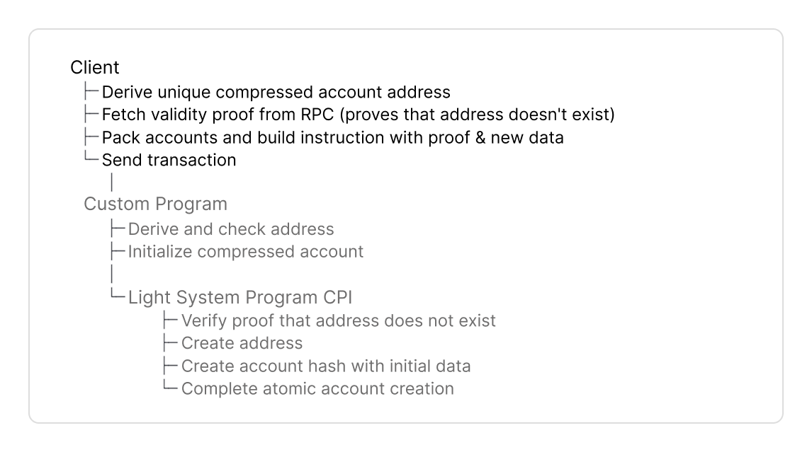
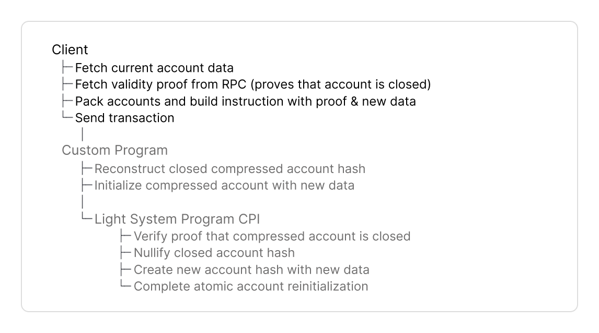

# Typescript

The TypeScript Client SDK provides two abstractions to create or interact with compressed accounts:

* **For local testing**, use [`TestRpc`](https://www.zkcompression.com/resources/sdks/typescript-client#testrpc).
  * `TestRpc` is an RPC implementation with in-memory indexer and without external dependencies.
  * It parses events and builds Merkle trees on-demand without persisting state.
* **For test-validator, devnet and mainnet** use [`Rpc`](https://www.zkcompression.com/resources/sdks/typescript-client#rpc)
  * `Rpc` is a thin wrapper extending Solana's web3.js `Connection` class with compression-related endpoints. Find a [full list of JSON RPC methods here](https://www.zkcompression.com/resources/json-rpc-methods).
  * It connects to the Photon indexer that tracks compressed state to query compressed accounts and the prover service for validity proofs.
* `Rpc` and `TestRpc` implement the same `CompressionApiInterface`. Seamlessly switch between `TestRpc`, local test validator with `Rpc`, and public Solana networks.


Find [full code examples for a counter program](typescript.md#full-code-example) at the end for Anchor.&#x20;


## Implementation Guide



<figure><picture><source srcset="../../.gitbook/assets/create.png" media="(prefers-color-scheme: dark)"></picture><figcaption></figcaption></figure>



<figure><picture><source srcset="../../.gitbook/assets/update-dark.png" media="(prefers-color-scheme: dark)"></picture><figcaption></figcaption></figure>



<figure><picture><source srcset="../../.gitbook/assets/close-dark.png" media="(prefers-color-scheme: dark)"></picture><figcaption></figcaption></figure>



<figure><picture><source srcset="../../.gitbook/assets/reinit-dark.png" media="(prefers-color-scheme: dark)"></picture><figcaption></figcaption></figure>



<figure><picture><source srcset="../../.gitbook/assets/burn-dark.png" media="(prefers-color-scheme: dark)"></picture><figcaption></figcaption></figure>





### Dependencies



```bash
npm install --save \
    @lightprotocol/stateless.js \ 
    @lightprotocol/compressed-token \ 
    @solana/web3.js \
    @lightprotocol/zk-compression-cli
```



```bash
yarn add \
    @lightprotocol/stateless.js \
    @lightprotocol/compressed-token \
    @solana/web3.js \
    @lightprotocol/zk-compression-cli
```



```bash
pnpm add \
    @lightprotocol/stateless.js \
    @lightprotocol/compressed-token \
    @solana/web3.js \
    @lightprotocol/zk-compression-cli
```




`@lightprotocol/stateless.js` provides the core SDK to create and interact with compressed accounts, including `Rpc` and `TestRpc` classes.




### Environment



Connect to local, devnet or mainnet with `Rpc`.



```typescript
import { Rpc } from '@lightprotocol/stateless.js';

const rpc = new Rpc(
  'https://api.mainnet-beta.solana.com',
  'https://mainnet.helius.xyz',
  'https://prover.mainnet.example.com',
  undefined,
  { apiKey: 'YOUR_API_KEY' }
);
```



```typescript
import { Rpc } from '@lightprotocol/stateless.js';

const rpc = new Rpc(
  'https://api.devnet.solana.com',
  'https://devnet.helius.xyz',
  'https://prover.devnet.example.com',
  undefined,
  { apiKey: 'YOUR_API_KEY' }
);
```



```typescript
import { Rpc } from '@lightprotocol/stateless.js';

const rpc = new Rpc(
  'http://127.0.0.1:8899',
  'http://127.0.0.1:8784',
  'http://127.0.0.1:3001'
);
```

* Requires running `light test-validator` locally





Set up test environment with `TestRpc`.

```typescript
import { getTestRpc } from '@lightprotocol/stateless.js';
import { LightWasm, WasmFactory } from '@lightprotocol/hasher.rs';

const lightWasm: LightWasm = await WasmFactory.getInstance();
const testRpc = await getTestRpc(lightWasm);
```





### Tree Configuration

Before creating a compressed account, your client must fetch metadata of two Merkle trees:

* an address tree to derive and store the account address and
* a state tree to store the account hash.


The protocol maintains Merkle trees at fixed addresses. You don't need to initialize custom trees. See the [addresses for Merkle trees here](https://www.zkcompression.com/resources/addresses-and-urls).


```typescript
const addressTree = await rpc.getAddressTreeInfoV2();
const stateTreeInfos = await rpc.getStateTreeInfos();
const outputStateTree = selectStateTreeInfo(stateTreeInfos);
```

Fetch metadata of trees with:

* `getAddressTreeInfoV2()` returns `TreeInfo` with the public key and other metadata for the address tree.
  * Used to derive addresses with `deriveAddress()` and
  * for `getValidityProof()` to prove the address does not exist yet in the state tree to avoid duplicate addresses.
* `getStateTreeInfos()` returns metadata for all active state trees.
* `selectStateTreeInfo()` selects a random state tree to store the compressed account hash.
  * Selecting a random state tree prevents write-lock contention on state trees and increases throughput.
  * Account hashes can move to different state trees after each state transition.
  * Best practice is to minimize different trees per transaction. Still, since trees may fill up over time, programs must handle accounts from different state trees within the same transaction.


`TreeInfo` contains metadata for a Merkle tree:

* `tree`: Merkle tree account pubkey
* `queue`: Queue account pubkey
  * Buffers insertions before they are added to the Merkle tree
  * Client and program do not interact directly with the queue
* `treeType`: Identifies tree version (StateV1, AddressV2) and account for hash insertion
* `cpiContext`: Optional CPI context account for batched operations across multiple programs (may be null)
  * Allows a single zero-knowledge proof to verify compressed accounts from different programs in one instruction
  * First program caches its signer checks, second program reads them and combines instruction data
  * Reduces instruction data size and compute unit costs when multiple programs interact with compressed accounts
* `nextTreeInfo`: The tree to use for the next operation when the current tree is full (may be null)
  * When set, switch to this tree instead of continuing with the current one




### Derive Address

Derive a persistent address as a unique identifier for your compressed account.

```typescript
const seed = deriveAddressSeed(
  [Buffer.from('my-seed')],
  programId
);
const address = deriveAddress(seed, addressTree.tree);
```

**First, derive the seed**:

* Pass arbitrary byte slices in the array to uniquely identify the account
* Specify `programId` to combine with your seeds

**Then, derive the address**:

* Pass the derived 32-byte `seed` from the first step.
* Specify `addressTree.tree` pubkey you fetched in the previous step, to ensure the address is unique to that tree. Different trees produce different addresses from identical seeds.


Use the same `addressTree` for both `deriveAddress()` and all subsequent operations on that account in your client and program.




### Validity Proof

Fetch a validity proof from your RPC provider that supports ZK Compression (Helius, Triton, ...). The proof type depends on the operation:

* To create a compressed account, you must prove the **address doesn't already exist** in the address tree.
* To update or close a compressed account, you must **prove its account hash exists** in a state tree.


[Here's a full guide](https://www.zkcompression.com/resources/json-rpc-methods/getvalidityproof) to the `getValidityProofV0()` method.




```typescript
const proof = await rpc.getValidityProofV0(
  [],
  [{ address, tree: addressTree.tree, queue: addressTree.queue }]
);
```

**Pass these parameters**:

* Leave (`[]`) empty since no compressed account exists yet.
* Specify the new address with its tree and queue pubkeys in `[{ address, tree, queue }]`.

The RPC returns `ValidityProofWithContext` with

* `compressedProof` with the proof that the address does not exist in the address tree, passed to the program in your instruction data.
* `newAddressParams` array with address tree public key and metadata to build `PackedAddressTreeInfo` in the next step.
* Empty `rootIndices` and `leafIndices` arrays, since you do not reference an existing account hash when you create a compressed account.




**Update and Close** use identical proof mechanisms. The difference is in your program's instruction handler.


```typescript
const hash = compressedAccount.hash;
const tree = compressedAccount.merkleContext.tree;
const queue = compressedAccount.merkleContext.queue;

const proof = await rpc.getValidityProofV0(
  [{ hash, tree, queue }],
  []
);
```

**Pass these parameters**:

* Specify the account hash with its tree and queue pubkeys in `[{ hash, tree, queue }]`.
* Leave (`[]`) empty, since the proof verifies the account hash exists in a state tree, not the address in an address tree.

The RPC returns `ValidityProofWithContext` with

* `compressedProof` with the proof that the account hash exists in the state tree, passed to the program in your instruction data.
* `rootIndices`, `leafIndices`, and `proveByIndices` arrays with proof metadata to build packed structs in the next step.
* An empty `newAddressParams` array, since you pass no address to the proof when you update or close a compressed account.



### Pack Accounts

Compressed account instructions require packing accounts into the `remainingAccounts` array. Follow the steps below to build the `PackedAccounts` helper.


**"Packing" accounts optimizes instruction size:**

* **Packed structs** contain account **indices** (u8) instead of 32 byte pubkeys. The indices point to the `remainingAccounts` array.
* **Non-Packed structs** contain full pubkeys. RPC methods return full pubkeys.

You will pass this array in the instruction data.


#### 1. Build PackedAccounts Helper

Build a `PackedAccounts` helper class to construct the `remainingAccounts` array with correct indices.

The helper

* derives CPI signer PDA and builds all 8 Light System accounts with correct permission flags
* deduplicates pubkeys to make sure each unique pubkey appears only once in `remainingAccounts`
* converts pubkeys to sequential u8 indices (0-7 for system accounts, 8+ for trees)

```
[0]    Your program accounts 
[1]    Light System Program
[2]    CPI Signer PDA
[3-8]  Other Light System accounts
[9+]   Merkle trees, queues
```


A complete copy-paste implementation is available at the bottom of this section.


<details>

<summary><em>System Accounts List</em></summary>

| # | Account                            | Purpose                                                                                                                                                                                        |
| - | ---------------------------------- | ---------------------------------------------------------------------------------------------------------------------------------------------------------------------------------------------- |
| 1 | Light System Program\[^1]          | Verifies validity proofs and executes CPI calls to create or interact with compressed accounts                                                                                                 |
| 2 | CPI Signer\[^2]                    | <p>- Signs CPI calls from your program to Light System Program<br>- PDA verified by Light System Program during CPI<br>- Derived from your program ID</p>                                      |
| 3 | Registered Program PDA             | <p>- Proves your program can interact with Account Compression Program<br>- Prevents unauthorized programs from modifying compressed account state</p>                                         |
| 4 | Noop Program\[^3]                  | <p>- Logs compressed account state to Solana ledger<br>- Indexers parse transaction logs to reconstruct compressed account state</p>                                                           |
| 5 | Account Compression Authority\[^4] | Signs CPI calls from Light System Program to Account Compression Program                                                                                                                       |
| 6 | Account Compression Program\[^5]   | <p>- Writes to state and address tree accounts<br>- Client and program do not directly interact with this program</p>                                                                          |
| 7 | Invoking Program                   | <p>Your program's ID, used by Light System Program to:<br>- Derive the CPI Signer PDA<br>- Verify the CPI Signer matches your program ID<br>- Set the owner of created compressed accounts</p> |
| 8 | System Program\[^6]                | Solana System Program to create accounts or transfer lamports                                                                                                                                  |

</details>

**Initialize `PackedAccounts`**

```typescript
class PackedAccounts {
  private systemAccounts: AccountMeta[] = [];
  private nextIndex: number = 0;
  private map: Map<string, [number, AccountMeta]> = new Map();
}
```

Initialize `PackedAccounts` with three empty fields:

1. `systemAccounts` stores the 8 Light System accounts at indices 0-7 with read-only flags.
   * These accounts log/verify state changes but don't modify their own state.
2. `nextIndex` tracks the next available index for tree/queue accounts, starts at 0.
   * Tree and queue accounts start after systemAccounts at index 8 with writable flag.
   * The value starts at 0, because it's relative to the `map` below, not the final array.
3. `map` deduplicates pubkeys to make sure each unique pubkey appears only once in `remainingAccounts`.
   * For example, if the input state tree is the same as the output state tree, both reference the same pubkey and return the same index (`insertOrGet()`).

You will populate these fields in the following steps.

**Add Light System Accounts**

```typescript
  addSystemAccounts(programId: PublicKey): void {
    const cpiSigner = PublicKey.findProgramAddressSync(
      [Buffer.from('cpi_authority')],
      programId
    )[0];
```

* Pass `programId` to derive the CPI signer PDA with `findProgramAddressSync()`.
* The Light System Program verifies this PDA during CPI calls.

Now, populate the `systemAccounts`:

```typescript
    const defaults = defaultStaticAccountsStruct();
    const lightSystemProgram = new PublicKey('SySTEM1eSU2p4BGQfQpimFEWWSC1XDFeun3Nqzz3rT7');
    const systemProgram = new PublicKey('11111111111111111111111111111111');
    this.systemAccounts = [
      { pubkey: lightSystemProgram, isSigner: false, isWritable: false },
      { pubkey: cpiSigner, isSigner: false, isWritable: false },
      { pubkey: defaults.registeredProgramPda, isSigner: false, isWritable: false },
      { pubkey: defaults.noopProgram, isSigner: false, isWritable: false },
      { pubkey: defaults.accountCompressionAuthority, isSigner: false, isWritable: false },
      { pubkey: defaults.accountCompressionProgram, isSigner: false, isWritable: false },
      { pubkey: programId, isSigner: false, isWritable: false },
      { pubkey: systemProgram, isSigner: false, isWritable: false },
    ];
  }
```

1. **Fetch 4 accounts from SDK** with `defaultStaticAccountsStruct()`:
   * `registeredProgramPda` proves your program can interact with Account Compression Program.
   * `noopProgram` logs compressed account state to Solana ledger.
   * `accountCompressionAuthority` signs CPI calls from Light System Program to Account Compression Program.
   * `accountCompressionProgram` writes to state and address tree accounts. The client and program do not interact with this program, only the Light System. This is all done under the hood.
2. **Use hardcoded program addresses** for Light System Program and Solana System Program.
3. **Build the 8-account array in this sequence** with all accounts marked as `isWritable: false`:
   * The order matters, since the Light System Program expects accounts at these exact indices
   * These accounts log/verify state changes but don't modify their own state.

**Add Tree and Queue Accounts**

```typescript
  insertOrGet(pubkey: PublicKey, isWritable: boolean = true): number {
    const key = pubkey.toBase58();
    const entry = this.map.get(key);
    if (entry) return entry[0];

    const index = this.nextIndex++;
    this.map.set(key, [index, { pubkey, isSigner: false, isWritable }]);
    return index;
  }
```

Call `insertOrGet(pubkey)` to add a tree or queue account to the accounts array and return its index for packed structs:

1. Returns existing index if the pubkey was already added:
   * Prevents duplicate accounts in `remainingAccounts`.
   * For example, if input and output state trees are the same, both use index 8.
2. If pubkey is not added yet, the method assigns the next sequential index for new accounts starting at index 8:
   * Use the returned index to set index fields in `PackedAddressTreeInfo` or `PackedStateTreeInfo`.
   * For example, `addressMerkleTreePubkeyIndex: 8` points to the address tree at position 8 in `remainingAccounts`.
   * Marks tree and queue accounts as writable by default.
   * The Light System Program writes new hashes and addresses to these accounts.

**Build Final Account Array**

```typescript
  toAccountMetas(): AccountMeta[] {
    const entries = Array.from(this.map.entries());
    entries.sort((a, b) => a[1][0] - b[1][0]);
    const packedAccounts = entries.map(([, [, meta]]) => meta);
    return [...this.systemAccounts, ...packedAccounts];
  }
}
```

Call `toAccountMetas()` to build the complete `AccountMeta[]` array for `.remainingAccounts()`.

**The method returns accounts in two sections:**

```
 [systemAccounts] [packedAccounts]
       ↑               ↑
  Light System     Merkle tree &
    accounts      queue accounts

```

1. **System accounts first** (indices 0-7):
   * All 8 Light System accounts with read-only flags.
   * Light System Program expects these accounts at these exact positions.
2. **Tree and queue accounts after** (indices 8+):
   * All tree and queue accounts with writable flags in sequential order.
   * Packed struct indices reference accounts by their position in this array.
   * Light System Program writes new hashes and addresses to these accounts.

<details>

<summary>Complete Implementation to copy-paste</summary>

```typescript
import { PublicKey, AccountMeta } from '@solana/web3.js';
import { defaultStaticAccountsStruct } from '@lightprotocol/stateless.js';

class PackedAccounts {
  private systemAccounts: AccountMeta[] = [];
  private nextIndex: number = 0;
  private map: Map<string, [number, AccountMeta]> = new Map();

  addSystemAccounts(programId: PublicKey): void {
    const cpiSigner = PublicKey.findProgramAddressSync(
      [Buffer.from('cpi_authority')],
      programId
    )[0];

    const defaults = defaultStaticAccountsStruct();
    const lightSystemProgram = new PublicKey('SySTEM1eSU2p4BGQfQpimFEWWSC1XDFeun3Nqzz3rT7');
    const systemProgram = new PublicKey('11111111111111111111111111111111');

    this.systemAccounts = [
      { pubkey: lightSystemProgram, isSigner: false, isWritable: false },
      { pubkey: cpiSigner, isSigner: false, isWritable: false },
      { pubkey: defaults.registeredProgramPda, isSigner: false, isWritable: false },
      { pubkey: defaults.noopProgram, isSigner: false, isWritable: false },
      { pubkey: defaults.accountCompressionAuthority, isSigner: false, isWritable: false },
      { pubkey: defaults.accountCompressionProgram, isSigner: false, isWritable: false },
      { pubkey: programId, isSigner: false, isWritable: false },
      { pubkey: systemProgram, isSigner: false, isWritable: false },
    ];
  }

  insertOrGet(pubkey: PublicKey, isWritable: boolean = true): number {
    const key = pubkey.toBase58();
    const entry = this.map.get(key);
    if (entry) return entry[0];

    const index = this.nextIndex++;
    this.map.set(key, [index, { pubkey, isSigner: false, isWritable }]);
    return index;
  }

  toAccountMetas(): AccountMeta[] {
    const entries = Array.from(this.map.entries());
    entries.sort((a, b) => a[1][0] - b[1][0]);
    const packedAccounts = entries.map(([, [, meta]]) => meta);
    return [...this.systemAccounts, ...packedAccounts];
  }
}
```

</details>

#### 2. Initialize Helper

```typescript
const packedAccounts = new PackedAccounts();
packedAccounts.addSystemAccounts(programId);
```

Initialize the helper and populate the 8 Light System accounts:

1. **Create helper instance** with `new PackedAccounts()`.
2. **Add system accounts** with `addSystemAccounts(programId)` to populate indices 0-7.

In the next steps, you will add tree and queue accounts from the validity proof, then convert to `AccountMeta[]`.


Program-specific accounts (signers, fee payer) are passed to `.accounts()`, not added to `remainingAccounts`.


#### 3. Pack Tree Accounts from Validity Proof

Add tree and queue pubkeys from the validity proof to the helper. The helper returns u8 indices for your instruction data.



```typescript
const addressTreeIndex = packedAccounts.insertOrGet(addressTree.tree);
const addressQueueIndex = packedAccounts.insertOrGet(addressTree.queue);

const packedAddressTreeInfo = {
  addressMerkleTreePubkeyIndex: addressTreeIndex,
  addressQueuePubkeyIndex: addressQueueIndex,
  rootIndex: proof.newAddressParams[0].rootIndex
};
```

* Call `insertOrGet()` with each tree and queue pubkey from the validity proof
* Create `PackedAddressTreeInfo` with three fields:

1. `addressMerkleTreePubkeyIndex` - points to the address tree account in `remainingAccounts`
   * The address tree is used to derive addresses and verify the address does not already exist
2. `addressQueuePubkeyIndex` - points to the address queue account in `remainingAccounts`
   * The queue buffers new addresses before they are inserted into the address tree
3. `rootIndex` - the Merkle root index from `proof.newAddressParams[0].rootIndex` (Validity Proof step)
   * Specifies which historical root to verify the address does not exist in the tree



```typescript
const merkleTreeIndex = packedAccounts.insertOrGet(compressedAccount.merkleContext.tree);
const queueIndex = packedAccounts.insertOrGet(compressedAccount.merkleContext.queue);

const packedStateTreeInfo = {
  merkleTreePubkeyIndex: merkleTreeIndex,
  queuePubkeyIndex: queueIndex,
  leafIndex: proof.leafIndices[0],
  rootIndex: proof.rootIndices[0],
  proveByIndex: false
};
```

* Call `insertOrGet()` with the state tree and queue pubkeys from `compressedAccount.merkleContext`
* Create `PackedStateTreeInfo` with five fields:

1. `merkleTreePubkeyIndex` - points to the state tree account in `remainingAccounts`
   * The state tree stores the existing account hash that Light System Program verifies
2. `queuePubkeyIndex` - points to the nullifier queue account in `remainingAccounts`
   * The queue tracks nullified (spent) account hashes to prevent double-spending
3. `leafIndex` - the leaf position in the Merkle tree from `proof.leafIndices[0]` (Validity Proof step)
   * Specifies which leaf contains your account hash to verify it exists in the tree
4. `rootIndex` - the Merkle root index from `proof.rootIndices[0]`
   * Specifies which historical root to verify the account hash against
5. `proveByIndex` - the proof verification mode, set to `false`
   * `false` verifies the account hash directly by reconstructing the Merkle path
   * `true` uses index-based batched verification for multiple accounts (advanced usage)
   * For single account operations, use `false`



#### 4. Add Output State Tree

Specify the state tree to store the new account hash.

```typescript
const outputTreeIndex = packedAccounts.insertOrGet(outputStateTree.tree);
```

* Use `outputStateTree` variable from Step 3 - it contains the `TreeInfo` with pubkey and metadata for the randomly selected state tree
* Call `insertOrGet(outputStateTree.tree)` to add the tree and get its index for instruction data


The output tree is separate from the trees in your validity proof. The validity proof references trees that verify existing state (or prove an address doesn't exist), while the output tree specifies where to write the new account hash.


#### 5. Finalize Accounts

Call `toAccountMetas()` to get the final `AccountMeta[]` array.

```typescript
const accountMetas = packedAccounts.toAccountMetas();
```

**The helper returns:**

* System accounts (indices 0-7) as `read-only`
  * System accounts like the noop program log state changes but don't modify their own state
* Tree and queue accounts (indices 8+) as `writable`
  * The Light System Program writes to tree and queue accounts to insert new hashes or addresses

#### 6. Summary

You built the `remainingAccounts` array with all accounts the Light System Program needs to execute your instruction:

* Light System accounts to create and interact with compressed accounts via the Light System Program.
* Tree accounts from the validity proof to prove address non-existence (create), or existence of the account hash (update/close).
* The output state tree to store the new account hash.

The accounts receive a sequential u8 index. Instruction data references accounts in this order.


`PackedAddressTreeInfo` and `PackedStateTreeInfo` structs contain indices instead of 32-byte pubkeys, to reduce instruction data size to 1 byte per index.




### Instruction Data

Build your instruction data with the validity proof, tree account indices, and complete account data.


Compressed account data must be passed in instruction data, since only a hash is stored on-chain. This is unlike Solana accounts, where programs can read data directly from accounts.

The program hashes this data and the Light System Program verifies the hash against the root in a Merkle tree account to ensure its correctness.




```typescript
const instructionData = {
  proof: proof.compressedProof,
  addressTreeInfo: packedAddressTreeInfo,
  outputStateTreeIndex: outputTreeIndex,
};
```

1. **Validity Proof**

* Add the `compressedProof` you fetched to prove that the address does not exist yet in the specified address tree.

2. **Specify Merkle trees to store address and account hash**

Include the Merkle tree metadata from the Pack Accounts section:

* `PackedAddressTreeInfo` specifies the index to the address tree account used to derive the address. The index points to the address tree account in `remainingAccounts`.
* `outputStateTreeIndex` points to the state tree account in `remainingAccounts` that will store the compressed account hash.

3. **Pass initial account data**

* The counter program initializes the account to 0, wherefore no new value needs to be passed.
* If your program requires initial data, add custom fields to your instruction struct.




The client includes the current account data for both Update and Close. The difference is in your programs instruction handler.


```typescript
const instructionData = {
  proof: proof.compressedProof,
  counterValue: currentCounterValue,
  accountMeta: {
    treeInfo: packedStateTreeInfo,
    address: compressedAccount.address,
    outputStateTreeIndex: outputTreeIndex
  },
};
```

1. **Validity Proof**

* Add the `compressedProof` you fetched to prove the account hash exists in the state tree.

2. **Specify input state and output state tree**

Include the Merkle tree metadata fetched in Step 3:

* `accountMeta` points to the input hash and specifies the output state tree with these fields:
  * `treeInfo: PackedStateTreeInfo` points to the existing account hash that will be nullified by the Light System Program
  * `address` specifies the account's derived address
  * `outputStateTreeIndex` points to the state tree that will store the updated or closed account hash

3. **Pass current account data**

* Pass the complete current account data. The program reconstructs the existing account hash from this data to verify it matches the hash in the state tree.





### Instruction

Build a `TransactionInstruction` with your `program_id`, `accounts`, and `data` from Step 7. Pass the `remainingAccounts` array you built in Step 6.

```typescript
const instruction = await program.methods
  .createCounter(
    instructionData.proof, 
    instructionData.addressTreeInfo, 
    instructionData.outputStateTreeIndex)
  .accounts({
    signer: payer.publicKey
  })
  .remainingAccounts(accountMetas)
  .instruction();
```

**What to include in `accounts`:**

1. **Define program-specific accounts** in `.accounts()` with any accounts your program requires - these won't interfere with compression-related accounts.
2. **Add the Light System and Merkle tree accounts** with `.remainingAccounts(accountMetas)` to the instruction's account list.
3. **Build the complete instruction with `.instruction()`**:

* Anchor converts `.accounts({ signer })` to `AccountMeta[]` with the program's IDL account metadata. These accounts have fixed indices defined by the IDL.
* `.remainingAccounts()` appends the Light System and Merkle tree accounts after named accounts.
* Returns `TransactionInstruction` with `programId`, merged `keys` (all accounts concatenated), and serialized instruction `data`.

```
[0]    Your program accounts (signer, etc.)
[1]    Light System Program
[2]    CPI Signer PDA
[3-8]  Other Light System accounts
[9+]   Merkle trees, queues (from validity proof)
```



### Send Transaction

Submit the instruction to the network.

```typescript
const transaction = new Transaction().add(instruction);
const signature = await sendAndConfirmTransaction(
  rpc,
  transaction,
  [payer]
);
```



## Full Code Example

The full code example below shows you how to create a counter with Anchor.


For help with debugging, see the [Error Cheatsheet](https://www.zkcompression.com/resources/error-cheatsheet).







Find the [source code here](https://github.com/Lightprotocol/program-examples/blob/3a9ff76d0b8b9778be0e14aaee35e041cabfb8b2/counter/anchor/tests/test.ts#L54).


```typescript
import * as anchor from "@coral-xyz/anchor";
import { Program, web3 } from "@coral-xyz/anchor";
import { Counter } from "../target/types/counter";
import idl from "../target/idl/counter.json";
import {
  bn,
  CompressedAccountWithMerkleContext,
  createRpc,
  defaultStaticAccountsStruct,
  defaultTestStateTreeAccounts,
  deriveAddress,
  deriveAddressSeed,
  LightSystemProgram,
  Rpc,
  sleep,
} from "@lightprotocol/stateless.js";
import { assert } from "chai";

const path = require("path");
const os = require("os");
require("dotenv").config();

const anchorWalletPath = path.join(os.homedir(), ".config/solana/id.json");
process.env.ANCHOR_WALLET = anchorWalletPath;

describe("test-anchor", () => {
  const program = anchor.workspace.Counter as Program<Counter>;
  const coder = new anchor.BorshCoder(idl as anchor.Idl);

  it("", async () => {
    let signer = new web3.Keypair();
    let rpc = createRpc(
      "http://127.0.0.1:8899",
      "http://127.0.0.1:8784",
      "http://127.0.0.1:3001",
      {
        commitment: "confirmed",
      }
    );
    let lamports = web3.LAMPORTS_PER_SOL;
    await rpc.requestAirdrop(signer.publicKey, lamports);
    await sleep(2000);

    const outputMerkleTree = defaultTestStateTreeAccounts().merkleTree;
    const addressTree = defaultTestStateTreeAccounts().addressTree;
    const addressQueue = defaultTestStateTreeAccounts().addressQueue;

    const counterSeed = new TextEncoder().encode("counter");
    const seed = deriveAddressSeed(
      [counterSeed, signer.publicKey.toBytes()],
      new web3.PublicKey(program.idl.address)
    );
    const address = deriveAddress(seed, addressTree);

    await CreateCounterCompressedAccount(
      rpc,
      addressTree,
      addressQueue,
      address,
      program,
      outputMerkleTree,
      signer
    );
  });
});

async function CreateCounterCompressedAccount(
  rpc: Rpc,
  addressTree: anchor.web3.PublicKey,
  addressQueue: anchor.web3.PublicKey,
  address: anchor.web3.PublicKey,
  program: anchor.Program<Counter>,
  outputMerkleTree: anchor.web3.PublicKey,
  signer: anchor.web3.Keypair
) {
  {
    const proofRpcResult = await rpc.getValidityProofV0(
      [],
      [
        {
          tree: addressTree,
          queue: addressQueue,
          address: bn(address.toBytes()),
        },
      ]
    );
    const systemAccountConfig = SystemAccountMetaConfig.new(program.programId);
    let remainingAccounts =
      PackedAccounts.newWithSystemAccounts(systemAccountConfig);

    const addressMerkleTreePubkeyIndex =
      remainingAccounts.insertOrGet(addressTree);
    const addressQueuePubkeyIndex = remainingAccounts.insertOrGet(addressQueue);
    const packedAddreesMerkleContext = {
      rootIndex: proofRpcResult.rootIndices[0],
      addressMerkleTreePubkeyIndex,
      addressQueuePubkeyIndex,
    };
    const outputMerkleTreeIndex =
      remainingAccounts.insertOrGet(outputMerkleTree);

    let proof = {
      0: proofRpcResult.compressedProof,
    };
    const computeBudgetIx = web3.ComputeBudgetProgram.setComputeUnitLimit({
      units: 1000000,
    });
    let tx = await program.methods
      .createCounter(proof, packedAddreesMerkleContext, outputMerkleTreeIndex)
      .accounts({
        signer: signer.publicKey,
      })
      .preInstructions([computeBudgetIx])
      .remainingAccounts(remainingAccounts.toAccountMetas().remainingAccounts)
      .signers([signer])
      .transaction();
    tx.recentBlockhash = (await rpc.getRecentBlockhash()).blockhash;
    tx.sign(signer);

    const sig = await rpc.sendTransaction(tx, [signer]);
    await rpc.confirmTransaction(sig);
    console.log("Created counter compressed account ", sig);
  }
}
```


Helper classes (`PackedAccounts`, `SystemAccountMetaConfig`, `getLightSystemAccountMetas`, `SystemAccountPubkeys`) are available in the [complete source code](https://github.com/Lightprotocol/program-examples/blob/3a9ff76d0b8b9778be0e14aaee35e041cabfb8b2/counter/anchor/tests/test.ts#L54).




## Next Steps

Start building programs to create, update, or close compressed accounts.


[guides](../guides/)

