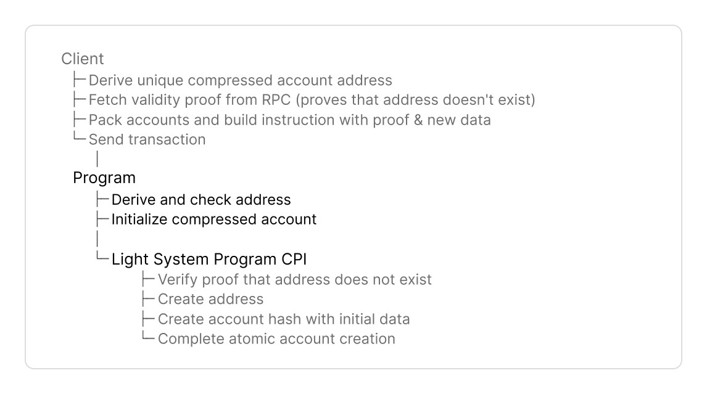

# How to Create Compressed Accounts

## Overview

Compressed accounts and addresses are created via CPI to the Light System Program.

* Compressed and regular Solana accounts share the same functionality and are fully composable.
* A compressed account has two identifiers: the account hash and its address (optional). In comparison, regular Solana accounts are identified by their address.
* The account hash is not persistent and changes with every write to the account.
* For Solana PDA like behavior your compressed account needs an address as persistent identifier.\
  Fungible state like [compressed token accounts](../../compressed-tokens/guides/how-to-create-compressed-token-accounts.md) do not need addresses.


Find [full code examples at the end](how-to-create-compressed-accounts.md#full-code-example) for Anchor and native Rust.


This guide will cover the components of a Solana program that creates compressed accounts.\
Here is the complete flow:

<figure><picture><source srcset="../../.gitbook/assets/program-create (1).png" media="(prefers-color-scheme: dark)"></picture><figcaption></figcaption></figure>

## Implementation Guide



#### Dependencies

Add dependencies to your program.




```toml
[dependencies]
light-sdk = "0.16.0"
anchor_lang = "0.31.1"
```





```toml
[dependencies]
light-sdk = "0.16.0"
borsh = "0.10.0"
solana-program = "2.2"
```




* The `light-sdk` provides macros, wrappers and CPI interface to create and interact with compressed accounts.
* Add the serialization library (`borsh` for native Rust, or use `AnchorSerialize`).



#### Constants

Set program address and derive the CPI authority PDA to call the Light System program.


```rust
declare_id!("rent4o4eAiMbxpkAM1HeXzks9YeGuz18SEgXEizVvPq");

pub const LIGHT_CPI_SIGNER: CpiSigner =
    derive_light_cpi_signer!("rent4o4eAiMbxpkAM1HeXzks9YeGuz18SEgXEizVvPq");
```


**`CPISigner`** is the configuration struct for CPIs to the Light System Program.

* CPI to the Light System program must be signed with a PDA derived by your program with the seed `b"authority"`
* `derive_light_cpi_signer!` derives the CPI signer PDA for you at compile time.



#### Compressed Account




```rust
#[derive(
    Clone,
    Debug,
    Default,
    AnchorSerialize,
    AnchorDeserialize,
    LightDiscriminator
)]
pub struct MyCompressedAccount {
    pub owner: Pubkey,
    pub message: String,
}
```





```rust
#[derive(
    Clone,
    Debug,
    Default,
    BorshSerialize,
    BorshDeserialize,
    LightDiscriminator
)]
pub struct MyCompressedAccount {
    pub owner: Pubkey,
    pub message: String,
}
```




Define your compressed account struct and derive

* the standard traits (`Clone`, `Debug`, `Default`),
* `borsh` or `AnchorSerialize` to serialize account data, and
* `LightDiscriminator` to implements a unique type ID (8 bytes) to distinguish account types. The default compressed account layout enforces a discriminator in its _own field_, [not the first 8 bytes of the data field](#user-content-fn-1)[^1].


The traits listed above are required for `LightAccount`. `LightAccount` wraps `my-compressed-account` in Step 7 to set the discriminator and create the compressed account's data.




#### Instruction Data

Define the instruction data with the following parameters:


```rust
pub struct InstructionData {
    proof: ValidityProof,
    address_tree_info: PackedAddressTreeInfo,
    output_state_tree_index: u8,
    message: String,
}
```


1. **Validity Proof**

* Define `proof` to include the proof that the address does not exist yet in the specified address tree.
* Clients fetch a validity proof with `getValidityProof()` from an RPC provider that supports ZK Compression (Helius, Triton, ...).

2. **Specify Merkle trees to store address and account hash**

* Define `address_tree_info: PackedAddressTreeInfo` to reference the address tree account used to derive the address in the next step.
* Define `output_state_tree_index` to reference the state tree account that stores the compressed account hash.


Clients pack accounts into the `remaining_accounts` array to reduce transaction size. Packed structs like `PackedAddressTreeInfo` contain account indices (u8) instead of 32 byte pubkeys. The indices point to the account in the `remaining_accounts` to retrieve the public key and other metadata.


3. **Initial account data**

* Define fields for your program logic. Clients pass the initial values.
* This example includes the `message` field to define the initial state of the account.



#### Derive Address

Derive the address as a persistent unique identifier for the compressed account.


```rust
let address_merkle_tree_pubkey =
    address_tree_info.get_tree_pubkey(&light_cpi_accounts)?;

let custom_seeds = [SEED, ctx.accounts.signer.key().as_ref()];

let (address, address_seed) = derive_address(
    &custom_seeds,
    &address_tree_pubkey,
    &crate::ID,
);
```


**Unpack the tree pubkey:**

* Call `get_tree_pubkey()` to retrieve the address tree pubkey from `address_tree_info`. The packed struct contains the index of the address tree in the `remaining_accounts` array.

**Pass these parameters to `derive_address()`:**

* `&custom_seeds`: Arbitrary byte slices that uniquely identify the account. This example uses `SEED` and the signer's pubkey.
* `&address_tree_pubkey`: The pubkey of the address tree where the address will be created. This parameter ensures an address is unique to an address tree. Different trees produce different addresses from identical seeds.
* `&crate::ID`: Your program's ID.

**The SDK returns:**

* `address`: The derived address for the compressed account.
* `address_seed`: Pass this to the Light System Program CPI in _Step 8_ to create the address.



#### Address Tree Check

Ensure global uniqueness of an address by verifying that the address tree pubkey matches the program's tree constant.


Every address is unique, but the same seeds can be used to create different addresses in different address trees. To enforce that a compressed PDA can only be created once with the same seed, you must check the address tree pubkey.



```rust
let address_tree = light_cpi_accounts.tree_pubkeys().unwrap()
    [address_tree_info.address_merkle_tree_pubkey_index as usize];

if address_tree != light_sdk::constants::ADDRESS_TREE_V2 {
    return Err(ProgramError::InvalidAccountData.into());
}
    Ok(())
}
```




#### Initialize Compressed Account

Initialize the compressed account struct with `LightAccount::new_init()`.


`new_init()` creates a `LightAccount` instance similar to anchor `Account` and lets your program define the initial account data.



```rust
let owner = crate::ID;
let mut my_compressed_account
        = LightAccount::<MyCompressedAccount>::new_init(
    &owner,
    Some(address),
    output_state_tree_index,
)?;

my_compressed_account.owner = ctx.accounts.signer.key();
my_compressed_account.data = data.to_string();
```


**Pass these parameters to `new_init()`:**

* `&owner`: The program's ID that owns the compressed account.
* `Some(address)`: The derived address from _Step 5_. Pass `None` for accounts without addresses.
* `output_state_tree_index`: References the state tree account that will store the updated account hash, defined in instruction data (_Step 4_)

**The SDK creates:**

* A `LightAccount` wrapper similar to Anchor's `Account.`
* `new_init()` lets the program set the initial data. This example sets:
  * `owner` to the signer's pubkey
  * `data` to an arbitrary string



#### Light System Program CPI

Invoke the Light System Program to create the compressed account and its address.


The Light System Program

* verifies the validity proof against the address tree's Merkle root,
* inserts the address into the address tree, and
* appends the new account hash to the state tree.



```rust
let light_cpi_accounts = CpiAccounts::new(
    fee_payer,
    remaining_accounts,
    LIGHT_CPI_SIGNER,
);

LightSystemProgramCpi::new_cpi(LIGHT_CPI_SIGNER, proof)
    .with_light_account(my_compressed_account)?
    .with_new_addresses(&[
        address_tree_info.into_new_address_params_packed(AddressSeed(address_seed))
    ])
    .invoke(light_cpi_accounts)?;
```


**Set up `CpiAccounts::new()`:**

* `fee_payer`: Fee payer and transaction signer
* `remaining_accounts`: `AccountInfo` slice with Light System and packed tree accounts.
* `LIGHT_CPI_SIGNER`: Your program's CPI signer defined in Constants.

<details>

<summary><em>System Accounts List</em></summary>

<table><thead><tr><th width="40">#</th><th width="256.43182373046875">Account</th><th>Description</th></tr></thead><tbody><tr><td>1</td><td><a data-footnote-ref href="#user-content-fn-2">Light System Program</a></td><td>Verifies validity proofs and executes CPI calls to create or interact with compressed accounts</td></tr><tr><td>2</td><td>CPI Signer</td><td>- PDA to sign CPI calls from your program to Light System Program<br>- Verified by Light System Program during CPI<br>- Derived from your program ID</td></tr><tr><td>3</td><td>Registered Program PDA</td><td>- Proves your program can interact with Account Compression Program<br>- Prevents unauthorized programs from modifying compressed account state</td></tr><tr><td>4</td><td><a data-footnote-ref href="#user-content-fn-3">Noop Program</a></td><td>- Logs compressed account state to Solana ledger<br>- Indexers parse transaction logs to reconstruct compressed account state</td></tr><tr><td>5</td><td><a data-footnote-ref href="#user-content-fn-4">Account Compression Authority</a></td><td>Signs CPI calls from Light System Program to Account Compression Program</td></tr><tr><td>6</td><td><a data-footnote-ref href="#user-content-fn-5">Account Compression Program</a></td><td>- Writes to state and address tree accounts<br>- Client and program do not directly interact with this program</td></tr><tr><td>7</td><td>Invoking Program</td><td>Your program's ID, used by Light System Program to:<br>- Derive the CPI Signer PDA<br>- Verify the CPI Signer matches your program ID<br>- Set the owner of created compressed accounts</td></tr><tr><td>8</td><td><a data-footnote-ref href="#user-content-fn-6">System Program</a></td><td>Solana System Program to create accounts or transfer lamports</td></tr></tbody></table>

</details>

**Build the CPI instruction**:

* `new_cpi()` initializes the CPI instruction with the `proof` to prove that an address does not exist yet in the specified address tree _- defined in the Instruction Data (Step 4)._
* `with_light_account` adds the `LightAccount` with the initial compressed account data to the CPI instruction _- defined in Step 7_.
* `with_new_addresses` adds the `address_seed` and metadata to the CPI instruction data - returned by `derive_address` _in Step 5_.
* `invoke(light_cpi_accounts)` calls the Light System Program with `CpiAccounts.`



## Full Code Example

The programs below implement all steps from this guide. Make sure you have your [developer environment](https://www.zkcompression.com/compressed-pdas/create-a-program-with-compressed-pdas#start-building) set up first, or simply run:


```bash
npm -g i @lightprotocol/zk-compression-cli
light init testprogram
```



For help with debugging, see the [Error Cheatsheet](../../resources/error-cheatsheet/).





Find the source code [here](https://github.com/Lightprotocol/program-examples/blob/3a9ff76d0b8b9778be0e14aaee35e041cabfb8b2/counter/anchor/programs/counter/src/lib.rs#L27).



```rust
#![allow(unexpected_cfgs)]
#![allow(deprecated)]

use anchor_lang::{prelude::*, AnchorDeserialize, AnchorSerialize};
use light_sdk::{
    account::LightAccount,
    address::v1::derive_address,
    cpi::{v1::CpiAccounts, CpiSigner},
    derive_light_cpi_signer,
    instruction::{PackedAddressTreeInfo, ValidityProof},
    LightDiscriminator,
};

declare_id!("rent4o4eAiMbxpkAM1HeXzks9YeGuz18SEgXEizVvPq");

pub const LIGHT_CPI_SIGNER: CpiSigner =
    derive_light_cpi_signer!("rent4o4eAiMbxpkAM1HeXzks9YeGuz18SEgXEizVvPq");

#[program]
pub mod program_create {

    use super::*;
    use light_sdk::cpi::{
        v1::LightSystemProgramCpi, InvokeLightSystemProgram, LightCpiInstruction,
    };

    /// Creates a new compressed account with a message
    pub fn create_message_account<'info>(
        ctx: Context<'_, '_, '_, 'info, GenericAnchorAccounts<'info>>,
        proof: ValidityProof,
        address_tree_info: PackedAddressTreeInfo,
        output_state_tree_index: u8,
        message: String,
    ) -> Result<()> {
        let light_cpi_accounts = CpiAccounts::new(
            ctx.accounts.signer.as_ref(),
            ctx.remaining_accounts,
            crate::LIGHT_CPI_SIGNER,
        );

        let (address, address_seed) = derive_address(
            &[b"message", ctx.accounts.signer.key().as_ref()],
            &address_tree_info
                .get_tree_pubkey(&light_cpi_accounts)
                .map_err(|_| ErrorCode::AccountNotEnoughKeys)?,
            &crate::ID,
        );

        let mut message_account = LightAccount::<MessageAccount>::new_init(
            &crate::ID,
            Some(address),
            output_state_tree_index,
        );

        message_account.owner = ctx.accounts.signer.key();
        message_account.message = message;

        msg!(
            "Created compressed account with message: {}",
            message_account.message
        );

        LightSystemProgramCpi::new_cpi(LIGHT_CPI_SIGNER, proof)
            .with_light_account(message_account)?
            .with_new_addresses(&[address_tree_info.into_new_address_params_packed(address_seed)])
            .invoke(light_cpi_accounts)?;

        Ok(())
    }
}

#[derive(Accounts)]
pub struct GenericAnchorAccounts<'info> {
    #[account(mut)]
    pub signer: Signer<'info>,
}

#[event]
#[derive(Clone, Debug, Default, LightDiscriminator)]
pub struct MessageAccount {
    pub owner: Pubkey,
    pub message: String,
}
```





Find the source code [here](https://github.com/Lightprotocol/program-examples/blob/9cdeea7e655463afbfc9a58fb403d5401052e2d2/counter/native/src/lib.rs#L160).



```rust
#![allow(unexpected_cfgs)]

use borsh::{BorshDeserialize, BorshSerialize};
use light_macros::pubkey;
use light_sdk::{
    account::LightAccount,
    address::v1::derive_address,
    cpi::{
        v1::{CpiAccounts, LightSystemProgramCpi},
        CpiSigner, InvokeLightSystemProgram, LightCpiInstruction,
    },
    derive_light_cpi_signer,
    error::LightSdkError,
    instruction::{PackedAddressTreeInfo, ValidityProof},
    LightDiscriminator, LightHasher,
};
use solana_program::{
    account_info::AccountInfo, entrypoint, program_error::ProgramError, pubkey::Pubkey,
};

pub const ID: Pubkey = pubkey!("rent4o4eAiMbxpkAM1HeXzks9YeGuz18SEgXEizVvPq");
pub const LIGHT_CPI_SIGNER: CpiSigner =
    derive_light_cpi_signer!("rent4o4eAiMbxpkAM1HeXzks9YeGuz18SEgXEizVvPq");

entrypoint!(process_instruction);

#[repr(u8)]
pub enum InstructionType {
    Create = 0,
}

impl TryFrom<u8> for InstructionType {
    type Error = LightSdkError;

    fn try_from(value: u8) -> Result<Self, Self::Error> {
        match value {
            0 => Ok(InstructionType::Create),
            _ => panic!("Invalid instruction discriminator."),
        }
    }
}

#[derive(
    Debug, Default, Clone, BorshSerialize, BorshDeserialize, LightDiscriminator, LightHasher,
)]
pub struct MyCompressedAccount {
    #[hash]
    pub owner: Pubkey,
    pub message: String,
}

#[derive(BorshSerialize, BorshDeserialize)]
pub struct CreateInstructionData {
    pub proof: ValidityProof,
    pub address_tree_info: PackedAddressTreeInfo,
    pub output_state_tree_index: u8,
    pub message: String,
}

pub fn process_instruction(
    program_id: &Pubkey,
    accounts: &[AccountInfo],
    instruction_data: &[u8],
) -> Result<(), ProgramError> {
    if program_id != &ID {
        return Err(ProgramError::IncorrectProgramId);
    }
    if instruction_data.is_empty() {
        return Err(ProgramError::InvalidInstructionData);
    }

    let discriminator = InstructionType::try_from(instruction_data[0])
        .map_err(|_| ProgramError::InvalidInstructionData)?;

    match discriminator {
        InstructionType::Create => {
            let instruction_data =
                CreateInstructionData::try_from_slice(&instruction_data[1..])
                    .map_err(|_| ProgramError::InvalidInstructionData)?;
            create(accounts, instruction_data)
        }
    }
}

pub fn create(
    accounts: &[AccountInfo],
    instruction_data: CreateInstructionData,
) -> Result<(), ProgramError> {
    let signer = accounts.first().ok_or(ProgramError::NotEnoughAccountKeys)?;

    let light_cpi_accounts = CpiAccounts::new(signer, &accounts[1..], LIGHT_CPI_SIGNER);

    let (address, address_seed) = derive_address(
        &[b"message", signer.key.as_ref()],
        &instruction_data
            .address_tree_info
            .get_tree_pubkey(&light_cpi_accounts)
            .map_err(|_| ProgramError::NotEnoughAccountKeys)?,
        &ID,
    );

    let new_address_params = instruction_data
        .address_tree_info
        .into_new_address_params_packed(address_seed);

    let mut my_compressed_account = LightAccount::<MyCompressedAccount>::new_init(
        &ID,
        Some(address),
        instruction_data.output_state_tree_index,
    );
    my_compressed_account.owner = *signer.key;
    my_compressed_account.message = instruction_data.message;

    LightSystemProgramCpi::new_cpi(LIGHT_CPI_SIGNER, instruction_data.proof)
        .with_light_account(my_compressed_account)?
        .with_new_addresses(&[new_address_params])
        .invoke(light_cpi_accounts)?;

    Ok(())
}

```




## Next steps

Build a client for your program or learn how to update compressed accounts.




[client-library](../client-library/)





[how-to-update-compressed-accounts.md](how-to-update-compressed-accounts.md)




[^1]: The [Anchor](https://www.anchor-lang.com/) framework reserves the first 8 bytes of a _regular account's data field_ for the discriminator.

[^2]: [Program ID:](https://solscan.io/account/SySTEM1eSU2p4BGQfQpimFEWWSC1XDFeun3Nqzz3rT7) SySTEM1eSU2p4BGQfQpimFEWWSC1XDFeun3Nqzz3rT7

[^3]: [Program ID:](https://solscan.io/account/noopb9bkMVfRPU8AsbpTUg8AQkHtKwMYZiFUjNRtMmV) noopb9bkMVfRPU8AsbpTUg8AQkHtKwMYZiFUjNRtMmV

[^4]: PDA derived from Light System Program ID with seed `b"cpi_authority"`.

    [Pubkey](https://solscan.io/account/HZH7qSLcpAeDqCopVU4e5XkhT9j3JFsQiq8CmruY3aru): HZH7qSLcpAeDqCopVU4e5XkhT9j3JFsQiq8CmruY3aru

[^5]: [Program ID](https://solscan.io/account/compr6CUsB5m2jS4Y3831ztGSTnDpnKJTKS95d64XVq): compr6CUsB5m2jS4Y3831ztGSTnDpnKJTKS95d64XVq

[^6]: [Program ID](https://solscan.io/account/11111111111111111111111111111111): 11111111111111111111111111111111
