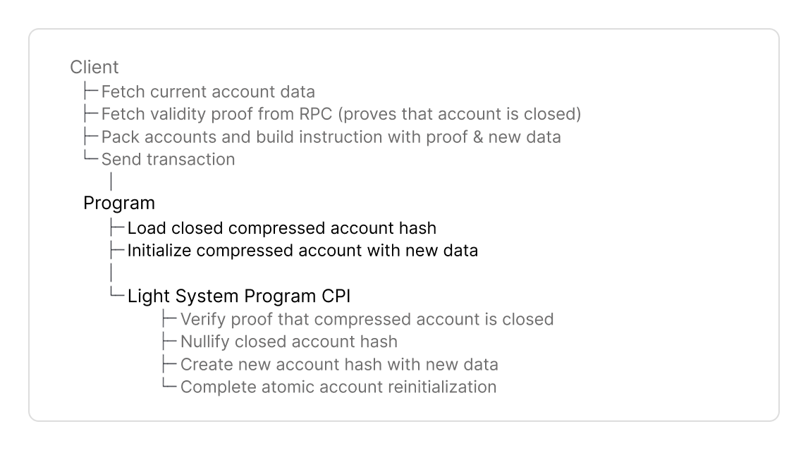

# How to Reinitialize Compressed Accounts

Compressed accounts are reinitialized via CPI to the Light System Program.

An empty compressed account can be reinitialized

* with an account hash marked as empty with zero values and zero discriminator
* to create a new account hash at the same address with new values.


Find [full code examples at the end](how-to-reinitialize-compressed-accounts.md#full-code-example) for Anchor and native Rust.


## Implementation Guide

This guide will cover the components of a Solana program that reinitializes compressed accounts.\
Here is the complete flow to reinitialize compressed accounts:

<figure><picture><source srcset="../../.gitbook/assets/program-reinit (1).png" media="(prefers-color-scheme: dark)"></picture><figcaption></figcaption></figure>



### Program Setup

<details>

<summary>Dependencies, Constants, Compressed Account</summary>

**Dependencies**

Add dependencies to your program.


```toml
[dependencies]
light-sdk = "0.16.0"
anchor_lang = "0.31.1"
```



```toml
[dependencies]
light-sdk = "0.16.0"
borsh = "0.10.0"
solana-program = "2.2"
```


* The `light-sdk` provides macros, wrappers and CPI interface to create and interact with compressed accounts.
* Add the serialization library (`borsh` for native Rust, or use `AnchorSerialize`).

**Constants**

Set program address and derive the CPI authority PDA to call the Light System program.


```rust
declare_id!("rent4o4eAiMbxpkAM1HeXzks9YeGuz18SEgXEizVvPq");

pub const LIGHT_CPI_SIGNER: CpiSigner =
    derive_light_cpi_signer!("rent4o4eAiMbxpkAM1HeXzks9YeGuz18SEgXEizVvPq");
```


**`CPISigner`** is the configuration struct for CPI's to the Light System Program.

* CPIs to the Light System program must be signed with a PDA derived by your program with the seed `b"authority"`
* `derive_light_cpi_signer!` derives the CPI signer PDA for you at compile time.

**Compressed Account**

Define your compressed account struct.

\#\[event] // declared as event so that it is part of the idl.#\[derive(    Clone,    Debug,    Default,    LightDiscriminator)]pub struct MyCompressedAccount {    pub owner: Pubkey,    pub message: String,}#\[derive(    Debug,     Default,     Clone,     BorshSerialize,     BorshDeserialize,     LightDiscriminator,)]pub struct MyCompressedAccount {    pub owner: Pubkey,    pub message: String,}

You derive

* the standard traits (`Clone`, `Debug`, `Default`),
* `borsh` or `AnchorSerialize` to serialize account data, and
* `LightDiscriminator` to implements a unique type ID (8 bytes) to distinguish account types. The default compressed account layout enforces a discriminator in its _own field_, [not the first 8 bytes of the data field](#user-content-fn-1)[^1].


The traits listed above are required for `LightAccount`. `LightAccount` wraps `MyCompressedAccount` in Step 3 to set the discriminator and create the compressed account's data.


</details>



### Instruction Data

Define the instruction data with the following parameters:




```rust
pub fn reinit_account<'info>(
    ctx: Context<'_, '_, '_, 'info, GenericAnchorAccounts<'info>>,
    proof: ValidityProof,
    account_meta: CompressedAccountMeta,
) -> Result<()>
```





```rust
pub struct ReinitInstructionData {
    pub proof: ValidityProof,
    pub account_meta: CompressedAccountMeta,
}
```




1. **Validity Proof**

* Define `proof` to include the proof that the closed account with zero values exists in the state tree.
* Clients fetch a validity proof with `getValidityProof()` from an RPC provider that supports ZK Compression (Helius, Triton, ...).

2. **Specify input state and output state tree (stores new account hash)**

* Define `account_meta: CompressedAccountMeta` to reference the closed account and specify the state tree to store the new account hash:
  * `tree_info: PackedStateTreeInfo`: References the existing account hash in the state tree.
  * `address`: The account's derived address.
  * `output_state_tree_index`: References the state tree account that will store the new compressed account hash.


Reinitialization does not require `current_value` parameters. `new_empty()` automatically uses the closed account as input.




### Reinitialize Closed Account

Reinitialize the closed account with `LightAccount::new_empty()`.


`new_empty()`

1. reconstructs the closed account hash with zero values as input, and
2. creates output state with default-initialized values.

You can set custom values in the same transaction:

1. Reinitialize with `new_empty()`, and
2. Update with `new_mut()` to set custom values.





```rust
let my_compressed_account = LightAccount::<MyCompressedAccount>::new_empty(
    &crate::ID,
    &account_meta,
)?;
```





```rust
let my_compressed_account = LightAccount::<MyCompressedAccount>::new_empty(
    &ID,
    &instruction_data.account_meta,
)?;
```




**Pass these parameters to `new_empty()`:**

* `&program_id`: The program's ID that owns the compressed account.
* `&account_meta`: The `CompressedAccountMeta` from instruction data (_Step 2_) that identifies the existing account and specifies the output state tree.
  * Anchor: Pass `account_meta` by reference. It is automatically deserialized as a function parameter.
  * Native Rust: Manually deserialize the instruction data struct, then pass the field by reference `&instruction_data.account_meta`.

**The SDK creates:**

* A `LightAccount` wrapper with account data automatically initialized to default values using the `Default` trait.
* This creates a zero-initialized instance: `Pubkey` as all zeros, `u64` as `0`, `String` as empty.


`new_empty()` reconstructs the closed account hash with zero values. The Light System Program verifies the closed account hash and creates the output hash in _Step 4_.




### Light System Program CPI

Invoke the Light System Program to reinitialize the compressed account.


The Light System Program

* validates the closed account hash exists in state tree,
* nullifies the closed account hash, and
* appends the new account hash with provided values to the state tree.





```rust
let light_cpi_accounts = CpiAccounts::new(
    ctx.accounts.signer.as_ref(),
    ctx.remaining_accounts,
    crate::LIGHT_CPI_SIGNER,
);

LightSystemProgramCpi::new_cpi(LIGHT_CPI_SIGNER, proof)
    .with_light_account(my_compressed_account)?
    .invoke(light_cpi_accounts)?;
```


**Set up `CpiAccounts::new()`:**

`CpiAccounts::new()` parses accounts for the CPI call to Light System Program.

**Pass these parameters:**

* `ctx.accounts.signer.as_ref()`: the transaction signer
* `ctx.remaining_accounts`: Slice with `[system_accounts, ...packed_tree_accounts]`. The client builds this with `PackedAccounts` and passes it to the instruction.
* `&LIGHT_CPI_SIGNER`: Your program's CPI signer PDA defined in Constants.




```rust
let (signer, remaining_accounts) = accounts
    .split_first();

let cpi_accounts = CpiAccounts::new(
    signer,
    remaining_accounts,
    LIGHT_CPI_SIGNER
);

LightSystemProgramCpi::new_cpi(LIGHT_CPI_SIGNER, instruction_data.proof)
    .with_light_account(my_compressed_account)?
    .invoke(cpi_accounts)?;
```


**Set up `CpiAccounts::new()`:**

`CpiAccounts::new()` parses accounts for the CPI call to Light System Program.

**Pass these parameters:**

* `signer`: account that signs and pays for the transaction
* `remaining_accounts`: Slice with `[system_accounts, ...packed_tree_accounts]`. The client builds this with `PackedAccounts`.
  * `split_first()` extracts the fee payer from the accounts array to separate it from the Light System Program accounts needed for the CPI.
* `&LIGHT_CPI_SIGNER`: Your program's CPI signer PDA defined in Constants.



<details>

<summary><em>System Accounts List</em></summary>

<table data-header-hidden><thead><tr><th width="40">#</th><th>Name</th><th>Description</th></tr></thead><tbody><tr><td>1</td><td><a data-footnote-ref href="#user-content-fn-2">​Light System Program​</a></td><td>Verifies validity proofs, compressed account ownership checks, cpis the account compression program to update tree accounts</td></tr><tr><td>2</td><td>CPI Signer</td><td>- PDA to sign CPI calls from your program to Light System Program<br>- Verified by Light System Program during CPI<br>- Derived from your program ID</td></tr><tr><td>3</td><td>Registered Program PDA</td><td>- Access control to the Account Compression Program</td></tr><tr><td>4</td><td><a data-footnote-ref href="#user-content-fn-3">​Noop Program​</a></td><td>- Logs compressed account state to Solana ledger. Only used in v1.<br>- Indexers parse transaction logs to reconstruct compressed account state</td></tr><tr><td>5</td><td><a data-footnote-ref href="#user-content-fn-4">​Account Compression Authority​</a></td><td>Signs CPI calls from Light System Program to Account Compression Program</td></tr><tr><td>6</td><td><a data-footnote-ref href="#user-content-fn-5">​Account Compression Program​</a></td><td>- Writes to state and address tree accounts<br>- Client and the account compression program do not interact directly.</td></tr><tr><td>7</td><td>Invoking Program</td><td>Your program's ID, used by Light System Program to:<br>- Derive the CPI Signer PDA<br>- Verify the CPI Signer matches your program ID<br>- Set the owner of created compressed accounts</td></tr><tr><td>8</td><td><a data-footnote-ref href="#user-content-fn-6">​System Program​</a></td><td>Solana System Program to transfer lamports</td></tr></tbody></table>

</details>

**Build the CPI instruction**:

* `new_cpi()` initializes the CPI instruction with the `proof` to prove the closed account hash exists in the state tree _- defined in the Instruction Data (Step 2)._
* `with_light_account` adds the `LightAccount` configured with the closed account hash as input and provided values as output _- defined in Step 3_.
* `invoke(light_cpi_accounts)` calls the Light System Program with `CpiAccounts`.



## Full Code Example

The counter programs below implement all steps from this guide. Make sure you have your [developer environment](https://www.zkcompression.com/compressed-pdas/create-a-program-with-compressed-pdas#start-building) set up first.


```bash
npm -g i @lightprotocol/zk-compression-cli@0.27.1-alpha.2
light init testprogram
```



For help with debugging, see the [Error Cheatsheet](https://www.zkcompression.com/resources/error-cheatsheet).





Find the source code [here](https://github.com/Lightprotocol/program-examples/tree/main/basic-operations/anchor/reinit).



```rust
#![allow(unexpected_cfgs)]
#![allow(deprecated)]

use anchor_lang::{prelude::*, AnchorDeserialize, AnchorSerialize};
use light_sdk::{
    account::LightAccount,
    address::v1::derive_address,
    cpi::{v1::CpiAccounts, CpiSigner},
    derive_light_cpi_signer,
    instruction::{account_meta::CompressedAccountMeta, PackedAddressTreeInfo, ValidityProof},
    LightDiscriminator,
};

declare_id!("DeSUZ4to3qN7mQimoTgvEnBXiBWeTqMVcMz3ynLaWx1t");

pub const LIGHT_CPI_SIGNER: CpiSigner =
    derive_light_cpi_signer!("DeSUZ4to3qN7mQimoTgvEnBXiBWeTqMVcMz3ynLaWx1t");

#[program]
pub mod reinit {

    use super::*;
    use light_sdk::cpi::{
        v1::LightSystemProgramCpi, InvokeLightSystemProgram, LightCpiInstruction,
    };

    /// Setup: Create a compressed account
    pub fn create_account<'info>(
        ctx: Context<'_, '_, '_, 'info, GenericAnchorAccounts<'info>>,
        proof: ValidityProof,
        address_tree_info: PackedAddressTreeInfo,
        output_state_tree_index: u8,
        message: String,
    ) -> Result<()> {
        let light_cpi_accounts = CpiAccounts::new(
            ctx.accounts.signer.as_ref(),
            ctx.remaining_accounts,
            crate::LIGHT_CPI_SIGNER,
        );

        let (address, address_seed) = derive_address(
            &[b"message", ctx.accounts.signer.key().as_ref()],
            &address_tree_info
                .get_tree_pubkey(&light_cpi_accounts)
                .map_err(|_| ErrorCode::AccountNotEnoughKeys)?,
            &crate::ID,
        );

        let mut my_compressed_account = LightAccount::<MyCompressedAccount>::new_init(
            &crate::ID,
            Some(address),
            output_state_tree_index,
        );

        my_compressed_account.owner = ctx.accounts.signer.key();
        my_compressed_account.message = message.clone();

        msg!(
            "Created compressed account with message: {}",
            my_compressed_account.message
        );

        LightSystemProgramCpi::new_cpi(LIGHT_CPI_SIGNER, proof)
            .with_light_account(my_compressed_account)?
            .with_new_addresses(&[address_tree_info.into_new_address_params_packed(address_seed)])
            .invoke(light_cpi_accounts)?;

        Ok(())
    }

    /// Setup: Close compressed account
    pub fn close_account<'info>(
        ctx: Context<'_, '_, '_, 'info, GenericAnchorAccounts<'info>>,
        proof: ValidityProof,
        account_meta: CompressedAccountMeta,
        current_message: String,
    ) -> Result<()> {
        let light_cpi_accounts = CpiAccounts::new(
            ctx.accounts.signer.as_ref(),
            ctx.remaining_accounts,
            crate::LIGHT_CPI_SIGNER,
        );

        let my_compressed_account = LightAccount::<MyCompressedAccount>::new_close(
            &crate::ID,
            &account_meta,
            MyCompressedAccount {
                owner: ctx.accounts.signer.key(),
                message: current_message,
            },
        )?;

        msg!("Close compressed account.");

        LightSystemProgramCpi::new_cpi(LIGHT_CPI_SIGNER, proof)
            .with_light_account(my_compressed_account)?
            .invoke(light_cpi_accounts)?;

        Ok(())
    }

    /// Reinitialize closed compressed account
    pub fn reinit_account<'info>(
        ctx: Context<'_, '_, '_, 'info, GenericAnchorAccounts<'info>>,
        proof: ValidityProof,
        account_meta: CompressedAccountMeta,
    ) -> Result<()> {
        let light_cpi_accounts = CpiAccounts::new(
            ctx.accounts.signer.as_ref(),
            ctx.remaining_accounts,
            crate::LIGHT_CPI_SIGNER,
        );

        let my_compressed_account = LightAccount::<MyCompressedAccount>::new_empty(
            &crate::ID,
            &account_meta,
        )?;

        msg!("Reinitializing closed compressed account");

        LightSystemProgramCpi::new_cpi(LIGHT_CPI_SIGNER, proof)
            .with_light_account(my_compressed_account)?
            .invoke(light_cpi_accounts)?;

        Ok(())
    }
}

#[derive(Accounts)]
pub struct GenericAnchorAccounts<'info> {
    #[account(mut)]
    pub signer: Signer<'info>,
}

#[event]
#[derive(Clone, Debug, Default, LightDiscriminator)]
pub struct MyCompressedAccount {
    pub owner: Pubkey,
    pub message: String,
}
```





Find the source code [here](https://github.com/Lightprotocol/program-examples/tree/main/basic-operations/native/programs/reinit).



```rust
#![allow(unexpected_cfgs)]

#[cfg(any(test, feature = "test-helpers"))]
pub mod test_helpers;

use borsh::{BorshDeserialize, BorshSerialize};
use light_macros::pubkey;
use light_sdk::{
    account::sha::LightAccount,
    address::v1::derive_address,
    cpi::{
        v1::{CpiAccounts, LightSystemProgramCpi},
        CpiSigner, InvokeLightSystemProgram, LightCpiInstruction,
    },
    derive_light_cpi_signer,
    error::LightSdkError,
    instruction::{account_meta::CompressedAccountMeta, PackedAddressTreeInfo, ValidityProof},
    LightDiscriminator,
};
use solana_program::{
    account_info::AccountInfo, entrypoint, program_error::ProgramError, pubkey::Pubkey,
};

pub const ID: Pubkey = pubkey!("C9WiPUaQ5PRjEWg7vUmgekfuQtAgFZFhn12ytXEMDr8y");
pub const LIGHT_CPI_SIGNER: CpiSigner = derive_light_cpi_signer!("C9WiPUaQ5PRjEWg7vUmgekfuQtAgFZFhn12ytXEMDr8y");

#[cfg(not(feature = "no-entrypoint"))]
entrypoint!(process_instruction);

#[derive(Debug, BorshSerialize, BorshDeserialize)]
pub enum InstructionType {
    Create,
    Close,
    Reinit,
}

#[derive(Debug, BorshSerialize, BorshDeserialize)]
pub struct CreateInstructionData {
    pub proof: ValidityProof,
    pub address_tree_info: PackedAddressTreeInfo,
    pub output_state_tree_index: u8,
    pub message: String,
}

#[derive(Debug, BorshSerialize, BorshDeserialize)]
pub struct CloseInstructionData {
    pub proof: ValidityProof,
    pub account_meta: CompressedAccountMeta,
    pub current_message: String,
}

#[derive(Debug, BorshSerialize, BorshDeserialize)]
pub struct ReinitInstructionData {
    pub proof: ValidityProof,
    pub account_meta: CompressedAccountMeta,
}

#[derive(Debug, Default, Clone, BorshSerialize, BorshDeserialize, LightDiscriminator)]
pub struct MyCompressedAccount {
    pub owner: Pubkey,
    pub message: String,
}

pub fn process_instruction(
    _program_id: &Pubkey,
    accounts: &[AccountInfo],
    instruction_data: &[u8],
) -> Result<(), ProgramError> {
    let (instruction_type, rest) = instruction_data
        .split_first()
        .ok_or(ProgramError::InvalidInstructionData)?;

    match InstructionType::try_from_slice(&[*instruction_type])
        .map_err(|_| ProgramError::InvalidInstructionData)?
    {
        InstructionType::Create => create(accounts, rest)?,
        InstructionType::Close => close(accounts, rest)?,
        InstructionType::Reinit => reinit(accounts, rest)?,
    }

    Ok(())
}

fn create(accounts: &[AccountInfo], instruction_data: &[u8]) -> Result<(), LightSdkError> {
    let instruction_data =
        CreateInstructionData::try_from_slice(instruction_data).map_err(|_| LightSdkError::Borsh)?;

    let signer = accounts.first().ok_or(ProgramError::NotEnoughAccountKeys)?;

    let light_cpi_accounts = CpiAccounts::new(
        signer,
        &accounts[1..],
        LIGHT_CPI_SIGNER
    );

    let (address, address_seed) = derive_address(
        &[b"message", signer.key.as_ref()],
        &instruction_data
            .address_tree_info
            .get_tree_pubkey(&light_cpi_accounts)
            .map_err(|_| ProgramError::NotEnoughAccountKeys)?,
        &ID,
    );

    let new_address_params = instruction_data
        .address_tree_info
        .into_new_address_params_packed(address_seed);

    let mut my_compressed_account = LightAccount::<MyCompressedAccount>::new_init(
        &ID,
        Some(address),
        instruction_data.output_state_tree_index,
    );
    my_compressed_account.owner = *signer.key;
    my_compressed_account.message = instruction_data.message;

    LightSystemProgramCpi::new_cpi(LIGHT_CPI_SIGNER, instruction_data.proof)
        .with_light_account(my_compressed_account)?
        .with_new_addresses(&[new_address_params])
        .invoke(light_cpi_accounts)?;

    Ok(())
}

fn close(accounts: &[AccountInfo], instruction_data: &[u8]) -> Result<(), LightSdkError> {
    let instruction_data =
        CloseInstructionData::try_from_slice(instruction_data).map_err(|_| LightSdkError::Borsh)?;

    let (signer, remaining_accounts) = accounts
        .split_first()
        .ok_or(ProgramError::InvalidAccountData)?;

    let cpi_accounts = CpiAccounts::new(
        signer,
        remaining_accounts,
        LIGHT_CPI_SIGNER
    );

    let my_compressed_account = LightAccount::<MyCompressedAccount>::new_close(
        &ID,
        &instruction_data.account_meta,
        MyCompressedAccount {
            owner: *signer.key,
            message: instruction_data.current_message,
        },
    )?;

    LightSystemProgramCpi::new_cpi(LIGHT_CPI_SIGNER, instruction_data.proof)
        .with_light_account(my_compressed_account)?
        .invoke(cpi_accounts)?;

    Ok(())
}

fn reinit(accounts: &[AccountInfo], instruction_data: &[u8]) -> Result<(), LightSdkError> {
    let instruction_data =
        ReinitInstructionData::try_from_slice(instruction_data).map_err(|_| LightSdkError::Borsh)?;

    let (signer, remaining_accounts) = accounts
        .split_first()
        .ok_or(ProgramError::InvalidAccountData)?;

    let cpi_accounts = CpiAccounts::new(
        signer,
        remaining_accounts,
        LIGHT_CPI_SIGNER
    );

    let my_compressed_account = LightAccount::<MyCompressedAccount>::new_empty(
        &ID,
        &instruction_data.account_meta,
    )?;

    LightSystemProgramCpi::new_cpi(LIGHT_CPI_SIGNER, instruction_data.proof)
        .with_light_account(my_compressed_account)?
        .invoke(cpi_accounts)?;

    Ok(())
}
```




## Next Steps

Build a client for your program or learn how to burn compressed accounts.




[client-library](../client-library/)





[how-to-burn-compressed-accounts.md](how-to-burn-compressed-accounts.md)




[^1]: The [Anchor](https://www.anchor-lang.com/) framework reserves the first 8 bytes of a _regular account's data field_ for the discriminator.

[^2]: ​[Program ID:](https://solscan.io/account/SySTEM1eSU2p4BGQfQpimFEWWSC1XDFeun3Nqzz3rT7) SySTEM1eSU2p4BGQfQpimFEWWSC1XDFeun3Nqzz3rT7

[^3]: [Program ID:](https://solscan.io/account/noopb9bkMVfRPU8AsbpTUg8AQkHtKwMYZiFUjNRtMmV) noopb9bkMVfRPU8AsbpTUg8AQkHtKwMYZiFUjNRtMmV

[^4]: PDA derived from Light System Program ID with seed `b"cpi_authority"`.

    [Pubkey](https://solscan.io/account/HZH7qSLcpAeDqCopVU4e5XkhT9j3JFsQiq8CmruY3aru): HZH7qSLcpAeDqCopVU4e5XkhT9j3JFsQiq8CmruY3aru

[^5]: [Program ID](https://solscan.io/account/compr6CUsB5m2jS4Y3831ztGSTnDpnKJTKS95d64XVq): compr6CUsB5m2jS4Y3831ztGSTnDpnKJTKS95d64XVq

[^6]: ​[Program ID](https://solscan.io/account/11111111111111111111111111111111): 11111111111111111111111111111111
