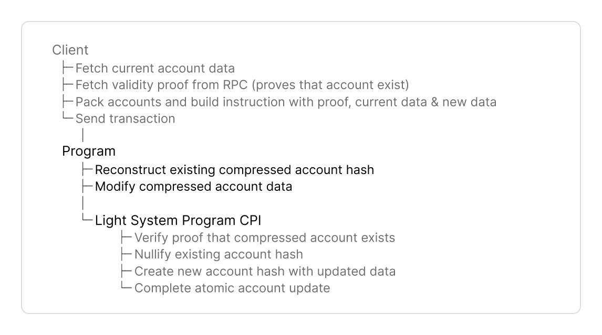

# How to Update Compressed Accounts

## Overview

Compressed accounts are updated via CPI to the Light System Program.

The update of a compressed account follows a UTXO pattern, unlike regular Solana accounts that overwrite data in place. Each update of a compressed account

* consumes the existing account hash and
* produces a new account hash with updated data.
* The existing account hash is nullified to prevent double spending.


Find [full code examples at the end](how-to-update-compressed-accounts.md#full-code-example) for Anchor and native Rust.


## Implementation Guide

This guide will cover the components of a Solana program that updates compressed accounts.\
Here is the complete flow:

<figure><picture><source srcset="../../.gitbook/assets/program-update (1).png" media="(prefers-color-scheme: dark)"></picture><figcaption></figcaption></figure>


### Program Setup

<details>

<summary>Dependencies, Constants, Compressed Account</summary>

**Dependencies**

Add dependencies to your program.


```toml
[dependencies]
light-sdk = "0.16.0"
anchor_lang = "0.31.1"
```



```toml
[dependencies]
light-sdk = "0.16.0"
borsh = "0.10.0"
solana-program = "2.2"
```


* The `light-sdk` provides macros, wrappers and CPI interface to create and interact with compressed accounts.
* Add the serialization library (`borsh` for native Rust, or use `AnchorSerialize`).

**Constants**

Set program address and derive the CPI authority PDA to call the Light System program.


````

</div>

**`CPISigner`** is the configuration struct for CPI's to the Light System Program.

* CPIs to the Light System program must be signed with a PDA derived by your program with the seed `b"authority"`
* `derive_light_cpi_signer!` derives the CPI signer PDA for you at compile time.

#### Compressed Account

Define your compressed account struct.

```rust
#[derive(
    Clone,
    Debug,
    Default,
    BorshSerialize, // AnchorSerialize
    BorshDeserialize, // AnchorDeserialize
    LightDiscriminator
)]
pub struct MyCompressedAccount {
    pub owner: Pubkey,
    pub message: String,
}
````


You derive

* the standard traits (`Clone`, `Debug`, `Default`),
* `borsh` or `AnchorSerialize` to serialize account data, and
* `LightDiscriminator` to implements a unique type ID (8 bytes) to distinguish account types. The default compressed account layout enforces a discriminator in its _own field_, [not the first 8 bytes of the data field](#user-content-fn-1)[^1].


The traits listed above are required for `LightAccount`. `LightAccount` wraps `MyCompressedAccount` in Step 3 to set the discriminator and create the compressed account's data.


</details>

#### Instruction Data

Define the instruction data with the following parameters:


```rust
pub struct InstructionData {
    proof: ValidityProof,
    account_meta: CompressedAccountMeta,
    current_message: String,
    new_message: String,
}
```


1. **Validity Proof**

* Define `proof` to include the proof that the account exists in the state tree.
* Clients fetch a validity proof with `getValidityProof()` from an RPC provider that supports ZK Compression (Helius, Triton, ...).

2. **Specify input state and output state tree (stores updated account hash)**

* Define `account_meta: CompressedAccountMeta` to reference the existing account and specify the state tree to store the updated account hash:
  * `tree_info: PackedStateTreeInfo`: References the existing account hash in the state tree.
  * `address`: The account's derived address.
  * `output_state_tree_index`: References the state tree account that will store the updated account hash.


Clients fetch the current account with `getCompressedAccount()` and populate `CompressedAccountMeta` with the account's metadata.


3. **Current account data**

* Define fields to include the current account data passed by the client.
* This depends on your program logic. This example includes `current_message` and `new_message` fields.
  * `new_message` contains the the new data that will replace the `data` field of the compressed account after the update.

#### Update Compressed Account

Load the compressed account and update it with `LightAccount::new_mut()`.


`new_mut()`:

* hashes the current account data as input state and
* lets your program define the output state.



```rust
let mut my_compressed_account
        = LightAccount::<MyCompressedAccount>::new_mut(
    &ID,
    account_meta,
    MyCompressedAccount {
        owner: *signer_key,
        message: current_message,
    },
)?;

my_compressed_account.message = new_message;
```


**Pass these parameters to `new_mut()`:**

* `&ID`: The program's ID that owns the compressed account.
* `&account_meta`: The `CompressedAccountMeta` from instruction data (_Step 2_) that identifies the existing account and specifies the output state tree.
* `MyCompressedAccount { ... }`: The current account data. The SDK hashes this input state for verification by the Light System Program.

**The SDK creates:**

* A `LightAccount` wrapper similar to Anchor's `Account`.
* `new_mut()` lets the program modify the output state. This example sets `message` to `new_message`.


`new_mut()` only hashes the input state. The Light System Program verifies that input hash exists in a state tree and creates the output hash in _Step 4._


#### Light System Program CPI

Invoke the Light System Program to update the compressed account.


The Light System Program

* validates the account exists in state tree,
* nullifies the existing account hash in the state tree, and
* appends the updated account hash to the state tree.



````

</div>

**Set up `CpiAccounts::new()`:**

* `fee_payer`: Fee payer and transaction signer
* `remaining_accounts`: `AccountInfo` slice with Light System and packed tree accounts.
* `LIGHT_CPI_SIGNER`: Your program's CPI signer defined in Constants.

**Build the CPI instruction**:

* `new_cpi()` initializes the CPI instruction with the `proof` to prove that the account exists in the specified state tree - _in the Instruction Data (Step 2)._
* `with_light_account` adds the `LightAccount`  with the modified compressed account data _- defined in Step 3_
* `invoke(light_cpi_accounts)` calls the Light System Program with `CpiAccounts`.

</div>

</div>

## Full Code Example

The counter programs below implement all steps from this guide. Make sure you have your [developer environment](https://www.zkcompression.com/compressed-pdas/create-a-program-with-compressed-pdas#start-building) set up first, or simply run:

```bash
npm -g i @lightprotocol/zk-compression-cli
light init testprogram
````



For help with debugging, see the [Error Cheatsheet](https://www.zkcompression.com/resources/error-cheatsheet).





Find the source code [here](https://github.com/Lightprotocol/program-examples/blob/3a9ff76d0b8b9778be0e14aaee35e041cabfb8b2/counter/anchor/programs/counter/src/lib.rs#L71).



```rust
#![allow(unexpected_cfgs)]
#![allow(deprecated)]

use anchor_lang::{prelude::*, AnchorDeserialize, AnchorSerialize};
use light_sdk::{
    account::LightAccount,
    address::v1::derive_address,
    cpi::{v1::CpiAccounts, CpiSigner},
    derive_light_cpi_signer,
    instruction::{account_meta::CompressedAccountMeta, PackedAddressTreeInfo, ValidityProof},
    LightDiscriminator,
};

declare_id!("Cj3DxyqB7wJh511VKexsjKt7Hx1kvPvCBMrbLuL8grKc");

pub const LIGHT_CPI_SIGNER: CpiSigner =
    derive_light_cpi_signer!("Cj3DxyqB7wJh511VKexsjKt7Hx1kvPvCBMrbLuL8grKc");

#[program]
pub mod update {

    use super::*;
    use light_sdk::cpi::{
        v1::LightSystemProgramCpi, InvokeLightSystemProgram, LightCpiInstruction,
    };

    /// Setup: Creates a compressed account
    pub fn create_account<'info>(
        ctx: Context<'_, '_, '_, 'info, GenericAnchorAccounts<'info>>,
        proof: ValidityProof,
        address_tree_info: PackedAddressTreeInfo,
        output_state_tree_index: u8,
        message: String,
    ) -> Result<()> {
        let light_cpi_accounts = CpiAccounts::new(
            ctx.accounts.signer.as_ref(),
            ctx.remaining_accounts,
            crate::LIGHT_CPI_SIGNER,
        );

        let (address, address_seed) = derive_address(
            &[b"message", ctx.accounts.signer.key().as_ref()],
            &address_tree_info
                .get_tree_pubkey(&light_cpi_accounts)
                .map_err(|_| ErrorCode::AccountNotEnoughKeys)?,
            &crate::ID,
        );

        let mut my_compressed_account = LightAccount::<MyCompressedAccount>::new_init(
            &crate::ID,
            Some(address),
            output_state_tree_index,
        );

        my_compressed_account.owner = ctx.accounts.signer.key();
        my_compressed_account.message = message.clone();

        msg!(
            "Created compressed account with message: {}",
            my_compressed_account.message
        );

        LightSystemProgramCpi::new_cpi(LIGHT_CPI_SIGNER, proof)
            .with_light_account(my_compressed_account)?
            .with_new_addresses(&[address_tree_info.into_new_address_params_packed(address_seed)])
            .invoke(light_cpi_accounts)?;

        Ok(())
    }

    /// Updates an existing compressed account's message
    pub fn update_account<'info>(
        ctx: Context<'_, '_, '_, 'info, GenericAnchorAccounts<'info>>,
        proof: ValidityProof,
        current_account: MyCompressedAccount,
        account_meta: CompressedAccountMeta,
        new_message: String,
    ) -> Result<()> {
        let light_cpi_accounts = CpiAccounts::new(
            ctx.accounts.signer.as_ref(),
            ctx.remaining_accounts,
            crate::LIGHT_CPI_SIGNER,
        );

        let mut my_compressed_account = LightAccount::<MyCompressedAccount>::new_mut(
            &crate::ID,
            &account_meta,
            current_account,
        )?;

        my_compressed_account.message = new_message.clone();

        msg!(
            "Updated compressed account message to: {}",
            my_compressed_account.message
        );

        LightSystemProgramCpi::new_cpi(LIGHT_CPI_SIGNER, proof)
            .with_light_account(my_compressed_account)?
            .invoke(light_cpi_accounts)?;

        Ok(())
    }
}

#[derive(Accounts)]
pub struct GenericAnchorAccounts<'info> {
    #[account(mut)]
    pub signer: Signer<'info>,
}

#[event]
#[derive(Clone, Debug, Default, LightDiscriminator)]
pub struct MyCompressedAccount {
    pub owner: Pubkey,
    pub message: String,
}
```





Find the source code [here](https://github.com/Lightprotocol/program-examples/blob/3a9ff76d0b8b9778be0e14aaee35e041cabfb8b2/counter/native/src/lib.rs#L197).



```rust
#![allow(unexpected_cfgs)]

#[cfg(any(test, feature = "test-helpers"))]
pub mod test_helpers;

use borsh::{BorshDeserialize, BorshSerialize};
use light_macros::pubkey;
use light_sdk::{
    account::sha::LightAccount,
    address::v1::derive_address,
    cpi::{
        v1::{CpiAccounts, LightSystemProgramCpi},
        CpiSigner, InvokeLightSystemProgram, LightCpiInstruction,
    },
    derive_light_cpi_signer,
    error::LightSdkError,
    instruction::{account_meta::CompressedAccountMeta, PackedAddressTreeInfo, ValidityProof},
    LightDiscriminator,
};
use solana_program::{
    account_info::AccountInfo, entrypoint, program_error::ProgramError, pubkey::Pubkey,
};

pub const ID: Pubkey = pubkey!("2m6LXA7E6kMSkK6QHq2WCznD6kvhDcVFqEKpETKAQxYe");
pub const LIGHT_CPI_SIGNER: CpiSigner =
    derive_light_cpi_signer!("2m6LXA7E6kMSkK6QHq2WCznD6kvhDcVFqEKpETKAQxYe");

entrypoint!(process_instruction);

#[repr(u8)]
#[derive(Debug)]
pub enum InstructionType {
    Create = 0,
    Update = 1,
}

impl TryFrom<u8> for InstructionType {
    type Error = LightSdkError;

    fn try_from(value: u8) -> Result<Self, Self::Error> {
        match value {
            0 => Ok(InstructionType::Create),
            1 => Ok(InstructionType::Update),
            _ => panic!("Invalid instruction discriminator."),
        }
    }
}

#[derive(
    Debug, Default, Clone, BorshSerialize, BorshDeserialize, LightDiscriminator,
)]
pub struct MyCompressedAccount {
    pub owner: Pubkey,
    pub message: String,
}

#[derive(BorshSerialize, BorshDeserialize)]
pub struct CreateInstructionData {
    pub proof: ValidityProof,
    pub address_tree_info: PackedAddressTreeInfo,
    pub output_state_tree_index: u8,
    pub message: String,
}

#[derive(BorshSerialize, BorshDeserialize)]
pub struct UpdateInstructionData {
    pub proof: ValidityProof,
    pub account_meta: CompressedAccountMeta,
    pub current_message: String,
    pub new_message: String,
}

pub fn process_instruction(
    program_id: &Pubkey,
    accounts: &[AccountInfo],
    instruction_data: &[u8],
) -> Result<(), ProgramError> {
    if program_id != &ID {
        return Err(ProgramError::IncorrectProgramId);
    }
    if instruction_data.is_empty() {
        return Err(ProgramError::InvalidInstructionData);
    }

    let discriminator = InstructionType::try_from(instruction_data[0])
        .map_err(|_| ProgramError::InvalidInstructionData)?;

    match discriminator {
        InstructionType::Create => {
            let instruction_data =
                CreateInstructionData::try_from_slice(&instruction_data[1..])
                    .map_err(|_| ProgramError::InvalidInstructionData)?;
            create(accounts, instruction_data)
        }
        InstructionType::Update => {
            let instruction_data =
                UpdateInstructionData::try_from_slice(&instruction_data[1..])
                    .map_err(|_| ProgramError::InvalidInstructionData)?;
            update(accounts, instruction_data)
        }
    }
}

pub fn create(
    accounts: &[AccountInfo],
    instruction_data: CreateInstructionData,
) -> Result<(), ProgramError> {
    let signer = accounts.first().ok_or(ProgramError::NotEnoughAccountKeys)?;

    let light_cpi_accounts = CpiAccounts::new(signer, &accounts[1..], LIGHT_CPI_SIGNER);

    let (address, address_seed) = derive_address(
        &[b"message", signer.key.as_ref()],
        &instruction_data
            .address_tree_info
            .get_tree_pubkey(&light_cpi_accounts)
            .map_err(|_| ProgramError::NotEnoughAccountKeys)?,
        &ID,
    );

    let new_address_params = instruction_data
        .address_tree_info
        .into_new_address_params_packed(address_seed);

    let mut my_compressed_account = LightAccount::<MyCompressedAccount>::new_init(
        &ID,
        Some(address),
        instruction_data.output_state_tree_index,
    );
    my_compressed_account.owner = *signer.key;
    my_compressed_account.message = instruction_data.message;

    LightSystemProgramCpi::new_cpi(LIGHT_CPI_SIGNER, instruction_data.proof)
        .with_light_account(my_compressed_account)?
        .with_new_addresses(&[new_address_params])
        .invoke(light_cpi_accounts)?;

    Ok(())
}

pub fn update(
    accounts: &[AccountInfo],
    instruction_data: UpdateInstructionData,
) -> Result<(), ProgramError> {
    let signer = accounts.first().ok_or(ProgramError::NotEnoughAccountKeys)?;

    let light_cpi_accounts = CpiAccounts::new(signer, &accounts[1..], LIGHT_CPI_SIGNER);

    let mut my_compressed_account = LightAccount::<MyCompressedAccount>::new_mut(
        &ID,
        &instruction_data.account_meta,
        MyCompressedAccount {
            owner: *signer.key,
            message: instruction_data.current_message,
        },
    )?;

    // Update the account data with new message
    my_compressed_account.account.message = instruction_data.new_message;

    LightSystemProgramCpi::new_cpi(LIGHT_CPI_SIGNER, instruction_data.proof)
        .with_light_account(my_compressed_account)?
        .invoke(light_cpi_accounts)?;

    Ok(())
}
```




### Next steps

Build a client for your program or learn how to close compressed accounts.

[^1]: The [Anchor](https://www.anchor-lang.com/) framework reserves the first 8 bytes of a _regular account's data field_ for the discriminator.
