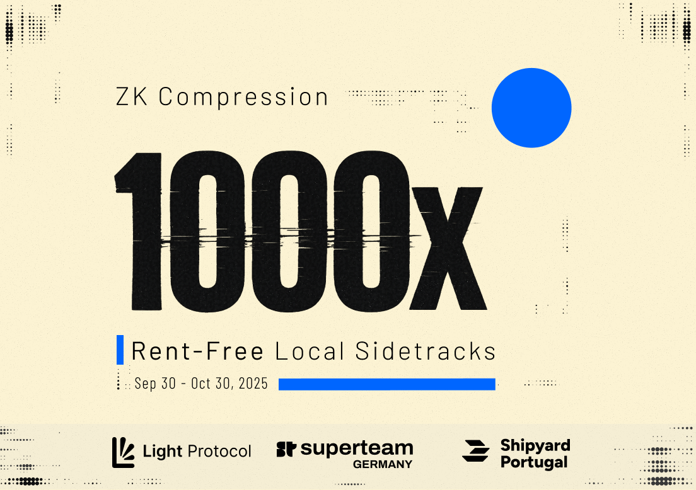

# Event: 1000x Hackathon Sidetracks

<figure><figcaption></figcaption></figure>

### Overview

1000x is a dedicated side track to the Solana Cypherpunk hackathon, hosted by [Light Protocol](https://x.com/LightProtocol) in collaboration with [Superteam Germany](https://x.com/SuperteamDE) and [Shipyard Portugal](https://x.com/SolanaPT).

Scale your application with rent-free tokens and accounts.\
Here's how you can participate:

1. **Use ZK Compression** in your Cypherpunk project
2. **Submit by October 30,** 2025 via Superteam Earn
3. You're now eligible to win prizes in 1000x


Participants must submit their project from **Germany** _or_ **Portugal**. [Solana Foundation and Colosseum Rules apply](https://www.colosseum.org/files/Breakout%20Hackathon%20Official%20Rules%202025.pdf). You can submit your project to both Colosseum and 1000x.


### **Sign Up to your Local Track!**

<table data-card-size="large" data-view="cards"><thead><tr><th></th><th data-hidden data-card-cover data-type="image">Cover image</th><th data-hidden data-card-target data-type="content-ref"></th></tr></thead><tbody><tr><td><h4>Germany</h4></td><td><a href=".gitbook/assets/ger-card.png">ger-card.png</a></td><td><a href="https://earn.superteam.fun/listing/1000x-or-local-track-with-superteam-germany">https://earn.superteam.fun/listing/1000x-or-local-track-with-superteam-germany</a></td></tr><tr><td><h4>Portugal</h4></td><td><a href=".gitbook/assets/pt-card.png">pt-card.png</a></td><td><a href="https://earn.superteam.fun/listing/1000x-or-local-track-with-shipyard-portugal">https://earn.superteam.fun/listing/1000x-or-local-track-with-shipyard-portugal</a></td></tr></tbody></table>

Details for Scope and Judging

Projects **must use compressed tokens or compressed accounts** in some capacity to be eligible, in addition to the following requirements:

* The [Solana Foundation](https://www.colosseum.org/files/Breakout%20Hackathon%20Official%20Rules%202025.pdf) and [Colosseum Hackathon](https://www.colosseum.org/files/Breakout%20Hackathon%20Official%20Rules%202025.pdf) rules apply.
* Each participant can have a maximum of 1 project submission count towards scoring in this side track.
* We award the prizes at our sole discretion. We reserve the right not to award the participation bounty if a submission is deemed insufficient in effort or quality.

Once all submissions are collected, we will distribute a list to the side-track judges for evaluation, based on the following criteria:

* Functionality
* Potential impact
* Novelty
* Design
* Extensibility

After the judges complete individual evaluations, they will discuss and choose the winners based on the project’s weighted scores.

### Project Ideas & Resources

We encourage you to build things that you're excited about. For inspiration, we have compiled a list of ideas to explore » [Project Ideas](https://github.com/Lightprotocol/cypherpunk-hackathon/blob/main/ideas.md).

#### **Additional Resources:**

» [Introductory Blog Post](https://www.helius.dev/blog/zk-compression-keynote-breakpoint-2024)

» [Introductory Workshop](https://x.com/tilo_cpn/status/1976671704979010003)

» [Light Protocol Monorepo](https://github.com/Lightprotocol/light-protocol)

» [Example programs](https://github.com/Lightprotocol/program-examples)

» Example[ Web ](https://github.com/Lightprotocol/example-web-client)& [Node Client](https://github.com/Lightprotocol/example-nodejs-client)

### Get Support

* Reach out via [Discord](https://discord.com/invite/CYvjBgzRFP) or [Telegram](https://t.me/tilo_light).
* Book a Call in our [Office hours](https://calendly.com/tilo-light/1000x-office-hours)

## Next Steps

Get started in less than 5 minutes with compressed tokens.


[quickstart.md](quickstart.md)

